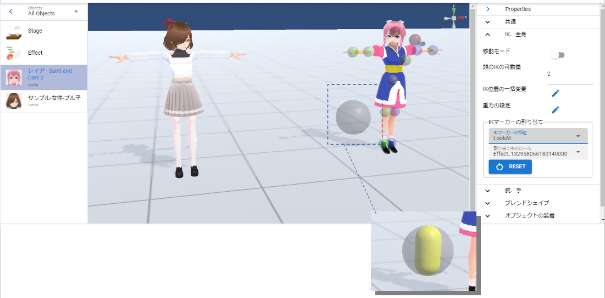

####################################
VRoid/VRM
####################################

　VRoid/VRMを読み込んでポーズを取らせたり後述のアニメーションを作成して楽しめるのが本アプリのメインの特徴です。VRMファイルの読み込みから実際の操作まで、一連の操作を説明していきます。

.. caution::
    本アプリではVRM1.0製のモデルも正常に読み込むことができます。

    ただし、コンストレイントなどVRM1.0で新規実装になった機能などはまだ使用例が世に広まっていないため、確認できていません。今後のアップデートで動作確認・対応を進めます。

.. contents::

.. index:: VRMの利用条件を確認する

VRMの利用条件を確認する
--------------------------------

　読み込みが進むとVRoid/VRMの利用条件確認画面が表示されます。自分以外の製作者のVRMファイルを読み込んだ場合、利用条件をよく確認し承諾できれば「OK」ボタンを押して読み込みを完了させてください。

.. image:: ../img/operation_vrm_5.png
    :align: center

　この後WebGL画面に目的のVRoid/VRMが表示されます。

.. note:: 
    * VRMを履歴から開いた場合、オプションによってはこの確認画面を省略することができます。
    * VRoidStudio 1.xのモデルと0.xのモデルは関節の形状や初期ポーズなどが異なります。本アプリではその差異をなるべく吸収していますが、VRoidStudio 1.xから出力した直後のモデルは次ページの11, 13のIKの初期表示が若干ずれます（動かし始めれば問題ありません）。
    * VRM 0.xのモデルとVRM1.xのモデルも関節の形状などが異なるため、初期ポーズが若干ずれます。こちらも動かし始めれば問題ありません。

|

.. index:: IKマーカーの操作（VRMの操作）

.. _inputikasmarker:

VRMのIKマーカーの操作
--------------------------

　読み込んだVRoid/VRMには図のようにIKマーカーと称する半透明の図形がついています。それぞれ次の部位の動きに連動しています。また、部位ごとにIKマーカーの操作の種類や形が決まっています。

.. image:: ../img/operation_vrm_6.jpg
    :align: center

|

.. csv-table::
    :header-rows: 1

    No, 部位, 対応操作,                           No, 部位, 対応操作
    1,  視線（EyeViewHandle）,移動,               2,   頭の左右の傾き・顎突き出し（Head）,回転
    3,  頭の向き（LookAt）,移動,                  4,   上半身の向き（Aim）,回転 
    5,  上半身・肩の左右の傾き（Chest）,回転,      6,  腰の向き・傾き・移動（Pelvis）,移動・回転
    7,  左肩（LeftShoulder）,回転,                8, 左ひじ（LeftLowerArm）,移動
    9,  左手（LeftHand）,移動・回転 ,              ,  , 
    10, 右肩（RightShoulder）, 回転,              11,  右ひじ（RightLowerArm）,移動,
    12,  右手（RightHand）,移動・回転,              ,  ,
    13, 左足の方向（LeftLowerLeg）≠ひざ,移動,        14, 左足首（LeftLeg）,移動・回転
    15, 右足の方向（RightLowerLeg）≠ひざ,移動,      16, 右足首（RightLeg）,移動・回転

.. index:: IKシステムの変更(VRM)

.. warning:: 
    **IKシステムの変更(ver 2.2.0)**

        Ver 2.2.0 では今後の汎用性のため、IKシステムをFinalIKからUnity本来のIKに変更しました。それによる影響は次の通りです。
        
        * Aimは移動ではなく **回転で** VRMの該当部位を操作するようになった
        * Chestも移動ではなく **回転で** VRMの該当部位を操作するようになった

        今までのポーズ・モーションファイルでこれらのIKマーカーを大きく操作していた場合はポーズ・モーションの変更が必要です。ご了承ください。

.. warning:: 
    **IKシステムの変更(ver 2.4.0)**

        実際のVRMのボーンの階層構造に準じた動きにするため、IKシステムの一部を変更しました。

        .. mermaid::

            flowchart LR

            Pelvis --> Aim --> Chest --> LeftShoulder & RightShoulder & Head

        * Pelvis を動かすと、Aim, Chest, Headも動くようになった
        * Aimを動かすとChest, Headも動くようになった
        * Chestを動かすとHeadも動くようになった

        影響
            * Aimのx/z軸の動きが逆になったため、既存のポーズ・モーションファイルのAimの回転を修正してください。
            * VR/AR空間ではIKマーカー自体は連動して動きませんが、VRMのボーンの動きとしてはその通りに維持されています。

.. note::
    * 対応していない操作をしてもその部位に動きはありません。特に体の中心部である **Head(2), Chest(5), LeftSholuder(7), RightShoulder(10), Aim(4)** は実際には遠く離れた場所に移動させても操作することができます。体の中に隠れやすい部位なので、操作しやすい位置に動かすとよいでしょう。
    * 可能な限り複雑でなく・面倒くさくなく・それでいて自在にポーズの編集をしていただくため、操作可能な部位はこれだけとなっています。そのため、操作が膨大になる FK (Forward Kinematics) には対応していません。
    * 世間的には厳密な言い方があるかもしれませんが、本アプリでは上記の各ボーン（部位）のこと＝IKマーカー（パーツ）として表記して説明していきます。
    * 13と15はひざと同じ意味ではありません。足の全体的な向きと捉えてください。
    * VR/AR対応のため、ver 2.3.0より1,2,5,6のIKマーカーの形を変更しました。（球体だと回転の状態がわかりづらくなるため）

|

各IKマーカーの操作
^^^^^^^^^^^^^^^^^^^^

　選択した各IKマーカーをクリックすると図のようになります。これが操作ハンドルです。

|

X,Y,Z軸移動
    　緑＝Y、青＝Z、赤＝X軸として、ドラッグするとその方向にIKマーカーを移動します。その移動量だけ体の該当部位も移動します。

中心の平面
    　真ん中の同じ色で四角のボックスは、その中をドラッグするとその面が示す軸ともう片方の軸のみで自由に移動させることができます。

.. index:: IKマーカーの特殊な操作（VRMの操作）

.. _specialoperation_vrm:

特殊な操作
^^^^^^^^^^^^^^^

　IKマーカーを選択した状態で次のキーを押すと特別な機能が使えます。

Ctrlキーを押しながらIKマーカーをクリック
    　IKマーカーを複数選択することができます。複数選択した状態で移動や回転を行うと複数の体の部位を同時に動かすことができます。
    　なお、操作ハンドルも当たり判定があるので、カメラをズームするなどしてIKマーカーだけを選択してください。

Xキーを押下
    グローバル座標・ローカル座標を切り替えます。デフォルトはローカル座標です。

Gキーを押下
    IKマーカーを移動のみにします。

Rキーを押下
    IKマーカーを回転のみにします。

Tキーを押下
    IKマーカーを初期状態に戻します。（移動・回転両方）

Shift + Zキーを押下
    IKマーカーによる移動・回転を元に戻します。

Shift + Yキーを押下
    IKマーカーによる移動・回転をやり直します。

|

.. index:: 移動・回転（VRMの操作）

VRoid/VRM自体の移動・回転
^^^^^^^^^^^^^^^^^^^^^^^^^^^^^^

　選択したVRoid/VRM自体を移動・回転するには、右のプロパティの「IK、全身」タブにある「移動モード」をONにします。

.. image:: ../img/operation_vrm_8.png
    :align: center

|

　すると、VRoid/VRMの足元付近をクリックするとIKマーカー全部が選択状態になります。表示されませんが実際にはここが全体のIKマーカーとなっています。

.. warning::
    ※足首と全体のIKマーカーが干渉しやすいため、移動しない場合は適時OFFに切り替えてください。

ver 2.3.0より、全体を動かすこのIKマーカーを台形で表示するようにしました。

|

.. image:: ../img/operation_vrm_9.png
    :align: center

　この状態で上下左右に移動・回転するとVRoid/VRM自体がそのとおりに動きます。これはプロパティの「共通」タブから数値で設定もできます。

VRoid/VRM自体のサイズ
^^^^^^^^^^^^^^^^^^^^^^^^^^^^^

.. image:: ../img/prop_common_1.png
    :align: center

　共通タブからはVRoid/VRMの全体の大きさも調整できますが、VRoid/VRMは読み込んだ時点のサイズが理想のサイズです。この倍率はあまり極端に変更しないことをオススメします。（IKマーカー自体のサイズまでは追随しないためIKマーカーと体の部位の位置がズレます）

|

.. index:: Tポーズに戻す（VRMの操作）

全ボーンをTポーズに戻す
^^^^^^^^^^^^^^^^^^^^^^^^^^^^^

　IKマーカーをいじりすぎて求めるポーズに戻せなくなった場合、リボンバーの **3Dモデル** タブの **全ボーンをリセット** を押すとTポーズ（デフォルトのポーズ）に戻すことが出来ます。

.. image:: ../img/operation_vrm_a.png
    :align: center

|

　また、全体の位置や回転も **位置をリセット**、**回転をリセット** で戻すことが出来ます。

|

.. index:: IKマーカーを数値で操作する

.. _inputikasnumber:

IKマーカーを数値で操作する
^^^^^^^^^^^^^^^^^^^^^^^^^^^^^^^^

　IKマーカーをマウスやタッチで操作するほか、実際の数値で入力して操作することもできます。目的のVRoid/VRMを選択し、右のプロパティの「**IK、全身**」タブにある「**IK位置の一括変更**」のボタンを押します。

.. image:: ../img/operation_vrm_c.png
    :align: center

|

.. |btnbonetranapply| image:: ../img/operation_vrm_l.png
.. |btnbonetranrel| image:: ../img/operation_vrm_m.png
.. |btnbonetranmirror| image:: ../img/operation_vrm_n.png

| 　専用のダイアログが表示されます。ここでスプレッドシート形式で各IKマーカーの位置や回転を直接指定することができます。目的の箇所を変更し終わったら最後に |btnbonetranapply|  **ポーズを適用** ボタンを押します。
| 　すると対象のVRoid/VRMの現在のポーズがそのとおりに変更されます。

.. image:: ../img/screen_ikmarker.png
    :align: center

|

各ボタンの機能は次のとおりです。

スプレッドシート

    ================ =================
    列名              説明
    ---------------- -----------------
    PositionX        X座標の位置
    PositionY        Y座標の位置
    PositionZ        Z座標の位置
    RotationX        X軸の回転
    RotationY        Y軸の回転
    RotationZ        Z軸の回転
    drag             IKマーカーを動かしたときの抗力
    angularDrag      IKマーカーを動かしたときの回転抗力
    ================ =================

|btnbonetranrel| 最新の状態に更新
    現在選択中のVRMのポーズ情報をスプレッドシートに反映します。基本的に選択すれば自動的に反映されますが、アプリの動作状態により情報が古いままになることがあります。その場合に使います。

|btnbonetranmirror| ポーズを反転する
    現在のポーズ情報の左右を入れ替えます。この状態で **ポーズを適用** を押せば現在のポーズが反転する結果となります。このボタンは **IK、全身** パネルにも存在します。

.. note::
    * VRM以外を選択している間はツールバー内のボタンは無効化します。
    * ここでの数値は現在のVRM固有の数値です。身長・体格差は反映されないため他のVRMで使い回す場合は手動で算出する必要があります。

|

.. index:: 可動範囲の制限を調整する（VRMの操作）

可動範囲の制限を調整する
^^^^^^^^^^^^^^^^^^^^^^^^^^^^^^^^^

| 　本アプリではVRMは標準でいくつかの可動範囲の制御が適用されます。それらによりVRMが無理なく自然な人体の動きを再現できます。
| 　しかしながら本アプリのIKと競合することもあり、それが原因でポーズやアニメーションが再現しきれない仕様も備わってしまっています。人体として多少不自然でもいいから完全に自由にポージングさせたい場合、これらIKマーカーの制限を外すことができます。

足の方向（LowerLeg）、足首（Leg）のX軸の回転角度・ひじ（LowerArm）のY軸の回転角度
    * ひじ、膝から下、足首の回転の範囲が実際の人体に沿って制限がかかります。
    * 設定画面の「Modelタブ」→「VRMの体に自然な可動制御を適用する」でオン・オフが切り替わります。

足の方向（LowerLeg）を動かした後の足首（Leg）のX軸の回転
    * 足（LowerLeg）を前後に動かしたときに足首（Leg）の回転角度をLowerLegに合わせて回転させます。
    * 設定画面の「Modelタブ」→「足首の回転を自動で行う」でオン・オフが切り替わります。

|

IKマーカー同士の連動
^^^^^^^^^^^^^^^^^^^^^^^^^^^^

| 　本アプリではVRMのボーンを動かすのにIKマーカーを使いますが、特定の部位のIKマーカーを動かすと別の部位が連動して動くようになっています。
| 　基本的にはIKマーカーを操作する時だけの話です。

次の3パターンの連動
    肩付近（Chest）と腕（LowerArm）・頭（Head）
        Chestを動かした時に腕（LowerArm）・頭（Head）のX軸・Z軸を可能な限り連動して移動させます。
    Aimと肩付近（Chest）
        Aimを動かした時に肩付近（Chest）のX軸・Z軸を可能な限り連動して移動させます。
    腰（Pelvis）と足（LowerLeg）
        腰を上下したときに足（LowerLeg）がその動きに合わせて前後に若干移動
    足首（Leg）と足の方向（LowerLeg）の連動
        足首を移動させたときに足（LowerLeg）を前後に若干移動
    手（Hand）と腕（LowerArm）の連動 
        手を移動させたときに腕（肘）も追随して移動

.. hint::    
    設定画面の「Modelタブ」→「ボーンの連動」でオン・オフが切り替わります。

.. warning::
    ver 1.x の時に存在した連動の問題は ver 2.0.2で解決済みです。
    
    アニメーション再生中は自動的にオフになり、キーフレームに登録された位置・回転が反映されます。

    オフにすると連動しなくなって自由になりますが、関節が曲がってはいけない方向に曲がるなどします（アニメーション中では適切にキーフレームに登録していただければ問題ありません）。

|

.. index:: IKマーカーを別オブジェクトに切り替える（VRMの操作）

IKマーカーを別オブジェクトに切り替える
^^^^^^^^^^^^^^^^^^^^^^^^^^^^^^^^^^^^^^^^^^^^^^^^^

| 　VRMは前述の部位に従ってIKマーカーが設定されており、それを動かすとポーズが変わります。体の各部位の動きの目印となるそのIKマーカーに、別のオブジェクトを割り当てることができます。
| 　これをするとどうなるのかを説明します。

.. image:: ../img/operation_vrm_d.png
    :align: center

| 

　IKマーカーの部位を選択し、その部位に割り当てるオブジェクトを選択します。選択可能なオブジェクトは次のとおりです。

| **Self** ・・・元のIKマーカーに戻します。
| **Main Camera**・・・アプリのメインカメラ
| **各VRM、OtherObject、Light、Camera、Image、Effect**・・・他の3Dオブジェクト

.. note::
    | ※部位にHead、LeftShoulder、RightShoulderは選択できません。
    | ※なお、自分自身や2Dオブジェクト、SystemEffectやAudio、Stageには割り当てられません。

.. caution::
    割り当てているオブジェクトを削除した場合、各VRMのIKは自動的にデフォルトに戻ります。

| 

**VRM AとVRM B、そしてエフェクトオブジェクトを使った場合**

|

　この状態でエフェクトオブジェクトを動かすと、キャラAとBがその方向に振り向き視線を合わせるようになります。

　この設定と状態をアニメーションに反映することも可能です。アニメーションプロジェクトに登録するのは次の内容となります。

.. csv-table::
    :header-rows: 1
    :align: center

    オブジェクト, 登録する操作
    VRM, IKマーカーの割り当て
    割り当てられたオブジェクト, 実際の移動や回転など

|

.. index:: 手のポーズの操作（VRMの操作）

手のポーズの操作
--------------------

　手のひらを操作するには右のプロパティから「腕・手」タブを開き、左右の手を好きなポーズを選んでください。

.. image:: ../img/prop_vrm_2.png
    :align: center

　スライダーでポーズの度合いを調整出来ます。手のポーズは今後のアップデートで増やす予定です。

Ver 1.0.0 時点：
    * 通常
    * 開く
    * グー
    * 指差し
    * Vサイン
    * サムズアップ
    * 握る
  
Ver 1.0.4から次に対応しました。
    * 手動操作

.. image:: ../img/prop_vrm_8.png
    :align: center

|

.. |imgfinger1| image:: ../img/prop_vrm_9a.png

.. |imgfinger3| image:: ../img/prop_vrm_9c.png

|imgfinger1| **親指～小指の関節**
    それぞれのスライダーで指の関節を回転します。上は第1関節～第2関節、下は第3関節です。

|imgfinger2| **指自体の操作（指と指の間、指の軸回転）**
    | 赤のスライダーは、指の間の開き具合をスライダーで調整します。
    | 緑のスライダーは、指の軸を中心として回転します。（実際の人間としてはできませんが、3Dモデルではしばしば必要な回転操作です）

|imgfinger3| **親指の付け根**
    親指の付け根の回転を円形のスライダーで調整できます。左は親指と手のひらの遠近の距離を、右は主に左右の回転を表します。

|

|

.. index:: ブレンドシェイプ（VRMの操作）

.. _blendshape_vrm:

ブレンドシェイプ
---------------------

　わかりやすく言うとVRoid/VRMの表情等を切り替えることができます。右のプロパティの「ブレンドシェイプ」タブを開き、好きなブレンドシェイプをスライダーで値を入力して調整してください。

..
    　ブレンドシェイプには ``汎用`` と ``専用`` の2種類があります。UnityやBlenderに詳しい方向けの説明ですと、SkinnedMeshRendererが ``汎用`` 、VRMBlendShapeProxyが ``専用`` と本アプリでは分類分けしています（VRM 1.xでは Vrm10RuntimeExpression(単にExpressionとも) といいます）。

.. image:: ../img/prop_vrm_4.png
    :align: center

|

* ブレンドシェイプはVRMファイルごとに決まっており、キャラクターによって操作できる数に増減があります。
* 各シェイプキーの横のスライダーを0～100までの間で動かしてください。

.. note::
    ver 2.3.0より、チェックボックスをONにした場合のみキーフレームに登録されるように変更しました。スライダーを動かすと自動的にチェックボックスにチェックが入るようになっています。

    もし登録を望まないシェイプの場合はチェックを外せばそのシェイプの値は保存されません。

    これにより、モーションやプロジェクトに保存されるブレンドシェイプも本当に変更したものだけになり、ファイルサイズの削減を実現しました。

Search（検索ボックス）
    ブレンドシェイプ名でインクリメンタルサーチできます。空欄の場合はすべてのブレンドシェイプが表示されます。

.. index:: ブレンドシェイプの注意点

専用のブレンドシェイプと共通のブレンドシェイプ
    :専用: 各VRM独自のシェイプです。こちらにあるシェイプを後述のモーションやポーズファイルにして別のVRMに適用しても、再現されない可能性があります。

    :共通: VRM1.0モデル、VRM0.xからのマイグレーションモデルにかぎらずすべてに共通のシェイプです。こちらにあるシェイプはモーションやポーズファイルに入れれば他のVRMでも再現されます。

    　VRM1.x対応により、名称を変更しました。

    　VRM 1.0の仕様により、SkinnedMeshRendererのブレンドシェイプの挙動に影響があり、本アプリでもSkinnedMeshRendererを利用していた ``汎用`` の一部のシェイプが機能しなくなりました。本アプリでは互換性を維持して使用可能になっていますが、混乱を招きかねないため、次のように名称を変更しました。

    .. csv-table::
        :align: center

        本アプリのバージョン, SkinnedMeshRendererのシェイプ, Expressionのシェイプ
        Ver 2.0, 専用, 共通
        Ver 1.x, 汎用, 専用

    .. caution::
        ``専用`` が **これまでとは逆になって** いますのでご注意ください。
    
    .. note::
        * もともとのExpressionはすべてのVRMで共通のシェイプが最低限備わっているだけです。
        * 他所様のアプリではExpressionとしての数は少ない可能性がありますが、本来はそちらが標準の状態です。本アプリは互換性重視のため、 **独自の改良ですべてのブレンドシェイプをExpressionとして使える** ようにしてあります。

    

自動まばたき
^^^^^^^^^^^^^^^^^^

　自動まばたきは指定のタイミングでVRMにまばたきをさせ続けます。

.. image:: ../img/prop_vrm_3.png
    :align: center

|

　アニメーションのキーフレームとは別に動き続けるため、ブレンドシェイプで目の開閉を一からキーフレームに組み込む必要がありません。

まばたきの間隔・まぶたを開ける秒数・閉じる秒数・閉じている秒数
    それぞれを指定することで目の動きだけでも表情を感じさせることができます。

　デフォルトではオンです。不要な場合は「自動まばたきを有効」のチェックを外してオフにしてください。

.. caution::
    目のブレンドシェイプと競合します。使う際はどちらか一方にすることをオススメします。

|

.. index:: オブジェクトの装着（VRMの操作）

オブジェクトの装着
----------------------

　VRoid/VRMの特定の体の部位にFBXやObj・Lightなど別のオブジェクトを紐付け、動きを連動させることができます。右のプロパティの「オブジェクトの装着」タブを開いてください。

.. image:: ../img/operation_vrm_f.png
    :align: center

|

1. あらかじめ別のオブジェクトを追加しておきます。

.. image:: ../img/operation_vrm_g.png
    :align: center

|

.. note::
    ※位置や回転は紐付けたい体の部位に合わせて調整しておきます。

2. VRoid/VRMを選択し、対象の体の部位を選択し、追加ボタンをクリックします。

.. image:: ../img/operation_vrm_h.png
    :align: center

3. 紐付けたいオブジェクトを選択し、「OK」ボタンを押します。

.. image:: ../img/operation_vrm_i.png
    :align: center

|

　装着可能なオブジェクトは次のとおりです。

.. csv-table::
    :header-rows: 1
    :align: center

    オブジェクトの種類
    FBX・Objなど3Dオブジェクト
    Image
    Light
    Camera
    Effect

4. 装着したオブジェクトの情報が表示されるようになります。

| 　以後、体の部位に合わせて装着したオブジェクトも連動して動くようになります。
| 　右端の削除ボタンで装着を解除できます。

.. caution::
    | ※装着されたオブジェクトの扱い
    | 　VRMが装着したオブジェクトは、アニメーションにおいては位置や回転などの変形操作をキーフレームに登録することはできなくなります。一覧で選択してもIKマーカーは表示されません。
    | 　各種プロパティは装着前に設定しておくようにしてください。

.. admonition:: アニメーションプロジェクトでのオブジェクトの装着について
    
    | 　このオブジェクトの装着は仕組みが入り組んでいるため、アニメーションにおいては使用と準備には注意してください。オブジェクトの装着と解除は **目的とするモーションの開始・終了とは別にする** 必要があります。
    | 　次の順序でキーフレームに登録するとよいでしょう。

    例:
        VRMの右手に剣の3Dオブジェクトを装着する
    
    .. csv-table::
        :header-rows: 1

        フレーム, VRM, その他オブジェクト
        1, 右手を所定の位置に動かす, 剣を所定の位置に動かす
        2, 右手に対して剣のオブジェクトを **装着する** , このときの位置・回転のままキーフレームに登録
        ～, ,なし
        9, 右手を動かし終える, なし
        10, 右手に装着した剣を **解除する** , このときの位置・回転のままキーフレームに登録

    * 2～10フレームの間はその他オブジェクトのプロパティを変更することはできません。
    * アニメーションにおけるポイントは、開始時点と終了時点で装着の状態が同じ状態になっていることです。例えば1フレーム目で装着なし、10フレーム目で装着ありのまま、フレーム操作をしたり再び再生ボタンを押すと、オブジェクトの位置が次第にズレていくことがあります。

|

重力の設定
--------------------

| 　VRoid/VRMが持つボーンには重力の設定が標準で備わっています。ボーンは通常はゲームやモーションなどの演出時にUnity標準の衝突判定の機能によって自動的に動きます。

　本アプリでもVRoid/VRMが動いた時に髪の毛がなびいたりしますが、それを手動で細かく調整することができます。

　本アプリのみの効果となりますが、例えばスカートがめくれすぎる現象をこの重力の設定によって修正することができます。

.. warning::
    後述のStageの風の効果と設定が競合します。風を使用する場合はこの機能を使わないでください。

.. image:: ../img/screen_gravity.png
    :align: center

|

　操作中のVRMが持つボーンの重力設定の情報がスプレッドシート上に羅列されます。ここで表示されるボーンは次のものです。

* VRM自体が持つ（VRoidStudioでの作成中にすでに保持している）ボーン
* Unityエディタや拙作VRMOneEditorなどのツールでVRMに後付けした3Dモデルが保持しているボーン

　なお、一度UniVRMにて変換を経ているはずなので、ボーンの情報としては ``VRMSpringBone`` コンポーネントに依存しています。

　何がどのボーンに実際に位置するのかはVRoidStudioやUnity上であらかじめ確認しておいてください。変更可能なセルは次のセルです。

.. csv-table::

    **Power**, そのボーンにかかる重力の直接的な強さ(0 ～ 1)
    **Direction X / Y / Z**, そのボーンにかかる重力の方向の強さ(-1 ～ 1)

.. note::
    * 各Directionの -1 は負の向きです。例えばY軸なら下に向かうようになります。(1 だと上に向かいます)
    * 重力によるボーンのなびき具合は　``Power * Direction`` で反映されます。
    * 最新の情報を読み直すにはツールバーの読み込みボタンを押してください。

テクスチャ
----------------

　VRMが保持しているテクスチャを細かく設定変更することができます。なお、OtherObjectのほうの設定と使用方法は全く同じです。

　詳しくは :doc:`operation_texture` を御覧ください。

.. _vrma_load:

VRMAnimationの再生
------------------------

OtherObjectのアニメーションと同様に、VRMAnimationも本アプリによるアニメーションプロジェクトの中で再生をコントロールできます。

.. |preview| image:: ../img/operation_vrm_o.png
.. |anireg| image:: ../img/operation_oobj_3.png

.. csv-table::

    プレビュー再生, アニメーション登録用
    |preview|, |anireg|
    即座に再生されます。こちらの操作はキーフレームには登録されません。, 「再生」や「停止」を選択後にキーフレームに登録します。

1. 一番上の入力ボックスをクリックしてVRMAnimationのファイルを選択して開きます。
2. 再生するアニメーション名を選択します。
3. 必要に応じて再生モード・アニメーション速度などを調整します。 
4. 再生して確認します。
5. よければアニメーションの状態（登録用）で再生状態を選び、キーフレームの登録をします。

コントロールの配置について:
    .. csv-table::
        
        ファイル選択ボックス,モーション有効トグルスイッチ,
        モーション選択ボックス
        再生, 停止, 再生モード選択ボックス
        シーク位置スライダー,,
        スピードスライダー,,
        アニメーションの状態,,

VRMAnimationを閉じる:
    ファイル選択ボックスの右端の X ボタンを押すと、開いているVRMAnimationを完全に閉じることができます。閉じた後は再び .vrmaファイルを読み込むまでは、キーフレームに登録していてもVRMAnimationを再生することはできません。

IK操作について:
    VRMAnimationが有効の間は、IKマーカーで操作することはできません。
    
    VRMAnimationを一時的に無効にするには、 **モーション有効トグルスイッチ** をOFFに切り替えてください。

.. note::
    * VRMAnimation内に複数のモーションが存在する場合、選択してください。
    * キーフレームに3Dオブジェクトのアニメーションデータが展開・表示されるわけではなく、あくまで再生・一時停止・停止・シークという状態がキーフレームに登録されるのみです。

.. hint::
    再生や停止ではなく、再生位置変更でシーク位置を変えることだけをキーフレームに登録していっても、そのオブジェクトのアニメーション再生を自由に行なえます。

    モーションのシーク位置を変更するには、次の操作を行ってください。

    1. シーク位置スライダーを動かす
    2. アニメーションの状態 を ``再生位置変更`` にする
    3. キーフレームに登録する

    
    例：
        あるVRMAnimationをVRM Aに読み込んだ

        .. csv-table::

            フレーム番号, アニメーションの状態（登録用）, シーク位置
            1, 再生位置変更, 0.855秒
            2, 再生位置変更, 0.124秒
            
        * 間隔(duration)は1秒。
        * このVRM Aは逆再生のようにアニメーションする。
