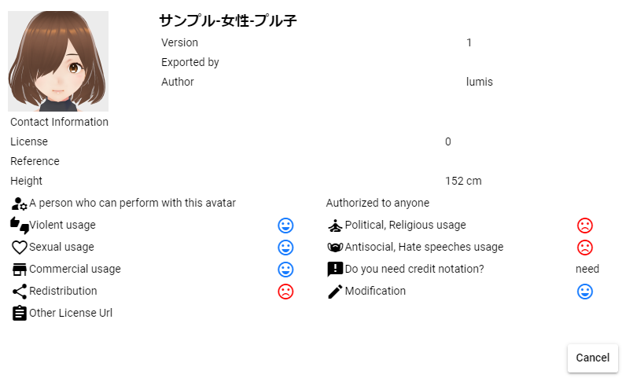
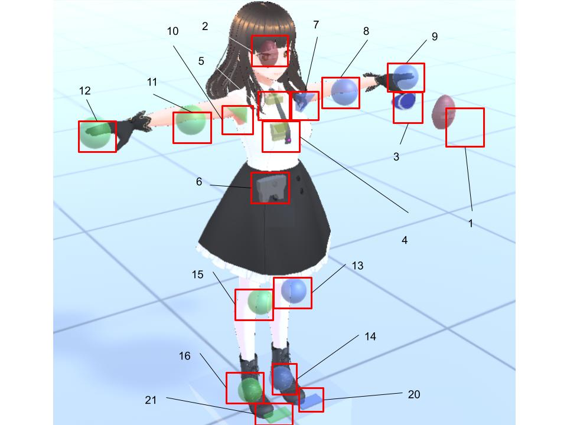

####################################
VRoid/VRM (1)
####################################

　VRoid/VRMを読み込んでポーズを取らせたり後述のアニメーションを作成して楽しめるのが本アプリのメインの特徴です。VRMファイルの読み込みから実際の操作まで、一連の操作を説明していきます。

.. caution::
    本アプリではVRM1.0製のモデルも正常に読み込むことができます。

    ただし、コンストレイントなどVRM1.0で新規実装になった機能などはまだ使用例が世に広まっていないため、確認できていません。今後のアップデートで動作確認・対応を進めます。

.. contents::

.. index:: VRMの利用条件を確認する

VRMの利用条件を確認する
^^^^^^^^^^^^^^^^^^^^^^^^^^^^^^^^^^^^^

　読み込みが進むとVRoid/VRMの利用条件確認画面が表示されます。自分以外の製作者のVRMファイルを読み込んだ場合、利用条件をよく確認し承諾できれば「OK」ボタンを押して読み込みを完了させてください。

　この後WebGL画面に目的のVRoid/VRMが表示されます。

.. note:: 
    * VRMを履歴から開いた場合、オプションによってはこの確認画面を省略することができます。
    * VRoidStudio 1.xのモデルと0.xのモデルは関節の形状や初期ポーズなどが異なります。本アプリではその差異をなるべく吸収していますが、VRoidStudio 1.xから出力した直後のモデルは次ページの11, 13のIKの初期表示が若干ずれます（動かし始めれば問題ありません）。
    * VRM 0.xのモデルとVRM1.xのモデルも関節の形状などが異なるため、初期ポーズが若干ずれます。こちらも動かし始めれば問題ありません。

|

.. index:: 
    VRMのIKマーカーについて
    IKマーカーの操作（VRMの操作）

.. _inputikasmarker:

VRMのIKマーカーについて
^^^^^^^^^^^^^^^^^^^^^^^^^^^^^^^^^^^^

　読み込んだVRoid/VRMには図のようにIKマーカーと称する半透明の図形がついています。それぞれ次の部位の動きに連動しています。また、部位ごとにIKマーカーの操作の種類や形が決まっています。

ver 2.12.0より、つま先のIKマーカーを追加しました。つま先はX軸のみの回転操作です。

|

.. |ico_aim| image:: ../img/vvmico_bn_aim.png

.. |ico_eyeviewhandle| image:: ../img/vvmico_bn_eyeviewhandle.png
.. |ico_head| image:: ../img/vvmico_bn_head.png
.. |ico_ikparent| image:: ../img/vvmico_bn_ikparent.png
.. |ico_lefthand| image:: ../img/vvmico_bn_lefthand.png
.. |ico_leftleg| image:: ../img/vvmico_bn_leftleg.png
.. |ico_leftlowerarm| image:: ../img/vvmico_bn_leftlowerarm.png
.. |ico_leftlowerleg| image:: ../img/vvmico_bn_leftlowerleg.png
.. |ico_leftshoulder| image:: ../img/vvmico_bn_leftshoulder.png
.. |ico_lookat| image:: ../img/vvmico_bn_lookat.png
.. |ico_pelvis| image:: ../img/vvmico_bn_pelvis.png
.. |ico_righthand| image:: ../img/vvmico_bn_righthand.png
.. |ico_rightleg| image:: ../img/vvmico_bn_rightleg.png
.. |ico_rightlowerarm| image:: ../img/vvmico_bn_rightlowerarm.png
.. |ico_rightlowerleg| image:: ../img/vvmico_bn_rightlowerleg.png
.. |ico_rightshoulder| image:: ../img/vvmico_bn_rightshoulder.png
.. |ico_lefttoes| image:: ../img/vvmico_bn_lefttoes.png
.. |ico_righttoes| image:: ../img/vvmico_bn_righttoes.png

.. csv-table::
    :header-rows: 1

    No, アイコン, 部位, 対応操作,                           No, アイコン, 部位, 対応操作
    1,  |ico_eyeviewhandle|, 視線（EyeViewHandle）,移動,               2, |ico_head|,  頭の左右の傾き・顎突き出し（Head）,回転
    3,  |ico_lookat|, 頭の向き（LookAt）,移動,                  4,   |ico_aim|, 上半身の向き（Aim）,回転 
    5,  |ico_chest|, 上半身・肩の左右の傾き（Chest）,回転,      6,  |ico_pelvis|, 腰の向き・傾き・移動（Pelvis）,移動・回転
    7,  |ico_leftshoulder|, 左肩（LeftShoulder）,回転,                8, |ico_leftlowerarm|, 左ひじ（LeftLowerArm）,移動
    9,  |ico_lefthand|, 左手（LeftHand）,移動・回転 ,              , , , 
    10, |ico_rightshoulder|, 右肩（RightShoulder）, 回転,              11,  |ico_rightlowerarm|, 右ひじ（RightLowerArm）,移動,
    12,  |ico_righthand|, 右手（RightHand）,移動・回転,              , , ,
    13, |ico_leftlowerleg|, 左足の方向（LeftLowerLeg）≠ひざ,移動,        14, |ico_leftleg|, 左足首（LeftLeg）,移動・回転
    15, |ico_rightlowerleg|, 右足の方向（RightLowerLeg）≠ひざ,移動,      16, |ico_rightleg|, 右足首（RightLeg）,移動・回転
    20, |ico_lefttoes|, 左足のつま先（LeftToes）, X軸の回転,            21, |ico_righttoes|, 右足のつま先（RightToes）, X軸の回転

.. index:: IKシステムの変更(VRM)

.. warning:: 
    **IKシステムの変更(ver 2.2.0)**

        Ver 2.2.0 では今後の汎用性のため、IKシステムをFinalIKからUnity本来のIKに変更しました。それによる影響は次の通りです。
        
        * Aimは移動ではなく **回転で** VRMの該当部位を操作するようになった
        * Chestも移動ではなく **回転で** VRMの該当部位を操作するようになった

        今までのポーズ・モーションファイルでこれらのIKマーカーを大きく操作していた場合はポーズ・モーションの変更が必要です。ご了承ください。

.. warning:: 
    **IKシステムの変更(ver 2.4.0)**

        実際のVRMのボーンの階層構造に準じた動きにするため、IKシステムの一部を変更しました。

        .. mermaid::

            flowchart LR

            Pelvis --> Aim --> Chest --> LeftShoulder & RightShoulder & Head

        * Pelvis を動かすと、Aim, Chest, Headも動くようになった
        * Aimを動かすとChest, Headも動くようになった
        * Chestを動かすとHeadも動くようになった

        影響
            * Aimのx/z軸の動きが逆になったため、既存のポーズ・モーションファイルのAimの回転を修正してください。
            * VR/AR空間ではIKマーカー自体は連動して動きませんが、VRMのボーンの動きとしてはその通りに維持されています。

.. note::
    * 対応していない操作をしてもその部位に動きはありません。特に体の中心部である **Head(2), Chest(5), LeftSholuder(7), RightShoulder(10), Aim(4)** は実際には遠く離れた場所に移動させても操作することができます。体の中に隠れやすい部位なので、操作しやすい位置に動かすとよいでしょう。
    * 可能な限り複雑でなく・面倒くさくなく・それでいて自在にポーズの編集をしていただくため、操作可能な部位はこれだけとなっています。そのため、操作が膨大になる FK (Forward Kinematics) には対応していません。
    * 世間的には厳密な言い方があるかもしれませんが、本アプリでは上記の各ボーン（部位）のこと＝IKマーカー（パーツ）として表記して説明していきます。
    * 13と15はひざと同じ意味ではありません。足の全体的な向きと捉えてください。
    * VR/AR対応のため、ver 2.3.0より1,2,5,6のIKマーカーの形を変更しました。（球体だと回転の状態がわかりづらくなるため）

|

各IKマーカーの操作
^^^^^^^^^^^^^^^^^^^^

　選択した各IKマーカーをクリックすると図のようになります。これが操作ハンドルです。

..  image:: ../img/operation_vrm_7.png

|

X,Y,Z軸移動
    　緑＝Y、青＝Z、赤＝X軸として、ドラッグするとその方向にIKマーカーを移動します。その移動量だけ体の該当部位も移動します。

中心の平面
    　真ん中の同じ色で四角のボックスは、その中をドラッグするとその面が示す軸ともう片方の軸のみで自由に移動させることができます。

.. index:: IKマーカーの特殊な操作（VRMの操作）

.. _specialoperation_vrm:

特殊な操作
^^^^^^^^^^^^^^^

　IKマーカーを選択した状態で次のキーを押すと特別な機能が使えます。

Ctrlキーを押しながらIKマーカーをクリック
    　IKマーカーを複数選択することができます。複数選択した状態で移動や回転を行うと複数の体の部位を同時に動かすことができます。
    　なお、操作ハンドルも当たり判定があるので、カメラをズームするなどしてIKマーカーだけを選択してください。

Xキーを押下
    グローバル座標・ローカル座標を切り替えます。デフォルトはローカル座標です。

Gキーを押下
    IKマーカーを移動のみにします。

Rキーを押下
    IKマーカーを回転のみにします。

Tキーを押下
    IKマーカーを初期状態に戻します。（移動・回転両方）

Shift + Zキーを押下
    IKマーカーによる移動・回転を元に戻します。

Shift + Yキーを押下
    IKマーカーによる移動・回転をやり直します。

|

.. index:: 移動・回転（VRMの操作）

VRoid/VRM自体の移動・回転
^^^^^^^^^^^^^^^^^^^^^^^^^^^^^^

　選択したVRoid/VRM自体を移動・回転するには、右のプロパティの「IK、全身」タブにある「移動モード」をONにします。

.. image:: ../img/operation_vrm_8.png
    :align: center

|

　すると、VRoid/VRMの足元付近をクリックするとIKマーカー全部が選択状態になります。表示されませんが実際にはここが全体のIKマーカーとなっています。

.. warning::
    ※足首と全体のIKマーカーが干渉しやすいため、移動しない場合は適時OFFに切り替えてください。

ver 2.3.0より、全体を動かすこのIKマーカーを台形で表示するようにしました。

|

.. image:: ../img/operation_vrm_9.png
    :align: center

　この状態で上下左右に移動・回転するとVRoid/VRM自体がそのとおりに動きます。これはプロパティの「共通」タブから数値で設定もできます。

VRoid/VRM自体のサイズ
^^^^^^^^^^^^^^^^^^^^^^^^^^^^^

.. image:: ../img/prop_common_1.png
    :align: center

　共通タブからはVRoid/VRMの全体の大きさも調整できますが、VRoid/VRMは読み込んだ時点のサイズが理想のサイズです。この倍率はあまり極端に変更しないことをオススメします。（IKマーカー自体のサイズまでは追随しないためIKマーカーと体の部位の位置がズレます）

|

.. index:: Tポーズに戻す（VRMの操作）

全ボーンをTポーズに戻す
^^^^^^^^^^^^^^^^^^^^^^^^^^^^^

　IKマーカーをいじりすぎて求めるポーズに戻せなくなった場合、リボンバーの **3Dモデル** タブの **全ボーンをリセット** を押すとTポーズ（デフォルトのポーズ）に戻すことが出来ます。

.. image:: ../img/operation_vrm_a.png
    :align: center

|

　また、全体の位置や回転も **位置をリセット**、**回転をリセット** で戻すことが出来ます。

.. image:: ../img/operation_vrm_b.png
    :align: center

|

.. index:: 
    入力モード（IK位置の一括変更）
    IKマーカーを数値で操作する

.. _inputikasnumber:

IKマーカーを数値で操作する
^^^^^^^^^^^^^^^^^^^^^^^^^^^^^^^^

　IKマーカーをマウスやタッチで操作するほか、実際の数値で入力して操作することもできます。目的のVRoid/VRMを選択し、右のプロパティの「**IK、全身**」タブにある「**IK位置の一括変更**」のボタンを押します。

.. image:: ../img/operation_vrm_c.png
    :align: center

|

.. |btnbonetranapply| image:: ../img/operation_vrm_l.png
.. |btnbonetranrel| image:: ../img/operation_vrm_m.png
.. |btnbonetranmirror| image:: ../img/operation_vrm_n.png

| 　専用のダイアログが表示されます。ここでスプレッドシート形式で各IKマーカーの位置や回転を直接指定することができます。目的の箇所を変更し終わったら最後に |btnbonetranapply|  **ポーズを適用** ボタンを押します。
| 　すると対象のVRoid/VRMの現在のポーズがそのとおりに変更されます。

.. image:: ../img/screen_ikmarker.png
    :align: center

|

各ボタンの機能は次のとおりです。

スプレッドシート

    ================ =================
    列名              説明
    ---------------- -----------------
    PositionX        X座標の位置
    PositionY        Y座標の位置
    PositionZ        Z座標の位置
    RotationX        X軸の回転
    RotationY        Y軸の回転
    RotationZ        Z軸の回転
    drag             IKマーカーを動かしたときの抗力
    angularDrag      IKマーカーを動かしたときの回転抗力
    ================ =================

|btnbonetranrel| 最新の状態に更新
    現在選択中のVRMのポーズ情報をスプレッドシートに反映します。基本的に選択すれば自動的に反映されますが、アプリの動作状態により情報が古いままになることがあります。その場合に使います。

|btnbonetranmirror| ポーズを反転する
    現在のポーズ情報の左右を入れ替えます。この状態で **ポーズを適用** を押せば現在のポーズが反転する結果となります。このボタンは **IK、全身** パネルにも存在します。

.. note::
    * VRM以外を選択している間はツールバー内のボタンは無効化します。
    * ここでの数値は現在のVRM固有の数値です。身長・体格差は反映されないため他のVRMで使い回す場合は手動で算出する必要があります。

|

.. index:: 簡単IKモード（IK位置の一括変更）

簡単IKモードを使う
^^^^^^^^^^^^^^^^^^^^^^^^^^^^^^^^^^^

　ver 2.13.0より導入しました。VRoid/VRMのみですが、6種類の部位から好きな動き方を選択するだけで、簡単にいろんなポーズを取らせることができる機能です。

　こちらは隣のボタンを押すとウィンドウが表示されます。

.. image:: ../img/operation_vrm_c2.png
    :align: center

|

.. |easyik_desktop| image:: ../img/screen_ikmarker_2.png
.. |easyik_mobile| image:: ../img/screen_ikmarker_3.png

.. |ico_ikeasymode| image:: ../img/prop_vrm_c2.png
.. |tool_ikapply| image:: ../img/screen_ikmarker_4a.jpg
.. |tool_ikdefault| image:: ../img/screen_ikmarker_4b.jpg
.. |tool_ikgetik| image:: ../img/screen_ikmarker_4c.jpg
.. |tool_ikclear| image:: ../img/screen_ikmarker_4d.jpg
.. |tool_ikopen| image:: ../img/screen_ikmarker_4e.jpg

.. csv-table::
    :header-rows: 1

    PC～ファブレット, スマートフォン
    |easyik_desktop|, |easyik_mobile|

　この機能でのポイントは次の要素です。

:6つの部位: 
    姿勢、視線、右腕、左腕、右足、左足の6種類の部位を使います。いずれの部位も選択しないとどのIKマーカーも変更しません。
    これらの部位にはポーズとして適用するのに順番があります。

    1. 姿勢
    2. 視線、右腕、左腕、右足、左足

    姿勢はもっとも優先される部位です。姿勢ではPelvisやAimをはじめとし、複数の上半身のIKマーカーを動かすようになっています。

    視線、両腕、両足は姿勢の動き方に加えて、さらに動くという流れになっています。

    .. hint::
        画面上ではVRMのボーンの並びとしてわかりやすいよう、視線と姿勢のコンボボックスの順序を入れ替えています。

:動き方: 6つの部位がどう動くかということです。
    
    .. note::
        ver 2.15.0より腕と足は左右にコンボボックスを分けました。

:サンプルデータ: 本アプリでは6種類の部位にいくつかの動き方を用意しています。

:Tポーズを起点にする:
    通常は現在のポーズのボーン情報を起点にしてそれぞれの動き方を適用していきます。このチェックボックスにチェックを入れると、Tポーズのボーン情報を起点にします。

    これを有効にすると各部位の動き方が全く同じになり、同一のポーズを再現しやすくなります。

操作方法
-----------------------

ポーズとして適用する
    6つの部位を組み合わせてポーズを作ります。

    1. VRMを選択します。
    2. 右のプロパティパネルから ``IK、全身`` パネルを開き、 |ico_ikeasymode| をクリックします。
    3. 姿勢、視線、両腕、両足のコンボボックスから、好きな動き方を選択します。
    4. ツールバーの左端にある ``適用`` ボタン |tool_ikapply| を押します。

    .. note::
        * 各部位の一番上の ``---`` を選ぶと何も動かしません。
        * 後述の ``位置や回転の変更値`` の計算式によっては割合で値が変わっていきます。
        * ``Tポーズを起点にする`` のチェックを外して複数回に渡って同じ動き方を適用すると、どんどんポーズが変化していくことがあります。
    
    .. hint::
        ポーズを適用した後にアプリ用ポーズとして保存すれば、後からお気に入りのポーズをすぐに使用できるでしょう。
        
デフォルトの動き方データに戻す
    ツールバーの |tool_ikdefault| ボタンを押します。設定のサンプルCSVのURLを読み込んでデータをもとに戻します。

現在のボーンの情報を再取得する
    ツールバーの |tool_ikgetik| ボタンを押します。基本的に適用後は自動的に再読込しますが、VRMを切り替えた後など、あえて手動で取得したい場合に使います。

選択を解除する
    ツールバーの |tool_ikclear| ボタンを押します。4つの部位のコンボボックスの選択をすべて解除します。

|

.. _easyikmodecsv:

.. index:: 動き方データのCSVファイル（簡単IKモード）

自分だけのデータを用意する
---------------------------------

自分のお気に入りの動き方を用意する
    CSVファイルで次の形式で用意していただくと、本アプリで読み込ませて自分だけの動き方を揃えることができます。

    下記のフォーマットでCSVファイルを用意したら、ツールバーの右端のボタン |tool_ikopen| を押してファイルを開いてください。

|

    :ファイル形式: タブ区切りのUTF-8ファイル

    :アプリのサンプルCSV: `sample_easy_posing <https://docs.google.com/spreadsheets/d/e/2PACX-1vRgPoXgJM4OC2CAWgvu2VXR-CDsKURfRevjQ8uklHWL5I9ARlZ7a9toycaNYvs4_ldh4Nd2I31m4xR_/pub?gid=0&single=true&output=tsv>`_

        ※Googleドライブから直接ダウンロードできます。
    
    .. csv-table:: csv-columns

        kind, name, lang, use_TPose, IKマーカーのラベル, ...
        0, right hand up, ja, ,0.10293, ...
    
    列名は実際は何でもかまいません。列の順番で機能が決まっています。

    .. csv-table::
        :header-rows: 1

        列番号, 意味, 説明
        1, 部位のインデックス, 0 - 姿勢 1 - 視線 2 - 左腕 3 - 左足 4 - 右腕 5 - 右足
        2, 動き方の名称, 簡単な説明を書きます。
        3, 言語, ja - 日本語 en - 英語 eo - エスペラント語。UIのロケールに応じて動き方を表示・非表示することができます。 空欄の場合はすべてのロケールで表示します。
        4, Tポーズを使う, 1 - 使う 1以外 - 使わない。ウィンドウ上の ``Tポーズを起点にする`` を強制的にONにします。 **姿勢のみ使用可能なオプションです**
        5~, 位置や回転の変更値, 5列目以降はすべてこの目的で使用します。下記を御覧ください。

    .. note::
        部位のインデックスと実際に動かすIKマーカーは紐づいていません。なので例えば、姿勢ですべてのIKマーカーを動かすようにCSVを作っても構いません。
        
        サンプルデータでは動く部位をイメージしやすいようにあえて動かすIKマーカーを限定しています。

位置や回転の変更値
    CSVに記述する際、5列目以降は各IKマーカーの位置・回転の軸別に変更値を記述してください。

    列の順番は :ref:`inputikasmarker` に記載のIKマーカーの順です。

    そしてIKマーカーごとに次の順で並びます。

    1. [IKマーカー名]_pos_x - X軸の位置
    2. [IKマーカー名]_pos_y - Y軸の位置
    3. [IKマーカー名]_pos_z - Z軸の位置
    4. [IKマーカー名]_rot_x - X軸の回転
    5. [IKマーカー名]_rot_y - Y軸の回転
    6. [IKマーカー名]_rot_z - Z軸の回転

    指定可能な値は次の内容です。

    :---: 変更しません。直前のボーンの位置・回転をそのまま使います。

    :直接の値: 0.25、-0.2934といった数値を直接指定します。回転の場合は角度です。

    :IKマーカーのラベル: 別のIKマーカーの位置や回転を変数のように参照して計算式で使用できます。

        IKマーカーの名前は :ref:`inputikasmarker` を御覧ください。次の形式でラベルを指定してください。
 
        位置 - ``[IKマーカー名]_[pos]_[軸]``

        回転 - ``[IKマーカー名]_[rot]_[軸]``

        ※軸は x, y, zのいずれかを指定します。

        **例**

        * ``Pelvis_pos_y * 1.5``
        * ``(LeftLowerArm_pos_x + LeftHand_pos_x) * 0.5``
        * ``RightHand_rot_x + 45``

    .. hint::
        IKマーカーのラベルを使用した場合、参照される値は直前のボーンの位置・回転値です。つまり下記のようになります。

        * 姿勢 - Tポーズまたは現在のポーズのボーン情報
        * 視線 - 姿勢の動き方の適用後のボーン情報
        * 腕 - 視線の動き方の適用後のボーン情報
        * 脚 - 腕の動き方の適用後のボーン情報

        もちろん、部位のコンボボックスを選択しなかった場合はその前の部位の適用後のボーン情報となります。

    .. caution::
        特定のIKマーカーは親のIKマーカーからのローカル座標のため、そのまま参照しても位置や回転が大幅に崩れる可能性があります。

        * Head, Chest, Aim, LeftShoulder, RightShoulder のX/Y/Z座標はそのまま使用しても参考になりません。それぞれの値を0.1乗算した値を使用してください。（例: ``Pelvis_pos_y + (Aim_pos_y * 0.1)`` = AimのYの位置 ）
        * Head、Chest、LeftShoulder、RightShoulderはPelvisが動くと同時に動くため、pos_x, pos_y, pos_zに値を代入しても効果はありません。

.. index:: 可動範囲の制限を調整する（VRMの操作）

可動範囲の制限を調整する
^^^^^^^^^^^^^^^^^^^^^^^^^^^^^^^^^

| 　本アプリではVRMは標準でいくつかの可動範囲の制御が適用されます。それらによりVRMが無理なく自然な人体の動きを再現できます。
| 　しかしながら本アプリのIKと競合することもあり、それが原因でポーズやアニメーションが再現しきれない仕様も備わってしまっています。人体として多少不自然でもいいから完全に自由にポージングさせたい場合、これらIKマーカーの制限を外すことができます。

足の方向（LowerLeg）、足首（Leg）のX軸の回転角度・ひじ（LowerArm）のY軸の回転角度
    * ひじ、膝から下、足首の回転の範囲が実際の人体に沿って制限がかかります。
    * 設定画面の「Modelタブ」→「VRMの体に自然な可動制御を適用する」でオン・オフが切り替わります。

足の方向（LowerLeg）を動かした後の足首（Leg）のX軸の回転
    * 足（LowerLeg）を前後に動かしたときに足首（Leg）の回転角度をLowerLegに合わせて回転させます。
    * 設定画面の「Modelタブ」→「足首の回転を自動で行う」でオン・オフが切り替わります。

|

IKマーカー同士の連動
^^^^^^^^^^^^^^^^^^^^^^^^^^^^

| 　本アプリではVRMのボーンを動かすのにIKマーカーを使いますが、特定の部位のIKマーカーを動かすと別の部位が連動して動くようになっています。
| 　基本的にはIKマーカーを操作する時だけの話です。

次の3パターンの連動
    肩付近（Chest）と腕（LowerArm）・頭（Head）
        Chestを動かした時に腕（LowerArm）・頭（Head）のX軸・Z軸を可能な限り連動して移動させます。
    Aimと肩付近（Chest）
        Aimを動かした時に肩付近（Chest）のX軸・Z軸を可能な限り連動して移動させます。
    腰（Pelvis）と足（LowerLeg）
        腰を上下したときに足（LowerLeg）がその動きに合わせて前後に若干移動
    足首（Leg）と足の方向（LowerLeg）の連動
        足首を移動させたときに足（LowerLeg）を前後に若干移動
    手（Hand）と腕（LowerArm）の連動 
        手を移動させたときに腕（肘）も追随して移動

.. hint::    
    設定画面の「Modelタブ」→「ボーンの連動」でオン・オフが切り替わります。

.. warning::
    ver 1.x の時に存在した連動の問題は ver 2.0.2で解決済みです。
    
    アニメーション再生中は自動的にオフになり、キーフレームに登録された位置・回転が反映されます。

    オフにすると連動しなくなって自由になりますが、関節が曲がってはいけない方向に曲がるなどします（アニメーション中では適切にキーフレームに登録していただければ問題ありません）。

|

.. index:: IKマーカーを別オブジェクトに切り替える（VRMの操作）

IKマーカーを別オブジェクトに切り替える
^^^^^^^^^^^^^^^^^^^^^^^^^^^^^^^^^^^^^^^^^^^^^^^^^

| 　VRMは前述の部位に従ってIKマーカーが設定されており、それを動かすとポーズが変わります。体の各部位の動きの目印となるそのIKマーカーに、別のオブジェクトを割り当てることができます。
| 　これをするとどうなるのかを説明します。

.. image:: ../img/operation_vrm_d.png
    :align: center

| 

　IKマーカーの部位を選択し、その部位に割り当てるオブジェクトを選択します。選択可能なオブジェクトは次のとおりです。

| **Self** ・・・元のIKマーカーに戻します。
| **Main Camera**・・・アプリのメインカメラ
| **各VRM、OtherObject、Light、Camera、Image、Effect**・・・他の3Dオブジェクト

.. note::
    | ※部位にHead、LeftShoulder、RightShoulderは選択できません。
    | ※なお、自分自身や2Dオブジェクト、SystemEffectやAudio、Stageには割り当てられません。

.. caution::
    割り当てているオブジェクトを削除した場合、各VRMのIKは自動的にデフォルトに戻ります。

| 

**VRM AとVRM B、そしてエフェクトオブジェクトを使った場合**

.. image:: ../img/operation_vrm_e.png
    :align: center

|

　この状態でエフェクトオブジェクトを動かすと、キャラAとBがその方向に振り向き視線を合わせるようになります。

　この設定と状態をアニメーションに反映することも可能です。アニメーションプロジェクトに登録するのは次の内容となります。

.. csv-table::
    :header-rows: 1
    :align: center

    オブジェクト, 登録する操作
    VRM, IKマーカーの割り当て
    割り当てられたオブジェクト, 実際の移動や回転など

|

