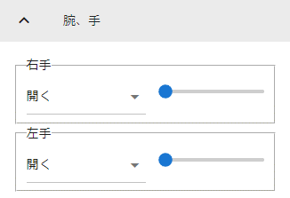
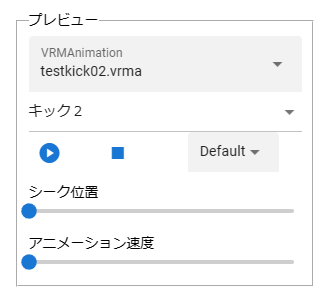

####################################
VRoid/VRM (2)
####################################

情報が多くなってきたのでページを分割しました。

.. contents::

.. index:: 手と足首の自然な回転（VRMの操作）

手と足首の自然な回転
------------------------

ver 2.10.0より追加しました。

今までは上腕やすねを動かすと手や足首を後から回転させないといけませんでした。このプロパティを有効にしてから動かすと、手や足首を人体として自然な向きのまま動かすことができます。

両手・両足を個別に有効にできます

.. image:: ../img/prop_vrm_b.png
        :align: center

具体的な例は次の図です。

.. image:: ../img/prop_vrm_b2.png
    :align: center

|

ただし、細かな回転を加えるにはチェックを外す必要があります。

**プロパティのチェックを外すと、手や足首の回転角度がIKマーカーに反映されます。**

.. hint::
    腕やすねを動かした後に手や足首を回転させるのが面倒な場合、このプロパティのチェックを入れると自動的に自然な向きに変わります。その後でチェックを外して細かい回転を加えると便利でしょう。

|

.. index:: 手のポーズの操作（VRMの操作）

手のポーズの操作
--------------------

　手のひらを操作するには右のプロパティから「腕・手」タブを開き、左右の手を好きなポーズを選んでください。

　スライダーでポーズの度合いを調整出来ます。手のポーズは今後のアップデートで増やす予定です。

Ver 1.0.0 時点：
    * 通常
    * 開く
    * グー
    * 指差し
    * Vサイン
    * サムズアップ
    * 握る
  
Ver 1.0.4から次に対応しました。
    * 手動操作

.. image:: ../img/prop_vrm_8.png
    :align: center

|

.. |imgfinger1| image:: ../img/prop_vrm_9a.png
.. |imgfinger2| image:: ../img/prop_vrm_9b.png
.. |imgfinger3| image:: ../img/prop_vrm_9c.png

|imgfinger1| **親指～小指の関節**
    それぞれのスライダーで指の関節を回転します。上は第1関節～第2関節、下は第3関節です。

|imgfinger2| **指自体の操作（指と指の間、指の軸回転）**
    | 赤のスライダーは、指の間の開き具合をスライダーで調整します。
    | 緑のスライダーは、指の軸を中心として回転します。（実際の人間としてはできませんが、3Dモデルではしばしば必要な回転操作です）

|imgfinger3| **親指の付け根**
    親指の付け根の回転を円形のスライダーで調整できます。左は親指と手のひらの遠近の距離を、右は主に左右の回転を表します。

|

|

.. index:: ブレンドシェイプ（VRMの操作）

.. _blendshape_vrm:

ブレンドシェイプ
---------------------

　わかりやすく言うとVRoid/VRMの表情等を切り替えることができます。右のプロパティの「ブレンドシェイプ」タブを開き、好きなブレンドシェイプをスライダーで値を入力して調整してください。

..
    　ブレンドシェイプには ``汎用`` と ``専用`` の2種類があります。UnityやBlenderに詳しい方向けの説明ですと、SkinnedMeshRendererが ``汎用`` 、VRMBlendShapeProxyが ``専用`` と本アプリでは分類分けしています（VRM 1.xでは Vrm10RuntimeExpression(単にExpressionとも) といいます）。

.. image:: ../img/prop_vrm_4.png
    :align: center

|

* ブレンドシェイプはVRMファイルごとに決まっており、キャラクターによって操作できる数に増減があります。
* 各シェイプキーの横のスライダーを0～100までの間で動かしてください。

.. note::
    ver 2.3.0より、チェックボックスをONにした場合のみキーフレームに登録されるように変更しました。スライダーを動かすと自動的にチェックボックスにチェックが入るようになっています。

    もし登録を望まないシェイプの場合はチェックを外せばそのシェイプの値は保存されません。

    これにより、モーションやプロジェクトに保存されるブレンドシェイプも本当に変更したものだけになり、ファイルサイズの削減を実現しました。

Search（検索ボックス）
    ブレンドシェイプ名でインクリメンタルサーチできます。空欄の場合はすべてのブレンドシェイプが表示されます。

.. index:: ブレンドシェイプの注意点

専用のブレンドシェイプと共通のブレンドシェイプ
    :専用: 各VRM独自のシェイプです。こちらにあるシェイプを後述のモーションやポーズファイルにして別のVRMに適用しても、再現されない可能性があります。

    :共通: VRM1.0モデル、VRM0.xからのマイグレーションモデルにかぎらずすべてに共通のシェイプです。こちらにあるシェイプはモーションやポーズファイルに入れれば他のVRMでも再現されます。

    　VRM1.x対応により、名称を変更しました。

    　VRM 1.0の仕様により、SkinnedMeshRendererのブレンドシェイプの挙動に影響があり、本アプリでもSkinnedMeshRendererを利用していた ``汎用`` の一部のシェイプが機能しなくなりました。本アプリでは互換性を維持して使用可能になっていますが、混乱を招きかねないため、次のように名称を変更しました。

    .. csv-table::
        :align: center

        本アプリのバージョン, SkinnedMeshRendererのシェイプ, Expressionのシェイプ
        Ver 2.0, 専用, 共通
        Ver 1.x, 汎用, 専用

    .. caution::
        ``専用`` が **これまでとは逆になって** いますのでご注意ください。
    
    .. note::
        * もともとのExpressionはすべてのVRMで共通のシェイプが最低限備わっているだけです。
        * 他所様のアプリではExpressionとしての数は少ない可能性がありますが、本来はそちらが標準の状態です。本アプリは互換性重視のため、 **独自の改良ですべてのブレンドシェイプをExpressionとして使える** ようにしてあります。

    

自動まばたき
^^^^^^^^^^^^^^^^^^

　自動まばたきは指定のタイミングでVRMにまばたきをさせ続けます。

.. image:: ../img/prop_vrm_3.png
    :align: center

|

　アニメーションのキーフレームとは別に動き続けるため、ブレンドシェイプで目の開閉を一からキーフレームに組み込む必要がありません。

まばたきの間隔・まぶたを開ける秒数・閉じる秒数・閉じている秒数
    それぞれを指定することで目の動きだけでも表情を感じさせることができます。

　デフォルトではオンです。不要な場合は「自動まばたきを有効」のチェックを外してオフにしてください。

.. caution::
    目のブレンドシェイプと競合します。使う際はどちらか一方にすることをオススメします。

口パク
^^^^^^^^^^^^^^

　VRoid/VRMがあたかもしゃべっているかのように口をずっと動かし続けます。

　アニメーションのキーフレームとは別に動き続けるため、ブレンドシェイプで口の開閉を一からキーフレームに組み込む必要がありません。

.. image:: ../img/prop_vrm_a.png
    :align: center

:口を開ける速度:
    口が ``aa`` の0.0から0.5に変わる速さを指定します。
:口を閉じる速度:
    口が ``aa`` の0.5から0.0に変わる速さを指定します。
:口パクの間隔:
    口の開閉が一巡した後、再び動き出すまでの時間を指定します。多ければ多いほど間隔が伸びて口を動かす頻度が減ります。

　デフォルトではオフです。使い方としては有効にした後、次のフレームで数秒後に無効にしてキャラクターが喋っている演出をするのに適しています。

.. hint::
    この機能により ``aa`` が変化している間も、個別に ``aa`` や他のシェイプを動かすことができます。

.. caution::
    この機能はユーザーの喋りに合わせてVRoid/VRMが口を動かすものではありません。あくまでもVRoid/VRMが喋っているように見せかけるための補助的な機能です。

|

.. index:: オブジェクトの装着（VRMの操作）

オブジェクトの装着
----------------------

　VRoid/VRMの特定の体の部位にFBXやObj・Lightなど別のオブジェクトを紐付け、動きを連動させることができます。右のプロパティの「オブジェクトの装着」タブを開いてください。

.. image:: ../img/operation_vrm_f.png
    :align: center

|

1. あらかじめ別のオブジェクトを追加しておきます。

.. image:: ../img/operation_vrm_g.png
    :align: center

|

.. note::
    ※位置や回転は紐付けたい体の部位に合わせて調整しておきます。

2. VRoid/VRMを選択し、対象の体の部位を選択し、追加ボタンをクリックします。

.. image:: ../img/operation_vrm_h.png
    :align: center

3. 紐付けたいオブジェクトを選択し、「OK」ボタンを押します。

.. image:: ../img/operation_vrm_i.png
    :align: center

|

　装着可能なオブジェクトは次のとおりです。

.. csv-table::
    :header-rows: 1
    :align: center

    オブジェクトの種類
    FBX・Objなど3Dオブジェクト
    Image
    Light
    Camera
    Effect

4. 装着したオブジェクトの情報が表示されるようになります。

.. image:: ../img/operation_vrm_j.png
    :align: center

| 　以後、体の部位に合わせて装着したオブジェクトも連動して動くようになります。
| 　右端の削除ボタンで装着を解除できます。

.. caution::
    | ※装着されたオブジェクトの扱い
    | 　VRMが装着したオブジェクトは、アニメーションにおいては位置や回転などの変形操作をキーフレームに登録することはできなくなります。一覧で選択してもIKマーカーは表示されません。
    | 　各種プロパティは装着前に設定しておくようにしてください。

.. admonition:: アニメーションプロジェクトでのオブジェクトの装着について
    
    | 　このオブジェクトの装着は仕組みが入り組んでいるため、アニメーションにおいては使用と準備には注意してください。オブジェクトの装着と解除は **目的とするモーションの開始・終了とは別にする** 必要があります。
    | 　次の順序でキーフレームに登録するとよいでしょう。

    例:
        VRMの右手に剣の3Dオブジェクトを装着する
    
    .. csv-table::
        :header-rows: 1

        フレーム, VRM, その他オブジェクト
        1, 右手を所定の位置に動かす, 剣を所定の位置に動かす
        2, 右手に対して剣のオブジェクトを **装着する** , このときの位置・回転のままキーフレームに登録
        ～, ,なし
        9, 右手を動かし終える, なし
        10, 右手に装着した剣を **解除する** , このときの位置・回転のままキーフレームに登録

    * 2～10フレームの間はその他オブジェクトのプロパティを変更することはできません。
    * アニメーションにおけるポイントは、開始時点と終了時点で装着の状態が同じ状態になっていることです。例えば1フレーム目で装着なし、10フレーム目で装着ありのまま、フレーム操作をしたり再び再生ボタンを押すと、オブジェクトの位置が次第にズレていくことがあります。

|

重力の設定
--------------------

| 　VRoid/VRMが持つボーンには重力の設定が標準で備わっています。ボーンは通常はゲームやモーションなどの演出時にUnity標準の衝突判定の機能によって自動的に動きます。

　本アプリでもVRoid/VRMが動いた時に髪の毛がなびいたりしますが、それを手動で細かく調整することができます。

　本アプリのみの効果となりますが、例えばスカートがめくれすぎる現象をこの重力の設定によって修正することができます。

.. warning::
    後述のStageの風の効果と設定が競合します。風を使用する場合はこの機能を使わないでください。

.. image:: ../img/screen_gravity.png
    :align: center

|

　操作中のVRMが持つボーンの重力設定の情報がスプレッドシート上に羅列されます。ここで表示されるボーンは次のものです。

* VRM自体が持つ（VRoidStudioでの作成中にすでに保持している）ボーン
* Unityエディタや拙作VRMOneEditorなどのツールでVRMに後付けした3Dモデルが保持しているボーン

　なお、一度UniVRMにて変換を経ているはずなので、ボーンの情報としては ``VRMSpringBone`` コンポーネントに依存しています。

　何がどのボーンに実際に位置するのかはVRoidStudioやUnity上であらかじめ確認しておいてください。変更可能なセルは次のセルです。

.. csv-table::

    **Power**, そのボーンにかかる重力の直接的な強さ(0 ～ 1)
    **Direction X / Y / Z**, そのボーンにかかる重力の方向の強さ(-1 ～ 1)

.. note::
    * 各Directionの -1 は負の向きです。例えばY軸なら下に向かうようになります。(1 だと上に向かいます)
    * 重力によるボーンのなびき具合は　``Power * Direction`` で反映されます。
    * 最新の情報を読み直すにはツールバーの読み込みボタンを押してください。

テクスチャ
----------------

　VRMが保持しているテクスチャを細かく設定変更することができます。なお、OtherObjectのほうの設定と使用方法は全く同じです。

　詳しくは :doc:`operation_texture` を御覧ください。

.. index:: VRMAnimationの再生（VRMの操作）

.. _vrma_load:

VRMAnimationの再生
------------------------

OtherObjectのアニメーションと同様に、VRMAnimationも本アプリによるアニメーションプロジェクトの中で再生をコントロールできます。FBXなどと異なるのは、VRMAnimationはVRMとは全く別のため、同じモーションを複数のVRMで使い回すこともできるという点です。

.. |anireg| image:: ../img/operation_oobj_3.png

.. csv-table::

    プレビュー再生, アニメーション登録用
    |preview|, |anireg|
    即座に再生されます。こちらの操作はキーフレームには登録されません。, 「再生」や「停止」を選択後にキーフレームに登録します。

1. リボンバーの ``3Dモデル`` タブの Pose/Motionの ``開く`` からVRMAnimationを開きます。
2. 本プロパティパネルの一番上のコンボボックスからVRMAnimationを選択します。
3. 再生したいアニメーションクリップを二番目のコンボボックスから選択します。
4. 必要に応じて再生モード・アニメーション速度などを調整します。 
5. 再生して確認します。
6. よければアニメーションの状態（登録用）で再生状態を選び、キーフレームの登録をします。

コントロールの配置について:
    .. csv-table::
        
        モーションファイル名のコンボボックス
        アニメーションクリップのコンボボックス
        再生, 停止, 再生モード選択ボックス
        シーク位置スライダー,,
        スピードスライダー,,
        アニメーションの状態,,

本アプリとVRMAnimationの回転:
    本アプリとVRMAnimationのVRM自体の回転の向きはZ方向が異なります。本アプリではVRMは Zのマイナス方向を向くのがデフォルトです。対してVRMAnimationは各アニメーションに依存します。

    なるべく向きの差異を吸収するため、本アプリではVRMAnimationを選択した直後だけ、Zの方向を逆転させています。

VRMAnimationを閉じる:
    本当に閉じる場合はプロジェクトの設定画面から対象のファイルを選択して削除してください。

.. index:: VRMAnimation中のIK操作について（VRMの操作）

.. admonition:: IK操作について

    VRMAnimationが有効の間は、IKマーカーで操作することはできません。
    
    VRMAnimationを一時的に無効にするには、 モーションファイル名のコンボボックスから ``---`` を選択します。するとVRMAnimationの選択を解除することができます。

    再びIKマーカーを操作してVRMを自由に動かせるようになります。

.. note::
    * VRMAnimation内に複数のモーションが存在する場合、選択してください。
    * キーフレームに3Dオブジェクトのアニメーションデータが展開・表示されるわけではなく、あくまで再生・一時停止・停止・シークという状態がキーフレームに登録されるのみです。

.. hint::
    再生や停止ではなく、再生位置変更でシーク位置を変えることだけをキーフレームに登録していっても、そのオブジェクトのアニメーション再生を自由に行なえます。

    モーションのシーク位置を変更するには、次の操作を行ってください。

    1. シーク位置スライダーを動かす
    2. アニメーションの状態 を ``再生位置変更`` にする
    3. キーフレームに登録する

    
    例：
        あるVRMAnimationをVRM Aに読み込んだ

        .. csv-table::

            フレーム番号, アニメーションの状態（登録用）, シーク位置
            1, 再生位置変更, 0.855秒
            2, 再生位置変更, 0.124秒
            
        * 間隔(duration)は1秒。
        * このVRM Aは逆再生のようにアニメーションする。
