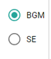
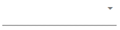
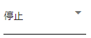
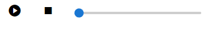
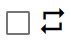
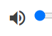
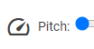

.. index:: Audio（プロパティ）

####################################
Audio
####################################

.. image:: ../img/screen_ribbon_audio.png

|

　Audioのプロパティです。これはリボンバーのオーディオタブにあります。

操作するオーディオの種類を切り替えます。

|
|
|

.. image:: ../img/prop_audio_2.png
    :align: left

使用したいオーディオファイルを読み込みます。
読み込んだオーディオを削除します。

|
|
|

読み込んだオーディオを操作する対象にします。

|
|
|

キーフレーム登録用にオーディオの状態を選択します。

|
|
|

プレビュー用に再生・停止・シークします。

.. warning::
    SEの場合はシークできません。

|
|
|

ループ再生を切り替えます。

|
|
|

音量を変更します。

|
|
|

オーディオのピッチを変更します。

