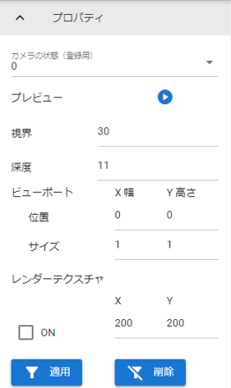
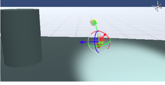
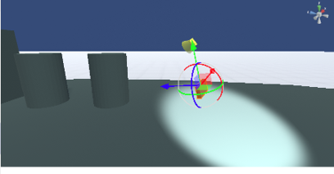
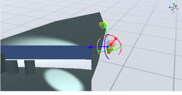

.. index:: Camera（プロパティ）

####################################
Camera
####################################

|

　メインカメラとは別のカメラオブジェクトの設定です。これをサブカメラと称します。

:カメラの状態（登録用）:
  サブカメラを投影するか否かを選びます。
:プレビュー:
  サブカメラの映像を表示します。表示中はメインカメラの映像は下に隠れます。
:視界:
  カメラの視界を広げたり狭くします。Unityでは有効視野（FOV）です。
:深度:
  カメラの表示の優先度です。わかりやすく示すとCSSのz-indexの効果が近いイメージです。
:ビューポート:
  WebGL画面におけるカメラの映像の表示範囲を指定します。
:レンダーテクスチャ:
  OtherObjectと組み合わせて使います。カメラの映像を別オブジェクトに投影するために使います。
  
  :X, Y:
    カメラから投影される映像のサイズ
  :ON/OFF:
    レンダーテクスチャを有効にします。

|

.. list-table::
    :header-rows: 1

    * - 視界＝30
      - 視界＝60
    * - |shikai30|
      - |shikai60|

.. list-table::
    :header-rows: 1

    * - ビューポート＝0, 0, 1, 1
      - ビューポート＝0, 0, 0.5, 0.5
    * - |vp0011|
      - |vp0055|

