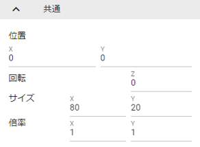

.. index:: プロパティ（共通）

####################################
共通
####################################

.. contents::

.. index:: 
    プロパティ（3Dモデル）
    360度回転（3Dモデル）
    比率を固定（3Dモデル）

共通（3Dモデル）
--------------------

　3Dモデルに共通して使用可能な変形のプロパティです。

.. image:: ../img/prop_common_1.png
    :align: center

|

:位置:
    X座標、Y座標、Z座標をそれぞれ設定します。
:回転:
    X座標、Y座標、Z座標をそれぞれ設定します。 ``360度回転を考慮`` をONにするとその回転角度になる際に可能な限り一回転しようとします。
:倍率:
    全座標合わせた倍率を設定します。 ``比率を固定`` をONにするとX/Y/Z座標を固定して1つのみの入力で済ませることができます。

.. note::
    倍率は、Stageの場合はX/Z座標のみです。それ以外の3Dモデル・オブジェクトはX/Y/Z座標です。

.. index:: ジャンプ（共通プロパティ）

ジャンプ（共通）
^^^^^^^^^^^^^^^^^^
:回数:
    ジャンプする回数を指定します。
:強さ:
    強さ（現在のY軸にプラスされる分）を設定します。

.. warning::
    アニメーションプロジェクトにて、キーフレームの間隔があまりに短いと一瞬すぎてジャンプしていないように見えることがあります。

|

.. index:: 直線的な揺れ（共通プロパティ）

直線的な揺れ（共通）
^^^^^^^^^^^^^^^^^^^^^^^^

　3Dモデルに共通して使用可能な直線的な揺れのアニメーション効果の設定です。

|

:On:
    有効にします。
:Position, Rotation, Scale:
    揺れの種類です。
:X, Y, Z:
    揺れる方向を指定します。
:振動量:
    揺れる回数を指定します。
:弾性:
    揺れた際の跳ね返りの範囲の上限を指定します。

|

.. index:: ランダムな揺れ（共通プロパティ）

ランダムな揺れ（共通）
^^^^^^^^^^^^^^^^^^^^^^^^^^

　3Dモデルに共通して使用可能なランダムな揺れのアニメーション効果の設定です。

.. image:: ../img/prop_common_4.png
    :align: center

|

:On:
    有効にします
:Position, Rotation, Scale:
    揺れの種類です
:強さ:
    揺れる強さを指定します
:振動量:
    揺れる回数を指定します
:ランダム性:
    揺れのランダム具合を指定します
:フェードアウト:
    揺れが終わるときに弱まっていくようにします。（オフの場合はピタっと終わります）

|

.. warning::
    | ジャンプ・直線的な揺れ・ランダムな揺れは後述のアニメーションにおいて、連続したフレームでは正常に動作しません。（利用しているライブラリの仕様のため）
    | どうしても連続して使いたい場合、必ずそれらの動きをしない操作のフレームを間に挿入してください。

|

.. index:: プロパティ（2Dモデル）

共通（2Dモデル）
------------------------

　2Dモデルに共通して使用可能な変形のプロパティです。

|

:位置:
    X座標、Y座標をそれぞれ **パーセント値** で設定します。そのため、画面サイズが変わると位置が若干ずれる可能性があります。
:回転:
    Z座標のみの回転の角度を設定します。
:サイズ:
    直接の描画領域としてX座標、Y座標をそれぞれ設定します。
:倍率:
    X座標、Y座標の倍率をそれぞれ設定します。サイズとは異なり、こちらは拡大縮小が伴います。

