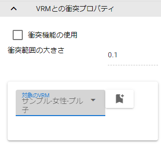

.. index:: Effect（プロパティ）

####################################
Effect
####################################

.. contents::

メインのプロパティ
---------------------

.. image:: ../img/prop_effect_1.png
    :align: center

|

　アニメーションする特殊な画面効果、エフェクトに関する設定です。

:ジャンル:
    エフェクトのジャンルを選びます。（下記を参照）
:エフェクト:
    選択したジャンルのエフェクトを選びます。
:プレビュー:
    エフェクトのプレビューを再生・一時停止、停止します。プレビューのためアニメーションプロジェクトには反映されません。
:ループ:
    エフェクトをずっと再生します。
:エフェクトの状態（登録用）:
    エフェクトの再生状態をアニメーションプロジェクトに登録します。

.. csv-table::

    Explosion, 爆発系のエフェクト
    Smoke,     煙・モヤ系のエフェクト
    Water,     水に関するエフェクト
    Action,    その他エフェクト

|

.. index:: VRMとの衝突プロパティ（プロパティ）

VRMとの衝突プロパティ
--------------------------

|

　衝突機能を利用するエフェクトのプロパティです。

:衝突機能の使用:
    このエフェクトオブジェクトの衝突を有効にします。
:衝突範囲の大きさ:
    衝突の範囲を数値で指定します。画面上の球体のプレビューの大きさも変わります。
:対象のVRM:
    衝突の対象とするVRMを選択するコンボボックスです。
:決定ボタン:
    選んだVRMを決定します。
:VRM一覧:
    このエフェクトオブジェクトの衝突の対象にしているVRMの一覧です。右端の削除ボタンで対象から外すことができます。

