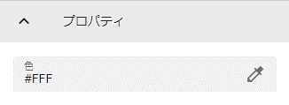

.. index:: Image（プロパティ）

####################################
Image
####################################

|

　3Dオブジェクトとして読み込んだ画像や写真を設定します。

:色:
    画像（テクスチャ）のベースの色を変更します。

**テクスチャタブ**

　OtherObjectと同様です。
