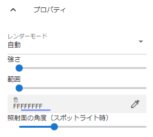
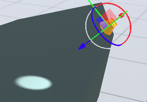
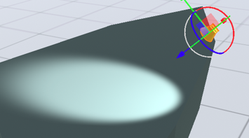

.. index:: Light（プロパティ）

####################################
Light
####################################

|

:レンダーモード:
  該当のライトオブジェクトを優先して表示するか否かです。「自動」が1つ以上あるとUnityの仕様上、光が干渉して正しく表示されないので、適切に「重要」を一つは使ってください。
:強さ:
  光の強さです。
:範囲:
  光が届く範囲を指定します。スポットライト時は距離となります。
:色:
  光の色です。
:照射面の角度（スポットライト時）:
  スポットライトのみ有効です。照射の角度を切り替えます。これは光が照らす範囲を示します。実際の効果は下図のとおりです。

.. list-table::
    :header-rows: 1

    * - 照射面の角度＝16度
      - 照射面の角度＝56度
    * - |sho16|
      - |sho56|

:フレアタイプ:
    光のフレアの種類を ``なし`` ``50mmZoom`` ``FlareSmall`` ``Sun`` から選びます。
:フレアカラー:
    フレアの色を指定します。
:フレアの明るさ:
    フレアの明るさを指定します。
:フレアフェードスピード:
    フレアが出現・消滅するスピードを指定します。