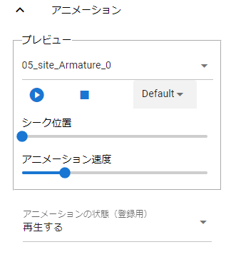

.. index:: OtherObject（プロパティ）

####################################
OtherObject
####################################

.. index:: テクスチャ（OtherObjectのプロパティ）

テクスチャ
--------------------

.. image:: ../img/prop_obj_1.png
    :scale: 100%
    :align: center

|

　OtherObjecに関する設定のうち、テクスチャに関するプロパティです。オブジェクトにテクスチャが複数存在した場合はコンボボックスから選ぶことができます。検出できるテクスチャの数はFBXやOBJなどによって異なります。

**シェーダー**・・・Unity標準のStandard、VRM標準のVRM/MToonのいずれかにシェーダーを切り替えます。

以下のシェーダーの設定を変更できます。詳しくはUnityのヘルプ等でご確認ください。

::

    色、ブレンドモード、カリングモード
    メタリック、光沢、発光色（Emission Color）、シェードの色（Shade Color）
    Shading Toony、 Rim Color、Rim fresnel power
    メインのテクスチャ

|

.. index:: アニメーション（OtherObjectのプロパティ）

アニメーション
--------------------

|

　アニメーションが設定されたFBXの場合、プレビュー再生やアニメーションプロジェクト用に登録できます。

| **プレビュー**・・・アニメーションが設定されている場合、再生・停止します。ここでの再生はあくまでプレビューです。
| **シーク位置**・・・アニメーションの再生位置を切り替えます。アニメーションプロジェクトに反映されます。
| **アニメーションの状態（登録用）**・・・アニメーションプロジェクトに再生状態を登録します。コンボボックスから次のいずれかを選びます。

.. list-table::
    :header-rows: 1

    * - 設定
      - 説明
    * - 再生
      - オブジェクトのアニメーションを再生または一時停止します。（該当のフレームになった場合、必ずいずれかの操作が行われます）
    * - 再生中
      - オブジェクトのアニメーションを再生中とし、再生状態を継続します。（つまり何も変更しません）
    * - 停止
      - オブジェクトのアニメーションを停止します。（該当のフレームになった場合、必ず停止操作が行われます）

.. note::
  ※他のプロパティでも同じ用語で使われます。その場合はそこでも同じ効果です。

