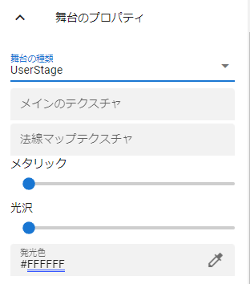
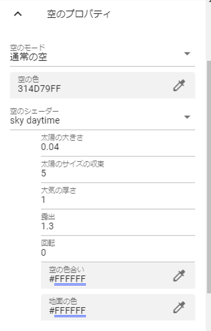
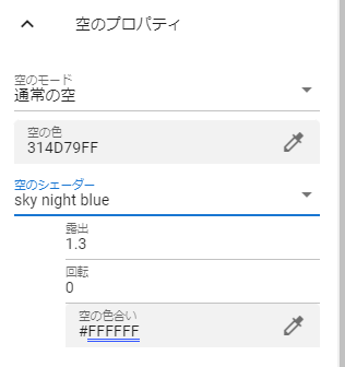
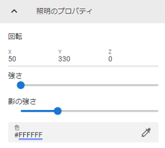
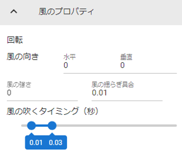

.. index:: Stage（プロパティ）

####################################
Stage
####################################

.. contents::

メインのプロパティ
------------------------

|

　Stageのメインのプロパティです。

| 舞台の種類色・・床のテクスチャを切り替えます。

.. csv-table::

    Default,    グリッドで表されるデフォルトの床です。
    BasicSeaLevel, 細かく調整可能な汎用的な水面です。水面はアニメーションします。不透明度が反映されます。
    DayTimeWaterStage, 水面です。日中の水面を表しており水面はアニメーションします。
    NighttimeWaterStage,   水面です。夜の水面を表しており水面はアニメーションします。
    DryGround,  乾燥地帯のような地面です。
    Desert,     砂漠の砂地です。
    Field1～4,  その他一般的な地形のような地面です。
    User,       テクスチャを指定できるなど、ユーザーがカスタマイズできる床です。

以下はUser stageのみ
    :メインのテクスチャ:
        テクスチャファイル
    :法線マップテクスチャ:
        法線マップのファイル
    :色:
        テクスチャのベースの色
    :ブレンドモード:
        シェーダのMode
    :メタリック:
        シェーダのMetallic
    :光沢:
        シェーダのGlossiness
    :発光色:
        シェーダのEmission Color

BasicSeaLevel、DayTimeWaterStage、NighttimeWaterStageについて
    設定オプションが多岐にわたるものがあります。詳しくはUnityのドキュメントを御覧ください。

    `<https://docs.unity3d.com/ja/2019.1/Manual/HOWTO-Water.html>`_

|

.. index:: 
    空（Stageのプロパティ）
    太陽

空のプロパティ
-------------------

　空に関する設定です。単色、太陽付き、夜間を細かく設定できます。

.. csv-table::

    "sky daytimeの場合", "sky night blue, sky night purpleの場合"
    |skydaytime|, |skynight|

:空のモード:
    ``単色`` 、 ``通常の空`` のどちらかを指定します。 ``通常の空`` にすると太陽が表示されるようになります。
:空の色:
    空の色を変更します。
:空のシェーダ:
    ``通常の空`` の場合に ``sky daitime``, ``sky night blue``, ``sky night purple`` のいずれかから選びます。また、選択によって設定が切り替わります。

詳しくはUnityのドキュメントをご覧ください。

`<https://docs.unity3d.com/ja/2019.4/Manual/shader-skybox-procedural.html>`_

.. hint::
    ``通常の空`` にして太陽が表示されたら、照明の回転をすることにより太陽を動かすことができます。

|

.. index:: 
    照明（Stageのプロパティ）
    オブジェクトの影（Stageのプロパティ）
    ハロー
    フレア

照明のプロパティ
-------------------

　照明（Directional light）の設定です。Lightとは異なりシステム的なライトということで、Stageのプロパティ扱いです。

:回転:
    光が照射される角度を指定します。この回転は操作ハンドルで行ったほうが楽です。
:強さ:
    光の強さを設定します。
:影の強さ:
    オブジェクトの影の濃さを設定します。

    .. hint::
        照明やLightオブジェクトの回転で影の向かう先を変化させることができます。

:色:
    光の色さを設定します。
:ハロー:
    円光の効果の基本値を調整します。

    .. warning::
        Stageの照明にはハローは効果がありません。

    .. note::
        このハローの設定は、すべてのLightオブジェクトに影響します。
        実際のハローの効果については、Lightオブジェクト側の色や強さ・範囲によって合わせて変化させることができます。

:フレアタイプ:
    光のフレアの種類を ``なし`` ``50mmZoom`` ``FlareSmall`` ``Sun`` から選びます。
:フレアカラー:
    フレアの色を指定します。
:フレアの明るさ:
    フレアの明るさを指定します。
:フレアフェードスピード:
    フレアが出現・消滅するスピードを指定します。

|

.. index:: 風（Stageのプロパティ）

風のプロパティ
--------------------

　風（WindZone）の設定です。

:風の向き:
    風の向きです。水平（X・Z方向）、垂直（Y方向）を0～360度指定します。
:風の強さ:
    VRMなどにかかる風の強さを指定します。0の場合はオフとなります。
:風の揺らぎ具合:
    風の強さにランダムにかかる副次的な強さです。
:風の吹くタイミング:
    風をこの範囲で指定した秒の範囲の間隔で吹かせます。
