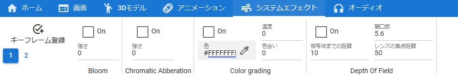
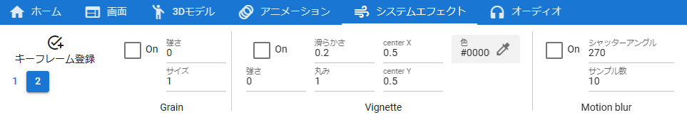
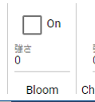
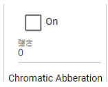
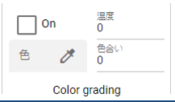
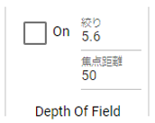
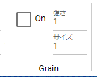
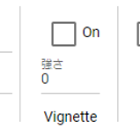
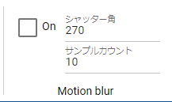

.. index:: SystemEffect（プロパティ）

####################################
SystemEffect
####################################

.. csv-table::

    |syseff1|
    |syseff2|

|

　SystemEffectのプロパティです。これはリボンバーのシステムエフェクトタブにあります。図の値がデフォルト値です。

.. index:: Bloom（SystemEffectのプロパティ）

Bloomのプロパティです。

:強さ:
    0～100の間で指定します。

|
|
|

.. index:: Chromatic Abberation（SystemEffectのプロパティ）

Chromatic Abberationのプロパティです。

:強さ:
    0～1の間で0.1刻みで指定します。

|
|
|

.. index:: Color grading（SystemEffectのプロパティ）

Color gradingのプロパティです。

:色:
    ベースの色を指定します。
:温度:
    -100～100の間で指定します。
:色合い:
    -100～100の間で指定します。

|
|
|

.. index:: Depth Of Field（SystemEffectのプロパティ）

Depth Of Fieldのプロパティです。

:被写体までの距離 (Focus Distance):
    0.1～50の間で0.05刻みで指定します。Depth Of Fieldのフォーカスの直接的な距離となります。
:絞り:
    0.1～32の間で0.1刻みで指定します。
:レンズの焦点距離 (Focal Length):
    1～50の間で指定します。

|
|
|

.. index:: Grain（SystemEffectのプロパティ）

Grainのプロパティです。

:強さ:
    0～1の間で0.1刻みで指定します。
:サイズ:
    0.3～3の間で0.1刻みで指定します。

|
|
|

.. index:: Vignette（SystemEffectのプロパティ）

Vignetteのプロパティです。

:強さ:
    0～1の間で0.1刻みで指定します。
:滑らかさ:
    0.1～1の間で0.01刻みで指定します。Vignetteの効果のかかる縁にアンチエイリアスをかけるかくっきりさせるかを調整します。
:丸み:
    0～1の間で0.01刻みで指定します。Vignetteの効果を円形から四角形に調整します。
:center X:
    -3～5の間で0.01刻みで指定します。Vignetteの効果の中心位置のX座標を調整します。
:center Y:
    -3～5の間で0.01刻みで指定します。Vignetteの効果の中心位置のY座標を調整します。

|
|
|

.. index:: Motion blur（SystemEffectのプロパティ）

Motion blurのプロパティです。

:シャッター角:
    0～100の間で指定します。
:サンプルカウント:
    4～32の間で指定します。

