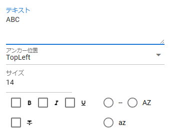
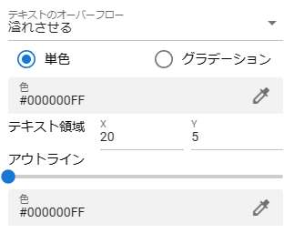

.. index:: 
    Text（プロパティ）
    Text3D（プロパティ）

####################################
Text / Text3D
####################################

.. csv-table::

    |text1|, |text2|

|

　ver 2.4.0より、3Dとしてのテキストにも対応しました。WebGL画面に表示する3D/2Dのテキストを設定します。

どちらもプロパティの内容は同じです。

:テキスト:
    表示する文字列を入力します。
:アンカー位置:
    移動や文字列描画の際の基準となる角を指定します。
:フォントサイズ:
    文字列のフォントサイズを指定します。
:装飾:
    文字列の装飾を指定します。

    左のチェックボックス
        太字, イタリック, アンダーライン, 取り消し線
    
    右のラジオボックス
        なにもしない, 大文字, 小文字

        ※こちらはいずれか1つしか選択できません。

:テキストのオーバーフロー:
    テキスト領域から文字が溢れた場合の挙動を設定します。次のいずれかを選択してください。

    * 溢れさせる
    * 省略記号付き
    * マスキング
    * 切り捨てる
    * 長方形をスクロール
    * ページ
    * リンク

:色:
    文字列の色を変更します。 ``単色`` か ``グラデーション`` を切り替えてください。

    単色
        テキストの色が全てこの色になります。

    グラデーション
        テキスト全体をそれぞれの角ごとに設定します。

        .. image:: ../img/prop_text_3.png
        
        |
        
        .. csv-table::

            TopLeft, 左上, TopRight , 右上
            BottomLeft , 左下, BottomRight , 右下
        
:テキスト領域:
    テキストの描画範囲を設定します。これは物理効果の ``衝突検知`` 時の当たり判定としても使われます。

:アウトライン:
    スライダーを動かしてアウトラインの幅を設定します。

:アウトライン（色）:
    アウトラインの色を設定します。

