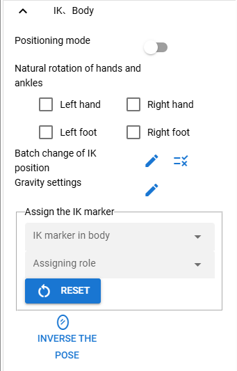
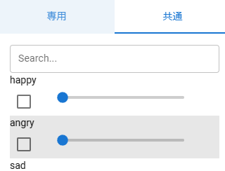

.. index:: VRoid/VRM（プロパティ）

####################################
VRoid/VRM
####################################

　VRoid/VRMで使用可能なプロパティです。

.. contents::

.. index:: IK（VRMのプロパティ)
.. index:: 移動モード（VRMのプロパティ)
.. index:: IK位置の一括変更（VRMのプロパティ)
.. index:: 重力の設定（VRMのプロパティ)
.. index:: IKマーカーの割り当て（VRMのプロパティ)

IK、全身
--------------------

|

　IK（VRoid/VRMの体の各パーツを操作する仕組みのこと）に関するプロパティです。

:移動モード:
    VRoid/VRM全体を一括で移動・回転させるモードに切り替えます。これが有効中でも各IKパーツの移動や回転も可能です。
:IK位置の一括変更:
    スプレッドシート形式でIKパーツの位置や回転を指定できるウィンドウを表示します。
:重力の設定:
    VRMが標準で持つボーンに対して重力の設定を行います。
:IKマーカーの割り当て:
    VRMが持つIKマーカーを別のオブジェクトに切り替えます。

IKマーカーの割り当て
    IKマーカーの部位:
        切り替え対象のIKのマーカーの部位を選択します。
    割り当て中のロール:
        選択した部位に対しどのオブジェクトをIKマーカーとして割り当てるか選択します。
    Reset:
        IKマーカーを元のマーカーに戻します。

:ポーズを反転する:
    現在のVRMのポーズを反転します。

|

.. index:: 手のポーズ（VRMのプロパティ)

腕、手
----------------

.. image:: ../img/prop_vrm_2.png
    :align: center

| 

**右手・左手：**

:コンボボックス:
    手動操作・開く・通常・グー・指差し・Vサイン・サムズアップ・握るのいずれかに切り替えます。
:スライダー:
    コンボボックスで指定したポーズの変化の度合いを指定します。

手動操作
^^^^^^^^^^^^^^^^

　ver 1.0.4より導入しました。手の指を一本ずつ回転操作して細かく手のひらのポーズを編集できます。

.. image:: ../img/prop_vrm_8.png
    :align: center

|

　``手動動作`` を選択するとUIが表示されます。指のUIは実際の手のひらと指に似せています。

.. index:: ブレンドシェイプ（VRMのプロパティ）

ブレンドシェイプ
----------------------------

　VRoid/VRMの表情等を細かく調整する項目です。

|

　VRoid/VRMはブレンドシェイプを2種類保有しています。Unity的な意味と本アプリでの捉え方は次のとおりに分類しています。

.. csv-table::
    :header-rows: 1

    Unity ,                  VRM version,   本アプリ(1.x) ,  本アプリ(2.x)
    SkinnedMeshRenderer ,    0.x/1.x    ,    汎用         ,   専用
    VRMBlendShapeProxy  ,    0.x        ,    専用         ,   廃止
    VRM10RuntimeExpression , 1.x        ,    専用         ,   共通

　SkinnedMeshRendererのブレンドシェイプについて、その命名規則が次のように大体決まっています。キャラクターによりその実際の数は異なるのでご注意ください。

.. csv-table::
    :header-rows: 1

    キー          ,     説明
    ～Fcl_All_～  ,    顔のパーツすべて動かす
    ～Fcl_BRW_～  ,    眉毛を動かす
    ～Fcl_EYE_～  ,    目を動かす
    ～Fcl_MTH_～  ,    口を動かす
    ～Fcl_HA_～   ,    歯を動かす
    ～上記以外～   ,    上記に当てはまらない部位を動かす

.. note::
    * VRoidStudio製のVRMの場合です。
    * 本アプリではわかりやすさのため、本来のブレンドシェイプの接頭辞を一括して非表示にしてあります。ご了承ください。
    * なお、他のアプリでも上記を目印にすればブレンドシェイプを探しやすいと思います。

.. warning::
    VRM 1.xの仕様によりExpressionとBlendShapeでは動作が変わります。詳しくは :ref:`blendshape_vrm` をご覧ください。
    
    素のVRM1.xですと、主に次のBlendShapeが動かない傾向にあります。

    * 喜怒哀楽（Fcl_Allなど、眉・目・口がすべて動くタイプ）
    * 口（あいうえお）
    * etc

    ※本アプリではどのVRMのどのブレンドシェイプが動かなくなるのか判別しきれないため、新しい方式の「Expression」に機能を移行しました。（独自改修あり）

|

.. index:: 自動まばたき（VRMのプロパティ）

自動まばたき
^^^^^^^^^^^^^^^

　VRoid/VRMの表情について、まばたきを自動的にさせます。

.. image:: ../img/prop_vrm_3.png
    :align: center
    
| 

:自動まばたきを有効:
    自動まばたきをオンオフ切り替えます。デフォルトはオンです。
:まばたきの間隔:
    この秒数の間隔でまばたきをします。
:まぶたを開ける秒数:
    この秒数をかけてまぶたを開けます。
:まぶたを閉じる秒数:
    この秒数をかけてまぶたを開けます。
:まぶたを閉じている時間:
    この秒数分まぶたを閉じています。

|

.. index:: オブジェクトの装着（VRMのプロパティ)

オブジェクトの装着
--------------------

　VRoid/VRMの各部位の動きに別のオブジェクトを連動させる機能の一覧です。

.. image:: ../img/prop_vrm_5.png
    :align: center
    
| 

　オブジェクトを体の次の部位に装着させることができます。装着する数に制限はありません。

:コンボボックス:
    装備させたい部位を選択します。
:装備ボタン:
    オブジェクトの装着ダイアログを表示します。
:現在の装備欄:
    右端の削除ボタンで装備を解除します。

    * お尻、左ふともも、右ふともも、左下脚、右下脚、左足、右足
    * 脊柱、胸、首、頭
    * 左肩、右肩、左上腕、右上腕
    * 左前腕、右前腕、左手、右手、胸上部

.. image:: ../img/prop_vrm_6.png
    :align: left

:ID:
    オブジェクトのIDです。

:Type:
    オブジェクトの種類です。

:Name:
    オブジェクトの名称です。

|
|
|
|
|
|
|

　装備させたいオブジェクトを選び、「OK」ボタンを押すと装備できます。

| 

テクスチャ
----------------------

.. image:: ../img/prop_obj_1.png
    :align: center

|

　VRMが保有しているテクスチャに関するプロパティです。テクスチャやマテリアルが複数存在した場合はコンボボックスから選ぶことができます。検出できるテクスチャの数は実際のVRMによって異なります。

:マテリアル名:
    現在選択中のテクスチャが保持しているマテリアルの名称です。
:シェーダー:
    Unity標準のStandard、VRM標準のVRM/MToon、StandardAssetのWater（FX/Water4）のいずれかにシェーダーを切り替えます。

以下のシェーダーの設定を変更できます。詳しくはUnityのヘルプ等でご確認ください。

:Standard:
    色、ブレンドモード、メタリック、光沢、発光色（Emission Color）、テクスチャ
:VRM/MToon:
    色、ブレンドモード、カリングモード
    メタリック、光沢、発光色（Emission Color）、シェードの色（Shade Color）
    Shading Toony、 Rim Color、Rim fresnel power
    SrcBlend、DstBlend、テクスチャ
:Water:
    フレネルスケール、反射色、鏡面色、波の振れ幅、波の周波数、波の急勾配、波の速度、波方向AB、波方向CD
:Sketch:
    Outline width、Stroke density、Add brightness、Mult brightness、Shadow brightness
:PostSketch:
    Outline width、Stroke density、Add brightness、Mult brightness
:Comic:
    enableTexTransparent、Line width、色、Tone threshold

.. hint::
    後述のOtherObjectのテクスチャの設定と同一です。

.. caution::
    VRMには適さないシェーダーもあります。想定と異なる変化する可能性があるので注意して使用してください。