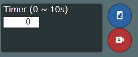

.. index:: MediaPipe（ポージング）

#####################################
MediaPipeでポーズを検出する
#####################################

.. contents::

　MediaPipeとはGoogleが公開している、ライブメディアとストリーミングメディア向けのAIソリューションで無償で利用できます。本アプリではPoseの機能を利用しています。

　ウェブカメラ等で移した映像からAIが自動的にポーズを検出し、それをVRoid/VRMに適用することができます。

https://google.github.io/mediapipe/

.. warning::
    ※なお、MediaPipeと本アプリのIKの位置は完全には一致しないため、そしてポーズの検出は100％ではありません。あらかじめご了承ください。

    ※VRoid/VRM以外はこの機能を使えません。

1. 「3Dモデル」タブの「MediaPipe」をクリックします。

.. image:: posing_a.png
    :align: center

|

2. 確認メッセージが表示されるので問題なければOKボタンを押して進みます。

|

.. note::
    ※初回はカメラの利用許可が求められるので、許可をして進めてください。

3. PCのスペックにもよりますが読み込み中の後カメラ映像が映し出されます。

.. image:: posing_c.png
    :align: center

|

.. note::
    ※この状態でアプリがフリーズする場合、一度本アプリをすべて終了し改めて起動しなおしてください。

.. sidebar::
    ポーズが検出されると・・・

    　点と線でおおよそのポーズが描画されます。

    　常にリアルタイムで検出し続けるため、ポーズが毎秒若干変化します。

    ※本アプリではカメラ映像を写真に保存する機能はありません。あくまでもポーズ検出のためだけにカメラを利用します。

.. image:: posing_d.png
    :align: center

|

ポーズを保存する
====================

　ポーズを取得する通常の手順です。

1. ウィンドウ中央より右にある青い SHUTTER ボタンをクリックします。

|

.. warning::
    ver 2.19.0でタイマーの機能を廃止しました。

    ※タイマーの秒数を1以上にすると、ボタンを押した後にタイマーが作動してその秒数後に自動的にポーズの撮影がされます。

2. 本アプリのメイン画面側でポーズが反映されたことを確認します。

.. image:: posing_f.png
    :align: center

|

.. note::
    ※撮影した人物・物体の位置・高さ・奥行きなどにより実際に反映されるポーズが想定とは異なる可能性があります。

|

ポーズを常時検出する
======================

　ver 2.0より追加した機能です。ウェブカメラで映して認識したポーズを現在選択中のVRMに **常に反映** します。

1. ウィンドウ中央下のAUTOボタンをクリックします。

.. image:: posing_e2.png
    :align: center

|

2. 再びAUTOボタンを押すとポーズの反映は停止します。

.. note::
    認識したポーズを約1秒間隔で反映し続けます。何らかの事情でウェブカメラが認識されなくなった場合、ポーズの反映も止まります。その場合は本アプリ自体を一度終わらせて再び起動させてください。

映像ソースを切り替える
==========================

　ウェブカメラを複数台接続している場合や写真からポーズを検出したい場合に切り替えることができます。

1. ツールウィンドウ中の映像ソースのコンボボックスから目的のものを選択します。

.. |imgsource| image:: posing_g.png

:|imgsource|:
    |
    | ※あるいは参照ボタンをクリックします

|

タイマーでポーズを保存する
===============================

.. warning::
    ver 2.19.0で廃止しました。

　タイマー機能により、カメラ映像を指定の時間後に自動的に撮影してそのポーズを検出させることができます。

1. ツールウィンドウ中の「タイマー保存」に秒数を指定します。

.. figure:: posing_i.png
    :align: center

    ※1～10秒の間で指定可能

2. ポーズ保存ボタンを押します。

.. figure:: posing_j.png
    :align: center

    ※左上に読み込みアニメーションが表示され、指定の秒数後に効果音を発して非表示になります。（1秒ごとに赤くなります）

|

3, 通常の手順通りポーズが保存されるのでメインの画面で確認・反映してください。

|

その他機能
===============================

.. warning::
    ver 2.19.0で廃止しました。

.. image:: posing_k.png
    :align: center

|

:Selfie Mode:
    映像を反転します。
:映像ソース:
    カメラあるいは参照ボタンで画像を指定します。
:Min Detection Confidence:
    検出の精度
:Min Tracking Confidence:
    トラッキングの精度

※他のオプションは `MediaPipe <https://google.github.io/mediapipe/>`_ のサイトで確認してください。

**メニューを閉じる**

.. |img_menubtn| image:: posing_m.png

1. メニュー右上の |img_menubtn| をクリックします。
2. メニューが非表示になり、背景にある検出プレビューが表示されます。

.. image:: posing_l.png
    :align: center

|

