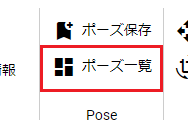
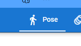
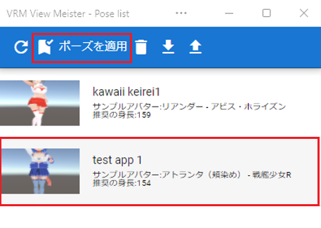
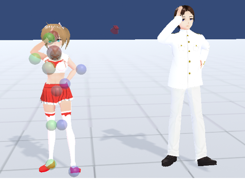
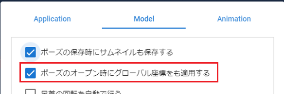
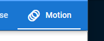
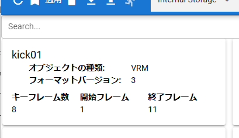
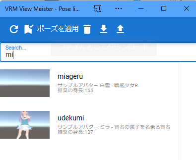
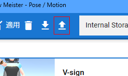

####################################
ポーズ・モーションを開く
####################################

.. contents::

ポーズ・モーションを開く
####################################

.. index::
    ポーズを開く

ポーズ
====================================

　保存したポーズをどのVRoid/VRMにでも即座に反映させることができます。

1. 「3Dモデル」タブの「ポーズ一覧」をクリックします。

|

2. ポーズ一覧のウィンドウが表示されるので右端の「Pose」タブをクリックします。

3. 目的のポーズを選び、「適用」をクリックします。

|

.. note::
    ※保存時のモデルのキャラクターをサンプルアバターとして表記しています。また、参考情報として身長も表記しています。

3. ポーズが反映されたのを確認します。

|

　身長や体格が異なる他のキャラクターにも同じポーズを反映できます。（ただし、元のキャラクターから極端に差がある場合はずれることがあります）

　ポーズの保存時は実際にはVRoid/VRM自体の位置データも保存しています。その位置データも復元するには「アプリの設定」の「Model」タブの「ポーズのオープン時にグローバル座標をも適用する」にチェックを入れてください。

|

.. warning::
    * 違うVRMであっても全く同じ位置に復元されます。複数のVRMを読み込んでいる場合には位置が重複するので必要に応じてオプションをオフにしてください。
    * 極端に体勢が崩れるポーズの場合は **1回の適用では反映しきれない** ことがあります（特にLowerLeg）。その場合はもう一度適用することでポーズが完全に再現されるようになります。

|

.. index:: モーションの読み込み

.. _openmotionfile:

モーションを開く
======================================

ver 2.3.0より、モーションを開く機能をこのウィンドウに統合しました。あらたに内部ストレージ・Googleドライブ・アプリのサンプルの保管に対応しました。

モーションはVRMだけでなく、他のオブジェクトに対しても適用することができます。

1. モーションを適用するタイムラインを選択します。

.. note::
    オブジェクト一覧ではなく、タイムラインを選択してください。そうすればSystemEffectや各Audioにも正しくモーションを適用することができます。

2. 「3Dモデル」タブの「ポーズ一覧」をクリックします。

3. ポーズ一覧のウィンドウが表示されるので右端の「Motion」タブをクリックします。

3. 目的のモーションを選び、「適用」をクリックします。

|

.. hint::
    モーションもドラッグアンドドロップに対応しています。

.. warning::
    ``オブジェクトの種類`` が選択中のタイムラインのオブジェクト（キャスト）の種類と異なる場合はモーションを適用することはできません。

ポーズとモーションの別の読み込み方法
=============================================

　ポーズやモーションを読み込むもう一つの手順として、 PC内に保存した ``.vvmpose`` または ``.vvmmot`` ファイルをWebGL画面にドラッグアンドドロップする方法も可能です。

　こちらの方法の場合、ポーズ一覧に登録していなくてもかまいません。 ポーズファイルの場合 **VRMに限りますが** エクスプローラー等からドラッグしてくるだけでいつでもすぐにポーズを再現できます。

**モーションの場合**

1. モーションを適用したいタイムライン（ロール）を選択します。
2. エクスプローラ等から ``.vvmmot`` ファイルをWebGL画面にドラッグアンドドロップします。

.. note::
    * タイムライン（ロール）の種類が同じである必要があります。
    * すでにモーションデータが存在する場合は上書きされますのでご注意ください（全部削除してから新規登録の扱い）。
    * 現在のプロジェクトの最大フレーム数より多い場合、その最大フレーム数までにカットされます。事前にある程度フレーム数を拡張しておくことをオススメします。
    * ドラッグアンドドロップする場合、 ``.vvmmot`` の拡張子のみ有効です。（ ``.json`` では開けません）
    * ドラッグアンドドロップする場合、現在選択中のキャストが何らかのタイムライン（ロール）に割り当てられている必要があります。（プロジェクトの設定画面から行う場合はロールに直接適用されるため、キャストが割り当てられていなくても問題ありません）

.. hint::
    　モーションにかかる各フレームの時間(duration)はタイムラインごとに（さらにはフレームごとに）独立しているため、既存のプロジェクトに読み込ませても他のタイムラインに影響はありません。

その他機能
########################################

.. index::
    読み込み場所の変更(ポーズ・モーション一覧)
    サンプルデータ(ポーズ・モーション一覧)

ポーズの読み込み場所を変更する
=======================================

ver 2.3.0から対応しました。ポーズを保存してある次の場所を自由に切り替えることができます。

.. csv-table::
    :header-rows: 1

    名称, 説明
    Internal Storage, 内部ストレージから読み込みます。デフォルトの状態です。
    Google Drive, Googleドライブから読み込みます。別途Googleドライブの設定が必要です。
    Application, 本アプリのサンプルを読み込みます。

1. ツールバーの中央にあるコンボボックスをクリックし、選択します。
2. Google DriveおよびApplicationの場合、読み込みがしばらく発生した後、保存されているポーズが表示されます。Internal Storageの場合は即座に表示されます。

ポーズ・モーションを検索する
=======================================

　本アプリの他の一覧部分と同様に、インクリメンタルサーチができます。

|

ディスクからポーズ・モーションファイルを読み込む
====================================================

　PCのディスクに保存したポーズやモーションファイルをアプリに読み込ませることができます。ポーズ一覧のアップロードボタンを押してください。

読み込み場所が ``Internal Storage`` の場合のみ使用可能です。

|

.. csv-table:: 対象のファイル
    :header-rows: 1

    種類, 拡張子
    ポーズ, **.vvmpose** または **.json**
    モーション, **.vvmmot** または **.json**

　本アプリ独自拡張子の **.vvmpose** や **.vvmmot** はあくまで判別のしやすさのためだけのものですが、 .jsonのままだと他と混同するおそれがあるので間違えないように気をつけてください。

　読み込み終わると一覧に表示されるようになります。（ポーズの場合、サムネイルはなくても問題ありません）

   

.. warning::
    | ※データ中に必要な項目がないと読み込み時にエラーとなります。
    | ※正しくないデータを読み込んだ場合の動作は保証致しません。

