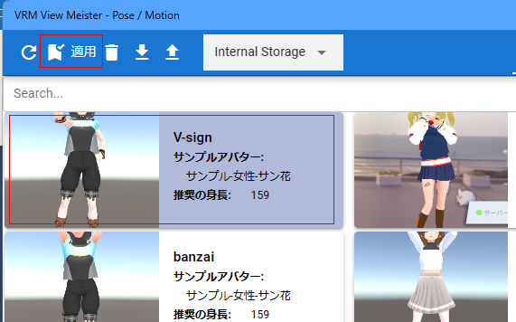

####################################
VRoid/VRMのポーズを再現する
####################################

　保存したポーズをどのVRoid/VRMにでも即座に反映させることができます。

1. 「3Dモデル」タブの「ポーズ一覧」をクリックします。

.. image:: posing_5.png
    :align: center

|

2. ポーズ一覧のウィンドウが表示されるので目的のポーズを選び、「ポーズを適用」をクリックします。

|

.. note::
    ※保存時のモデルのキャラクターをサンプルアバターとして表記しています。また、参考情報として身長も表記しています。

3. ポーズが反映されたのを確認します。

.. image:: posing_7.png
    :align: center

|

　身長や体格が異なる他のキャラクターにも同じポーズを反映できます。（ただし、元のキャラクターから極端に差がある場合はずれることがあります）

　ポーズの保存時は実際にはVRoid/VRM自体の位置データも保存しています。その位置データも復元するには「アプリの設定」の「Model」タブの「ポーズのオープン時にグローバル座標をも適用する」にチェックを入れてください。

.. image:: posing_8.png
    :align: center

|

.. warning::
    * 違うキャラクターであっても全く同じ位置に復元されます。複数キャラクターを読み込んでいる場合には位置が重複するので必要に応じてオプションをオフにしてください。
    * 極端に体勢が崩れるポーズの場合は **1回の適用では反映しきれない** ことがあります（特にLowerLeg）。その場合はもう一度適用することでポーズが完全に再現されるようになります。

.. hint::
    　ポーズを再現するもう一つの手順として、 PC内に保存した .vvmposeファイルをWebGL画面にドラッグアンドドロップする方法も可能です。

    　こちらの方法の場合、ポーズ一覧に登録していなくてもかまいません。 対象は **VRMに限りますが** エクスプローラー等からドラッグしてくるだけでいつでもすぐにポーズを再現できます。

|

ポーズを検索する
=======================================

　本アプリの他の一覧部分と同様に、インクリメンタルサーチができます。

.. image:: posing_o.png
    :align: center

|

ディスクからポーズファイルを読み込む
=======================================

　PCのディスクに保存したポーズファイルをアプリに読み込ませることができます。ポーズ一覧のアップロードボタンを押してください。

.. image:: posing_9.png
    :align: center

|

| 　対象のファイルは **.vvmpose** または **.json** です。
| 　本アプリ独自拡張子の「**.vvmpose**」はあくまで判別のしやすさのためだけのものですが、 .jsonのままだと他と混同するおそれがあるので間違えないように気をつけてください。

　読み込み終わると一覧に表示されるようになります。（サムネイルはなくても問題ありません）

   

.. warning::
    | ※データ中に必要な項目がないと読み込み時にエラーとなります。
    | ※正しくないデータを読み込んだ場合の動作は保証致しません。

