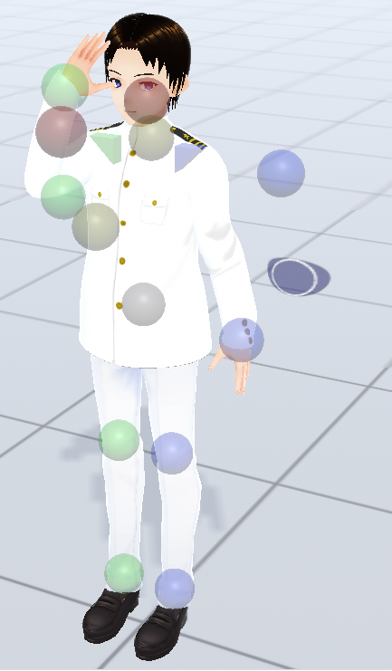
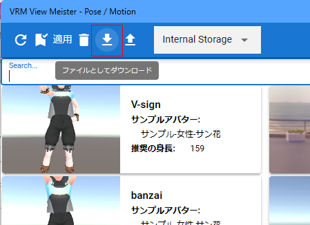

#####################################
ポーズ・モーションを保存する
#####################################

.. contents::

ポーズ・モーションを保存する
######################################

ポーズを保存する
===============================

　ポーズはVRoid/VRMのみ、全身のIKマーカーを動かした状態を保存しておくことができます。これはアニメーションではなく、単一のポーズごとです。

1. VRoid/VRMにポーズを取らせます。

|

2. 「3Dモデル」タブの **Pose/Motion** から「保存」をクリックします。

.. image:: posing_2.png
    :align: center

|

1. ``端末`` , ``内部ストレージ`` , ``Google Drive`` のいずれかを選びます。

2. ポーズ名を入力してください。

.. image:: posing_3.png
    :align: center

|

ポーズが保存されます。

|

**サムネイルを保存する・しない**

　ポーズファイルはサムネイルに対応しています。実際の動作にはまったく影響しませんが、一覧で見やすくなります。保存しないようにするには、設定画面で ``ポーズの保存時にサムネイルも保存する`` のチェックを外してください。

.. image:: posing_n.png
    :align: center

|

特に問題ないと思われるので、端末に保存する場合でもサムネイルがデータ中に含まれます。

.. hint::
    ポーズの保存時にはキーフレームの登録をしておく必要はありません。

    保存したデータは？
        内部ストレージの場合、アプリ内（使用中のブラウザの中）に保存されます。ローカルディスクのフォルダとは違うアプリごとの専用の領域のような場所なので、他のアプリからは見えないようになっています。

        端末の場合はそのままPCのフォルダに保存されます。

        Google Driveの場合はGoogleドライブ内に保存されます。

.. caution::
    Google Driveの場合、別途ユーザー側で事前にGoogleアカウントの取得・GoogleAppsScriptの設定が必要です。

.. index:: モーションの保存（アニメーションプロジェクト）

.. _savemotionfile:

モーションを保存する
=================================

　モーションの場合はすべてのタイムライン（ロール）の種類を保存できます。

1. モーションを保存したいタイムライン（ロール）をタイムラインの一覧で選択します。
2. この後はポーズの手順とほぼ同一です。 「保存」ボタンを押したあとのメニューでは「モーション保存」以下のメニューから選んでください。

モーションの場合サムネイルは存在しません。

.. index:: モーションファイルの読み書きの注意点

.. warning::
    **モーションを作るVRMの体格に注意**

    VRMでモーションデータを作る際、途中で身長や体格の異なるVRMに差し替えて作ると接地や各部位にズレが生じてしまいます。必ず同じVRMのままモーションの作成を完成させてください。

    例：
        1. 160cmのVRMでモーションを途中まで作り、一旦ファイルに保存する
        2. 別の日に155cmのVRMにvvmmotファイルを読み込み、モーションの続きを作成する
        3. また別の日に140cmのVRMにvvmmotファイルを読み込み、モーションを再生する
    
        この場合、3の140cmのVRMはモーション中に全身が浮き沈みしたり予期せぬ動きを起こします。

.. caution::
    モーションを読み込んだ後、再びモーションファイルとして保存する場合は **必ず** 各キーフレームを一度は登録してください。

    モーションを読み込んだ直後は、タイムライン（ロール）の中には今現在のVRMの身長情報と、モーションの中にある参考情報としての別VRMの身長情報が混ざった状態です。

    | 改めてキーフレームに登録することで、今現在のVRMの身長・体格としてモーションが登録されていきます。
    | （登録する際、ポーズなどを動かす必要はありません。フレーム番号を選択してVRMなどオブジェクトがそのモーションを再現したらすぐに 登録ボタンを押して構いません）

    これは、上記の「モーションを作るVRMの体格に注意」の問題と同じ意味となります。

|

その他機能
####################

ディスクに保存する
=======================

　内部ストレージやGoogle Driveに保存した後も端末に保存し直すことができます。

1. 「3Dモデル」タブの「ポーズ一覧」をクリックします。

.. image:: posing_5.png
    :align: center

|

2. ツールバー右にある PoseまたはMotionを選択します。
3. ダウンロードしたいポーズまたはモーションを選択します。
4. ツールバーにある「ダウンロード」ボタンをクリックします。

|

:保存形式:

    .. csv-table::
        :header-rows: 1

        種類, 拡張子
        ポーズ, **.vvmpose**
        モーション, **.vvmmot**

.. note::
    中身はJSON形式です。識別しやすくするため独自の拡張子でダウンロードされます。

|

.. index:: モーションを.anim形式で保存

Unityなど汎用形式でモーション保存する
==========================================

VRMのみですが、汎用的なアニメーション形式での保存も可能です。

1. 「3Dモデル」タブの「ポーズ一覧」をクリックします。

.. image:: posing_5.png
    :align: center

2. ポーズ一覧のウィンドウが表示されるので右端の「Motion」タブをクリックします。

.. image:: posing_6b.png
    :align: center

3. ツールバーの ``汎用的なモーションファイルでエクスポートする`` をクリックします。

4. 目的の形式のメニューをクリックします。

|

5. ファイル名を入力し、 ``OK`` ボタンを押します。

:保存形式:
    **.anim** 

.. note::
    .animファイルは Unityでそのまま読み込み可能な AnimationClipファイルです。

.. warning::
    本アプリ ``ver 2.3.0`` 時点では HumanoidのAnimatorのモーションのみに対応しています。.bvhは試験運用中のため動作保証はまだできません。ご了承下さい。

    .animファイルを本アプリで再び読み込むことはできません。

