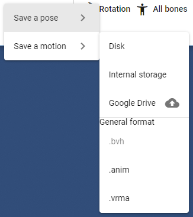

#####################################
VRoid/VRMのポーズを保存する
#####################################

　VRoid/VRMのみ、全身のIKマーカーを動かした状態をアプリ内に保存しておくことができます。これはアニメーションではなく、単一のポーズごとです。

1. VRoid/VRMにポーズを取らせます。

.. image:: posing_1.png
    :align: center

|

2. 「3Dモデル」タブの「ポーズ保存」をクリックします。

|

3. ``端末`` あるいは ``内部ストレージ`` を選びます。

4. ポーズ名を入力してください。

.. image:: posing_3.png
    :align: center

|

即座にポーズが保存されます。

|

**サムネイルを保存する・しない**

　ポーズファイルはサムネイルに対応しています。実際の動作にはまったく影響しませんが、一覧で見やすくなります。保存しないようにするには、設定画面で ``ポーズの保存時にサムネイルも保存する`` のチェックを外してください。

.. image:: posing_n.png
    :align: center

|

※なおセキュリティ対策のため、端末に保存する場合は必ずカットされます。ポーズファイルを端末から読み込んだ場合もサムネイルの情報はカットされます。

.. hint::
    ポーズの保存時にはキーフレームの登録をしておく必要はありません。

.. admonition:: ※保存したポーズデータは？
    
    　内部ストレージの場合、アプリ内（使用中のブラウザの中）に保存されます。ローカルディスクのフォルダとは違うアプリごとの専用の領域のような場所なので、他のアプリからは見えないようになっています。

    　端末の場合はそのままPCのフォルダに保存されます。

ディスクに保存する
=======================

　内部ストレージに保存した後も端末に保存し直すことができます。そういう場合はダウンロードボタンを押してください。

.. image:: posing_4.png
    :align: center

|

:保存形式:
    **.vvmpose**

.. note::
    中身はJSON形式です。識別しやすくするため独自の拡張子でダウンロードされます。

|