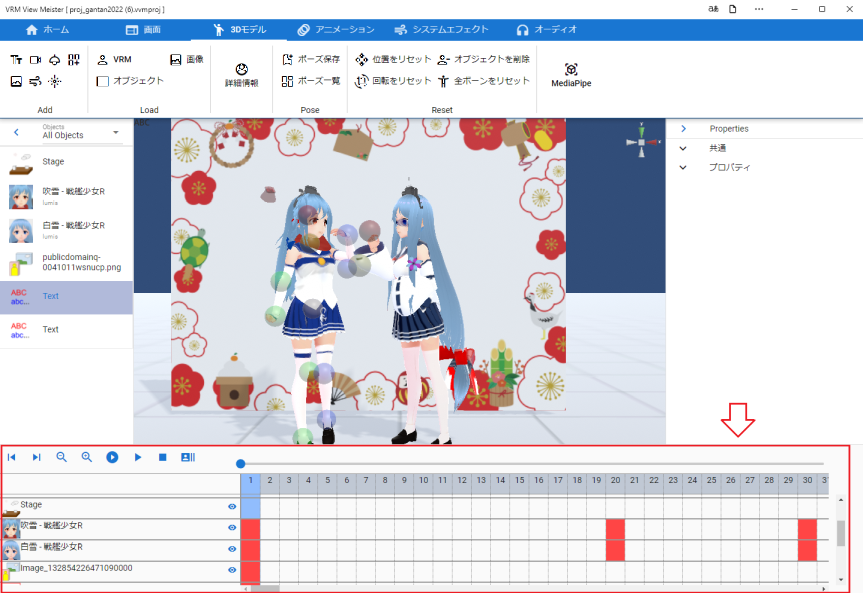

.. index:: アニメーションプロジェクトとは

#####################################
アニメーションプロジェクトとは
#####################################

| 　本アプリで読み込めるオブジェクトを自由にアニメーションさせることができます。アニメーションの作り方はMMD、MMM（MikuMikuMoving）や一般的なアニメーション作成ソフトと似せてあるので、少し使っていただければすぐ慣れると思います。
| 　本アプリ独自のアニメーションを「アニメーションプロジェクト」という名で説明に使っていきます。

|

.. note::
    * 本アプリのアニメーションは独自の実装のため、MMDやUnity Editorで使われるアニメーションの形式とは一切互換性はありませんのでご注意ください。（将来的には一般的な形式にエクスポートする機能の実装も考えています）
    * FBXに含まれるアニメーションデータを再生することはできます。
    * 後述の録画をすると一般的に再生可能な形式で保存することができます。

本アプリで使われるアニメーションに関するファイル形式
    独自の形式となっています。次の3つです。

    .. csv-table::
        :header-rows: 1

        拡張子, 概要
        .vvmproj, アニメーションプロジェクト（本アプリでのアニメーションにかかわる全情報を保持するファイル）。
        .vvmmot, モーションデータ（本アプリで各タイムライン（ロール）１つあたりのアニメーション情報）。VRMやOtherObjectだけでなくカメラや2Dオブジェクト、システムエフェクトのアニメーション情報も保持可能。
        .vvmpose, ポーズデータ（アニメーションでいうと１フレームのみの情報）、VRM専用。
    
    .. warning::
        ver 2.2.0でIKシステムの変更を行いました。

        今までのポーズ・モーションファイルではAimとChestのポーズ・モーションの変更が必要です。

        IKについて詳しくは :ref:`inputikasmarker` を御覧ください。