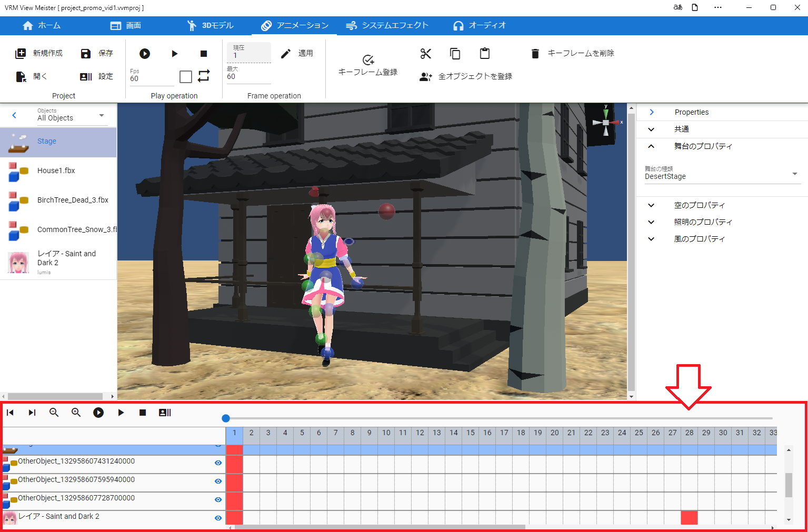

.. index:: アニメーションプロジェクトとは

#####################################
アニメーションプロジェクトとは
#####################################

| 　本アプリで読み込めるオブジェクトを自由にアニメーションさせることができます。アニメーションの作り方はMMD、MMM（MikuMikuMoving）や一般的なアニメーション作成ソフトと似せてあるので、少し使っていただければすぐ慣れると思います。
| 　本アプリ独自のアニメーションを「アニメーションプロジェクト」という名で説明に使っていきます。

|

.. note::
    | ※本アプリのアニメーションは独自の実装のため、MMDやUnity Editorで使われるアニメーションの形式とは一切互換性はありませんのでご注意ください。
    | ※FBXに含まれるアニメーションデータを再生することはできます。
    | ※後述の録画をすると一般的に再生可能な形式で保存することができます。
