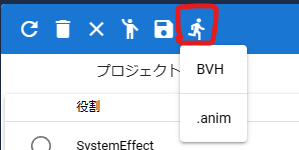
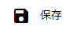
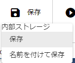
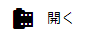
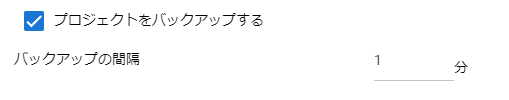
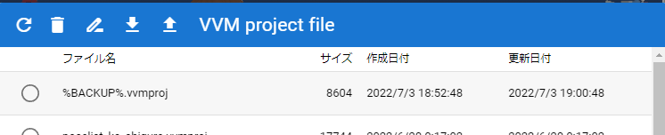

.. index:: アニメーションの読み込みと保存（アニメーションプロジェクト）

#########################################
アニメーションの読み込みと保存
#########################################

.. contents::

.. index:: モーションの保存（アニメーションプロジェクト）

.. _savemotionfile:

モーションファイルに保存する
=====================================

.. index:: モーションを.vvmmot形式で保存

本アプリ独自形式 .vvmmot
------------------------------------

　一ロールだけのモーションデータをファイルに保存することができます。すべてのロールに対して出力することができます。

1. リボンバーの ``アニメーション`` タブの ``設定`` をクリックします。

2. ``役割の管理`` タブを開きます。

3. 保存したいロールの行を選択します。

4. ツールバーの ``モーションをファイルに保存する`` をクリックします。

|

5. ファイル名を入力し、 ``OK`` ボタンを押します。

:保存形式:
    **.vvmmot**
    
    * 独自の拡張子ですが実際はただのJSON形式のファイルです。.jsonに拡張子を変更しても読み込むことはできます。正しくないデータを読み込んだ場合の動作は保証致しません。

.. index:: モーションファイルの読み書きの注意点

.. warning::
    **モーションを作るVRMの体格に注意**

    VRMでモーションデータを作る際、途中で身長や体格の異なるVRMに差し替えて作ると接地や各部位にズレが生じてしまいます。必ず同じVRMのままモーションの作成を完成させてください。

    例：
        1. 160cmのVRMでモーションを途中まで作り、一旦ファイルに保存する
        2. 別の日に155cmのVRMにvvmmotファイルを読み込み、モーションの続きを作成する
        3. また別の日に140cmのVRMにvvmmotファイルを読み込み、モーションを再生する
    
        この場合、3の140cmのVRMはモーション中に全身が浮き沈みしたり予期せぬ動きを起こします。

.. caution::
    モーションを読み込んだ後、再びモーションファイルとして保存する場合は **必ず** 各キーフレームを一度は登録してください。

    モーションを読み込んだ直後は、タイムライン（ロール）の中には今現在のVRMの身長情報と、モーションの中にある参考情報としての別VRMの身長情報が混ざった状態です。

    | 改めてキーフレームに登録することで、今現在のVRMの身長・体格としてモーションが登録されていきます。
    | （登録する際、ポーズなどを動かす必要はありません。フレーム番号を選択してVRMなどオブジェクトがそのモーションを再現したらすぐに 登録ボタンを押して構いません）

    これは、上記の「モーションを作るVRMの体格に注意」の問題と同じ意味となります。

.. index:: モーションを.anim形式で保存

Unityなど汎用形式
-----------------------------------

1. リボンバーの ``アニメーション`` タブの ``設定`` をクリックします。

2. ``役割の管理`` タブを開きます。

3. 保存したいロールの行を選択します。

4. ツールバーの ``汎用的なモーションファイルでエクスポートする`` をクリックします。

5. 目的の形式のメニューをクリックします。

|

1. ファイル名を入力し、 ``OK`` ボタンを押します。

:保存形式:
    **.anim** 

.. note::
    .animファイルは Unityでそのまま読み込み可能な AnimationClipファイルです。

.. warning::
    本アプリ ``ver 2.0.0`` 時点では HumanoidのAnimatorのモーションのみに対応しています。.bvhは試験運用中のため動作保証はまだできません。ご了承下さい。

    .animファイルを本アプリで再び読み込むことはできません。

| 

.. index:: モーションの読み込み（アニメーションプロジェクト）

.. _openmotionfile:

モーションファイルを読み込む
=================================

　モーションファイル ``.vvmmot`` を読み込み、アニメーションプロジェクト中の特定のロール（タイムライン）に反映させることができます。

1. リボンバーの ``アニメーション`` タブの ``設定`` をクリックします。

2. ``役割の管理`` タブを開きます。

3. 読み込ませたいロールの行を選択します。

4. ツールバーの ``モーションファイルを読み込み`` をクリックします。

|

5. 対象のファイルを選択すると自動的に読み込まれます。

**別方法**

1. モーションを適用したいロールに割り当てられているキャストを選択します。
2. エクスプローラ等から ``.vvmmot`` ファイルをWebGL画面にドラッグアンドドロップします。

.. note::
    * ロールの種類が同じである必要があります。
    * すでにモーションデータが存在する場合は上書きされますのでご注意ください（全部削除してから新規登録の扱い）。
    * 現在のプロジェクトの最大フレーム数より多い場合、その最大フレーム数までにカットされます。事前にある程度フレーム数を拡張しておくことをオススメします。
    * ドラッグアンドドロップする場合、 ``.vvmmot`` の拡張子のみ有効です。（ ``.json`` では開けません）
    * ドラッグアンドドロップする場合、現在選択中のキャストが何らかのロールに割り当てられている必要があります。（プロジェクトの設定画面から行う場合はロールに直接適用されるため、キャストが割り当てられていなくても問題ありません）

.. hint::
    　モーションにかかる各フレームの時間(duration)はタイムラインごとに（さらにはフレームごとに）独立しているため、既存のプロジェクトに読み込ませても他のタイムラインに影響はありません。

|

.. index:: アニメーションプロジェクトの保存（アニメーションプロジェクト）

.. _saveproject:

アニメーションプロジェクトファイルを保存する
===================================================

　一通りアニメーションプロジェクトを作成したらファイルとして保存することができます。

:保存される内容:
    * タイムライン（すべてのキーフレーム含む）
    * 全ロールの情報
    * その他アニメーションプロジェクト上の設定
    * プロジェクト内の素材（実際のファイル含む）

1. リボンバーの ``アニメーション`` タブから ``保存`` をクリックします。

|

2.  ``保存`` あるいは ``名前を付けて保存`` をクリックします。

.. note::
    各OS版の場合、 ``端末`` のメニューがあり、PCに直接保存することができます。

3.  ``名前をつけて保存`` の場合、入力ダイアログ上で名前を入力します。

アニメーションプロジェクトがアプリ内部の専用ストレージまたはPCに保存されます。

.. note::
    * **保存** の場合、すでにプロジェクトが存在すると確認メッセージが表示されます。
    * 保存後は右上に通知メッセージが表示されます。

|

:保存形式: 
    **.vvmproj**

    ※独自の拡張子ですが実際はただのJSON形式のファイルです。

|projopen| PCや端末にダウンロードする場合は ``開く`` で内部ストレージダイアログを表示した後、ツールバーのこのボタンをクリックしてください。

|

.. index:: 
    アニメーションプロジェクトを開く（アニメーションプロジェクト）
    実際のオブジェクトの復元
    オブジェクトを開いた後の挙動

.. _openproject:

アニメーションプロジェクトを開く
=================================

　保存したプロジェクトファイルを読み込むことが出来ます。

1. リボンバーの ``アニメーション`` タブから ``開く`` をクリックします。

2. ``ファイルから`` の場合はOSのファイルダイアログが、``内部ストレージから`` はアプリ内で内部ストレージダイアログが開きます。

.. hint::
    一覧上部の検索ボックスでプロジェクトを絞り込むことができます。

    .. image:: img/loadsave_e.png
        :align: center

3. 対象のプロジェクトを選んだら ``OK`` ボタンを押します。

復元される内容
    * タイムライン（すべてのキーフレーム含む）
    * 全ロールの情報
    * その他アニメーションプロジェクト上の設定
    * プロジェクト内の素材（実際の素材ファイル含む）
    * キャストの実体（実際のオブジェクトファイル）

.. admonition:: ウェブアプリ版と各OS版の違い

    プロジェクトファイルを開く際の実際の挙動がウェブアプリ版と各OS版では異なります。プロジェクトで使用したVRMや3Dモデルファイルがある場合、次のように読み込まれます。

    ウェブアプリ版
        アプリ内（ブラウザが端末内に用意した特別な場所）に保存されたファイルを読み込みます（本アプリのサーバには保存されません）。

    各OS版
        アプリ内にはファイルパスやファイル種類などのメタ情報のみ保存されます。そのメタ情報を参照して実際の端末内にあるVRMや3Dモデルファイルを開き読み込みます。

    　プロジェクトファイル内には各キャストのファイルパスを示す ``path`` というプロパティがありますが、そこは実際のファイルパスではありません。そこにファイルパスを直接編集してもそのキャストの対象のファイルは読み込まれません。

    　これはHTMLやjavascriptを使う関係上、 **セキュリティ対策として、一度開いたことのあるファイルしか自動的に読み込ませない** という制限をかけているためです。ご了承下さい。

.. admonition:: 実際のオブジェクトの復元

    　各ロールに割り当てられていたキャスト（オブジェクト）も可能な限り自動的に開いて復元されます。
    
    | 　ただし次の条件に合致するオブジェクトのみです。
    | 　合致しないオブジェクトは読み込まれず、該当のロールにはどのキャストも割り当てられません。アニメーションを再生してもそのロールは動かないので、「 :ref:`settingcast2role` 」の操作をする必要があります。
    
    * 基本の図形(OtherObject), Camera, Light, Effect, Text
    * アプリの履歴に保存されているオブジェクトファイル（VRM, OtherObject, Image, UImage）
    * 設定で指定されたサイズ以下のオブジェクトファイル
 

    　VRMとそれ以外のオブジェクトについては、ロールに割り当てる基準となる項目が異なります。それぞれ合致した場合は自動的に割り当てが完了し、アプリ上ですぐに操作可能になります。

    .. csv-table::
        :header-rows: 1
        :align: center

        種類, 基準
        VRM, VRMのタイトル
        OtherObject, ファイル名
        Image, ファイル名
        UImage, ファイル名
        上記以外, 種類に応じて自動的に

    ※ここではAudioは含みません。 

.. caution::
    これまでに開いていたプロジェクトの内容はリセットされます。

    設定 ``プロジェクトを開いた時、このサイズを超えるファイルを自動的に読み込まない。`` を有効なサイズにしている場合、アニメーションプロジェクトを開く際にサイズを超えた各オブジェクトは読み込みをスキップします。この場合、後から該当するオブジェクトのファイルを開いてください。ロールとキャストの復元については上記の通りです。

.. index:: プロジェクトを新規作成する（アニメーションプロジェクト）

プロジェクトを新規作成する
===============================

　プロジェクトを新規作成します。アプリ起動時は必要ありません。すでに開いているプロジェクトを一からやり直したい場合などに利用します。

1. リボンバーの ``アニメーション`` タブから ``新規作成`` をクリックします。

新規作成で行われること
    * アニメーションプロジェクトをすべて削除（SystemEffect、BGM、SE、Stageを除く）
    * 読み込み済みのすべてのVRoid/VRM、各オブジェクトの削除

|

.. index:: プロジェクトファイルを管理する（アニメーションプロジェクト）

プロジェクトファイルを管理する
====================================

　保存したプロジェクトファイルを内部ストレージダイアログで管理できます。

1. リボンバーの ``アニメーション`` タブから ``開く`` をクリックします。

|

2. 内部ストレージダイアログが開かれます。

|

ファイルから開く
---------------------

1. ツールバー上のこのボタンをクリックします。

|

1. 対象の拡張子 .vvmproj または .json のファイルを選択して開きます。

※正しくないデータを読み込んだ場合の動作は保証致しません。

|

名前を変更する
----------------

1. ツールバー上のこのボタンをクリックし、新しい名前を入力します。

|

内部ストレージから削除する
-----------------------------

1. ツールバー上のこのボタンをクリックします。

.. image:: img/loadsave_9.png
    :align: center

|

.. note::
    プロジェクトに紐づいた素材も全てアプリ内から削除されます。

.. index:: 
    プロジェクトファイルをバックアップする（アニメーションプロジェクト）
    バックアップ
    バックアップの復元

プロジェクトファイルをバックアップする
=========================================

　現在開いているプロジェクトを、定期的にバックアップすることができます。

1. アプリの設定を開きます。
2. アプリケーションタブにある ``プロジェクトをバックアップする`` にチェックを入れます。
3. バックアップの間隔に、どのくらいの頻度でバックアップを自動的にするか目的の分を指定します。

4. 内部ストレージダイアログを開くと、 ``%BACKUP%`` の名称で保存されています。

|

.. admonition:: バックアップの作動するきっかけ

    バックアップは次の操作をすると動作の対象となり、指定の間隔で作動します。

    * フレームの最大数を変更した
    * キーフレームを登録・削除した
    * キーフレームをクリップボードから貼り付けた
    * タイムラインの内容をクリアした
    * ロールおよびタイムラインを削除した

    逆をいえば、キーフレームに登録さえしなければ古いバックアップを上書きせずに新しい操作を行い続けることができます。

　予期せぬ事態が起きてアプリが終了したり継続不可能になった場合、 ``%BACKUP%.vvmproj`` を開けば以前の状態からすぐ再開できるようになります。

.. warning::
    バックアップされたプロジェクトファイルを開いた後、改めて保存する際はファイル名を変更してください。 ``%BACKUP%`` が入ったファイル名では保存できません。

