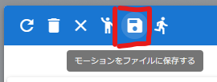

.. index:: アニメーションの読み込みと保存（アニメーションプロジェクト）

#########################################
アニメーションの読み込みと保存
#########################################

.. index:: モーションの保存（アニメーションプロジェクト）

モーションファイルに保存する
=====================================

　一ロールだけのモーションデータをファイルに保存することができます。

1. リボンバーの ``アニメーション`` タブの ``設定`` をクリックします。

2. 保存したいロールの行を選択します。

3. ツールバーの ``モーションをファイルに保存する`` をクリックします。

|

4. ファイル名を入力し、 ``OK`` ボタンを押します。

:保存形式:
    **.vvmmot**
    
    ※独自の拡張子ですが実際はただのJSON形式のファイルです。.jsonに拡張子を変更しても読み込むことはできます。正しくないデータを読み込んだ場合の動作は保証致しません。

| 

.. index:: モーションの読み込み（アニメーションプロジェクト）

モーションファイルを読み込む
=================================

　モーションファイルを読み込み、アニメーションプロジェクト中の特定のロール（タイムライン）に反映させることができます。

1. リボンバーの ``アニメーション`` タブの ``設定`` をクリックします。

2. 読み込ませたいロールの行を選択します。

3. ツールバーの ``モーションファイルを読み込み`` をクリックします。

.. image:: img/loadsave_2.png
    :align: center

|

4. 対象のファイルを選択すると自動的に読み込まれます。

.. note::
    * オブジェクトの種類が同じである必要があります。
    * すでにモーションデータが存在する場合は上書きされますのでご注意ください（全部削除してから新規登録の扱い）。
    * 現在のプロジェクトの最大フレーム数より多い場合、その最大フレーム数までにカットされます。事前にある程度フレーム数を拡張しておくことをオススメします。

|

.. index:: アニメーションプロジェクトの保存（アニメーションプロジェクト）

アニメーションプロジェクトファイルを保存する
===================================================

　一通りアニメーションプロジェクトを作成したらファイルとして保存することができます。

:保存される内容:
    * タイムライン（すべてのキーフレーム含む）
    * 全ロールの情報
    * その他アニメーションプロジェクト上の設定

1. リボンバーの ``アニメーション`` タブから ``保存`` をクリックします。

.. image:: img/loadsave_3.png
    :align: center

|

2.  ``保存`` あるいは ``名前を付けて保存`` をクリックします。

.. image:: img/loadsave_4.png
    :align: center

3.  ``名前をつけて保存`` の場合、入力ダイアログ上で名前を入力します。

.. note::
    * **保存** の場合、すでにプロジェクトが存在すると確認メッセージが表示されます。
    * 保存後は右上に通知メッセージが表示されます。

|

:保存形式: 
    **.vvmproj**

    ※独自の拡張子ですが実際はただのJSON形式のファイルです。.jsonに拡張子を変更しても読み込むことはできます。

.. |projopen| image:: img/loadsave_5.png

|projopen| PCや端末にダウンロードする場合は ``開く`` で内部ストレージダイアログを表示した後、ツールバーのこのボタンをクリックしてください。

|

.. index:: アニメーションプロジェクトを開く（アニメーションプロジェクト）

アニメーションプロジェクトを開く
=================================

　保存したプロジェクトファイルを読み込むことが出来ます。

1. リボンバーの ``アニメーション`` タブから ``開く`` をクリックします。

2. 内部ストレージダイアログが開きます。

3. 対象のプロジェクトを選んだら ``OK`` ボタンを押します。

復元される内容
    * タイムライン（すべてのキーフレーム含む）
    * 全ロールの情報
    * その他アニメーションプロジェクト上の設定

復元されない内容
    キャストの実体（実際の各オブジェクト）

.. note::
    ※開いた直後はロールにはいずれのキャストも割り当てられていないため、アニメーションを再生しても何も動きません。

    ※前述の通りこの後VRoid/VRMを開くと、タイトルが一致した場合のみ自動的にロールに割り当てが行われ、すぐにアニメーションを確認できるようになります。

.. caution::
    すでにプロジェクトを開いた状態で別のプロジェクトを開くとタイムライン（ロール）の数がマージされます。（それぞれのタイムラインの内容自体は保持されます）

.. index:: プロジェクトを新規作成する（アニメーションプロジェクト）

プロジェクトを新規作成する
===============================

　プロジェクトを新規作成します。アプリ起動時は必要ありません。すでに開いているプロジェクトを一からやり直したい場合などに利用します。

1. リボンバーの ``アニメーション`` タブから ``新規作成`` をクリックします。

新規作成で行われること
    * アニメーションプロジェクトをすべて削除（SystemEffect、BGM、SE、Stageを除く）
    * 読み込み済みのすべてのVRoid/VRM、各オブジェクトの削除

|

.. index:: プロジェクトファイルを管理する（アニメーションプロジェクト）

プロジェクトファイルを管理する
====================================

　保存したプロジェクトファイルを内部ストレージダイアログで管理できます。

1. リボンバーの ``アニメーション`` タブから ``開く`` をクリックします。

|

2. 内部ストレージダイアログが開かれます。

|

ファイルから開く
---------------------

1. ツールバー上のこのボタンをクリックします。

|

1. 対象の拡張子 .vvmproj または .json のファイルを選択して開きます。

※正しくないデータを読み込んだ場合の動作は保証致しません。

|

名前を変更する
----------------

1. ツールバー上のこのボタンをクリックし、新しい名前を入力します。

.. image:: img/loadsave_8.png
    :align: center

|

内部ストレージから削除する
-----------------------------

1. ツールバー上のこのボタンをクリックします。

|