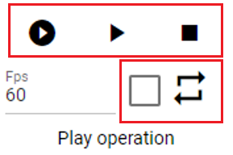
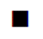
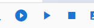

#########################################
アニメーションの再生と停止
#########################################

.. index:: アニメーションを再生する（アニメーションプロジェクト）

アニメーションの再生と停止
===============================

　アニメーションを再生したり一時停止する手順です。リボンバーのアニメーションタブのこれらのボタンを使います。

|

1. 最初から再生する場合はこのボタンで行います。

|

|normalplay| 途中から再生するはこちらのボタンを押します。

2. 一時停止する場合はこのボタンを押します。

.. figure:: img/play_4.png
    :align: center

    ※一時停止ボタンは再生状態により、途中から再生ボタンとアイコンが切り替わります。

3. 停止する場合はこのボタンを押します。

|

.. note::
    タイムラインの上部のバーからも同じ操作を行えます。
    |tlbarplay| 

|

.. index:: アニメーションをループ再生する（アニメーションプロジェクト）

アニメーションをループ再生する
===================================

　アニメーションを停止する手順です。リボンバーのアニメーションタブのこのボタンを使います。

1. アニメーションをループ再生するにはこれにチェックを入れます。

|

2. その後、最初から再生ボタンあるいは途中から再生ボタンを押します。

※再生中にチェックをオンオフ切り替えてもすぐには反映されません。停止して最初から再生することでそのループの設定が正しく反映されます。
