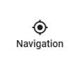
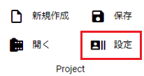
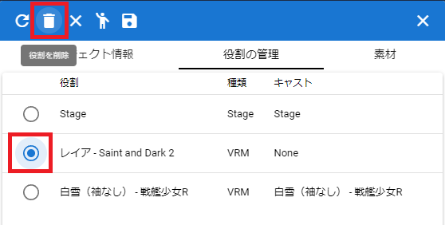
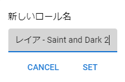

#########################################
アニメーションの各種設定
#########################################

.. contents::

.. index:: フレーム数とFPSを設定する（アニメーションプロジェクト）

.. _setfpsframe:

フレーム数とFPSを設定する
-------------------------------

　アニメーションの長さを最初に決めます。デフォルトでは60となっており、FPSも60になっています。リボンバーの ``アニメーション`` タブにある図の2箇所を好みで設定してください。

.. |prop_right| image:: img/proper_1right.png
.. |prop_left| image:: img/proper_1left.png

.. csv-table::
    :align: center

    |prop_left| , |prop_right|
    プロジェクトの設定画面, リボンバー
    FPS（1秒間あたりのフレーム数）, 最大のフレーム数

|

※FPSで示される ``フレーム`` と本アプリでの ``フレーム`` は同意味ではありません。本アプリでの ``フレーム`` はあくまでもデータの管理上の配列の意味にすぎません。

.. warning::
    FPSを変更すると、 ``FPS / 6000.0`` を再計算して自動的に全キーフレームのduration(間隔)を更新します。手動で設定した間隔も全て変更されるので、FPSの変更を本当にするべきなのか確認してください。

|

.. index:: デフォルトの間隔を設定する

.. _setdefaultduration:

デフォルトの間隔を設定する
---------------------------------

　アニメーションプロジェクトでは、そのフレームの内容に到達する間隔が秒数で決まっています。デフォルトでは ``FPS / 6000.0`` の計算結果が設定されています。

　これを任意の秒数に変更することができます。

1. リボンバーの ``デフォルトの間隔`` を入力します。（0.0001～99.9999 秒）

.. image:: img/proper_h.png
    :align: center

|

　ここで指定することにより、これ以後のキーフレームの登録では変更後の秒数が基準となって登録されます。

　フレームを1つ以上離して登録すると、そのフレームの間隔は ``デフォルトの間隔 * 離したフレーム数`` の計算結果をベースとして調整された秒数となります。

.. hint::
    キーフレーム個別で間隔を設定したい場合は後述の :doc:`animation_register` →「キーフレームの間隔を設定する」を参照してください。

.. index:: 
    WebGL画面サイズを設定する（アニメーションプロジェクト）
    ウィンドウサイズ
    WebGL画面サイズ

WebGL画面サイズを設定する
---------------------------

　必要に応じてWebGLの画面サイズを設定します。デフォルトはウィンドウの大きさに依存しています。リボンバーの ``画面`` タブにて画面サイズを指定してください。

.. image:: img/proper_2.png
    :align: center

|

| 　現在のアプリのウィンドウサイズを超える画面サイズを指定した場合はスクロールバーが表示されます。
| 　 ``元のサイズ`` ボタンを押すとウィンドウサイズにフィットした画面サイズに戻ります。 

　また、比率が違うと画面サイズを変えた時にメインカメラやCameraオブジェクトからの想定していた見え方が変わってきますのでご注意ください。

.. admonition:: ウィンドウのサイズとWebGLの画面サイズの関係について

    本アプリではウィンドウサイズの変更とWebGLの画面サイズの変更の2種類の意味が存在します。

    :ウィンドウサイズの変更:
        　アプリのウィンドウ自体の変更です。リボンバーや左右のパネル・タイムラインパネルを差し引いた幅・高さがWebGL画面の最終的なサイズとなります。WebGL画面サイズがアプリの初期状態の場合、WebGL画面はウィンドウサイズに応じて自動的にリサイズされます。
    
    
    :WebGLの画面サイズの変更:
        | 　アプリのウィンドウと関係なくサイズを変更することができます。WebGL画面のサイズが大幅に大きい場合はスクロールバーが表示されます。一度でも手動でWebGL画面サイズを変更している場合はウィンドウサイズを変更しても自動的に変わることはありません。
        | ``元のサイズ`` で元に戻せばまた自動的にリサイズされるようになります。

|

.. index:: ナビゲーション(アニメーションの各種設定)

ナビゲーションウィンドウ
^^^^^^^^^^^^^^^^^^^^^^^^^^^^

　画面サイズが変わった時にスクロールするのは手間になります。そのような時にこれを使うと全体を把握しつつスクロールできるようになるため操作性の向上が見込めます。

1. リボンバーの画面タブにある ``Navigation`` ボタンを押します。
 

|

2. アプリのメインウィンドウ内にナビゲーションの小ウィンドウが表示されます。

.. image:: ../img/screen_naviwin.png
    :align: center

|

3. ナビゲーションのプレビュー画面に現在表示中の範囲として赤い枠が表示されます。
4. 表示領域よりWebGL画面の解像度が大きい場合、赤い枠を任意の場所でクリックしたりドラッグすると、WebGL画面がその通りにスクロールします。

.. hint::
    ナビゲーションのウィンドウ内からも ``元のサイズ`` や ``カメラのリセット`` を行うことができます。

|

.. index:: ロールにキャストを割り当てる（アニメーションプロジェクト）

.. _settingcast2role:

ロールにキャストを割り当てる
--------------------------------

　アニメーションプロジェクトはロールごとにタイムラインが存在します。ロールは通常、キャスト（アバター・オブジェクト）を読み込んだときに自動的に割り当てられます。ここではキャストを特定のロールに割り当てる方法を説明します。

　キャストがロールに割り当られることにより、ロール上にあるアニメーションデータをそのキャストで再生できるようになります。

キャスト（アバター・オブジェクト）とロールが紐づくタイミング
    * VRoid/VRMや各オブジェクトなどを新規に読み込んだとき
    * 役割の設定画面で後から変更したとき
    * 保存したプロジェクトを開いたとき

|

後からキャストをロールに割り当てる
^^^^^^^^^^^^^^^^^^^^^^^^^^^^^^^^^^^^

    　ケースとしては、一度登録したアニメーションを後から読み込んだ同種類のキャストに置き換えたい、などです。

    1. リボンバーの ``アニメーション`` タブから ``設定`` をクリックします。

    .. image:: img/proper_3.png
        :align: center

    |

    2.  ``役割の管理`` タブを開きます。

    .. image:: img/proper_4.png
        :align: center

    |

    1. キャストを割り当てたい役割（ロール）の列をクリックします。

    .. image:: img/proper_5.png
        :align: center

    |

    4. ポップアップダイアログが開くので、目的のキャストを選択してSETボタンを押します。

    .. image:: img/proper_6.png
        :align: center

    |

    .. note::
        ``None`` を選択するとロールをキャストなしの状態にすることができます。

    5. 元々の役割からキャストが自動的に割当解除されるのを確認します。

    .. image:: img/proper_7.png
        :align: center

    |

    ※アニメーションのタイムライン上も表示が切り替わります。

    .. figure:: img/proper_8.png
        :align: center

        **上:** 後から割り当てたロールのタイムライン

        **下:** 元々のロールのタイムライン

    |

    キャストの割当が解除されたロールとタイムラインは削除されずにそのまま残ります。

|

.. index:: ロールの削除（アニメーションプロジェクト）

ロールを削除する
--------------------

| 　ロールを削除します。アニメーションプロジェクトにおいて不要になったロールを削除します。この操作により、ロールに割り当てられているキャストである実際のオブジェクトも合わせて削除されます。
| 　キャスト（オブジェクト）だけを削除する場合はオブジェクト一覧を右クリックして削除してください。

1. リボンバーの ``アニメーション`` タブから ``設定`` をクリックします。

|

2. ``役割の管理`` タブを開きます。
3. 削除したい役割の左端のラジオボタンにチェックを入れ、ツールバーの ``役割を削除`` をクリックします。

|

4. 確認メッセージが表示されるのでよければOKボタンを押します。

.. warning::
    * このようにロールを削除すると、ロールとキャスト（オブジェクト）の両方を削除します。
    * Stageは削除できません。

※オブジェクト一覧で右クリックし、 ``このオブジェクトとロールを両方削除する`` でも同じことを行えます。

.. image:: img/proper_a.png
    :align: center

|

.. index:: タイムラインをまとめて削除する（アニメーションプロジェクト）

空のタイムラインをまとめて削除する
----------------------------------------

　ロールにキャスト（オブジェクト）を割り当るのを繰り返していると、オブジェクトが割り当てられていない・何もキーフレームが登録されていないタイムライン（ロール）が比較的多く残ることがあります。

1. リボンバーの ``アニメーション`` タブの ``設定`` をクリックします。

2. ツールバーの ``空のタイムラインを削除`` をクリックします。

.. image:: img/proper_e.png
    :align: center

|

3. 確認メッセージが表示されるのでよければOKボタンを押します。

.. image:: img/proper_f.png
    :align: center

|

ここで削除されるのは次の条件に合致するタイムラインです。

    | 1. キーフレームが一つも登録されていない
    | 2. タイムライン（ロール）にオブジェクトが割り当てられていない

.. warning::
    ※SystemEffect、BGM、SE、Stageはロールとオブジェクトを分離することはできないため、対象になりません。

|

.. index:: ロールのタイトルを変更する（アニメーションプロジェクト）

ロールのタイトルを変更する
------------------------------------

　ロールにはわかりやすさのためタイトルを入力できます。通常は次のように初期値として設定されます。

:VRM:
    VRMのメタ情報のタイトル

:VRM以外:
    種類名＋日時による連番

| 　この仕様のため、VRMのタイトルがロールのタイトルと同じVRMの場合は自動的にロールとキャストが割り当てられます。
| 　変更するとVRMは自動的に割り当てられなくなりますが、アニメーションプロジェクトにおいてわかりやすいロール名で管理することができます。

1. リボンバーの ``アニメーション`` タブから ``設定`` をクリックします。

|

2. ``役割の管理`` タブを開きます。

.. image:: img/proper_b.png
    :align: center

|

3. 役割のタイトルを編集したい行を探し役割の箇所をクリックします。

.. image:: img/proper_c.png
    :align: center

|

4. ポップアップダイアログが表示されるので新しい名前を入力しSETボタンを押します。

|

入力を確定するとタイムライン上のロールのタイトルの表示も変わります。

|

.. index:: ロールを再読込する（アニメーションプロジェクト）

すべてのロールを再読込する
------------------------------------

　HTMLとUnityのWebGLは常に完全に連動しているわけではありません。HTML側とWebGL側のロールのデータと表示にずれがあった場合に再読込することで表示を最新化します。

1. リボンバーの ``アニメーション`` タブの ``設定`` をクリックします。

|

2. ``役割の管理`` タブを開きます。
3. ツールバーの ``最新の状態に更新`` をクリックします。

.. image:: img/proper_g.png
    :align: center

|

