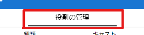
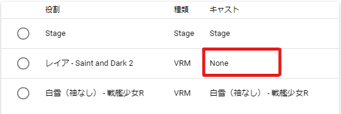

#########################################
アニメーションの各種設定
#########################################

.. index:: フレーム数とFPSを設定する（アニメーションプロジェクト）

フレーム数とFPSを設定する
-------------------------------

　アニメーションの長さを最初に決めます。デフォルトでは60となっており、FPSも60になっています。リボンバーの「アニメーション」タブにある図の2箇所を好みで設定してください。

.. image:: img/proper_1.png
    :align: center

|

※FPSで示される「フレーム」と本アプリでの「フレーム」は同意味ではありません。本アプリでの「フレーム」はあくまでもデータの管理上の配列の意味にすぎません。

|

.. index:: 画面サイズを設定する（アニメーションプロジェクト）

画面サイズを設定する
---------------------------

　必要に応じて画面サイズを設定します。デフォルトはウィンドウの大きさに依存しています。リボンバーの「画面」タブにて画面サイズを指定してください。

.. image:: img/proper_2.png
    :align: center

|

| 　現在のアプリのウィンドウサイズを超える画面サイズを指定した場合はスクロールバーが表示されます。
| 　「元のサイズ」ボタンを押すとウィンドウサイズにフィットした画面サイズに戻ります。（HTMLとWebGLの仕様の関係上、1回押しただけでは入力欄の数値までは変わりません。もう一度「元のサイズ」ボタンを押すとサイズの数値も元に戻ります。

　また、比率が違うと画面サイズを変えた時にメインカメラやCameraオブジェクトからの想定していた見え方が変わってきますのでご注意ください。

|

.. index:: ロールにキャストを割り当てる（アニメーションプロジェクト）

ロールにキャストを割り当てる
--------------------------------

　アニメーションプロジェクトはロールごとにタイムラインが存在します。ロールは通常、キャスト（アバター・オブジェクト）を読み込んだときに自動的に割り当てられます。ここではキャストを特定のロールに割り当てる方法を説明します。

　キャストがロールに割り当られることにより、ロール上にあるアニメーションデータをそのキャストで再生できるようになります。

キャストとロールが紐づくタイミング
    * VRoid/VRMや各オブジェクトなどを新規に読み込んだとき
    * 役割の設定画面で後から変更したとき

.. note::
    　VRMについてはアニメーションプロジェクトファイルを先に開くか、VRMを先に開くかにより紐づき方が若干変わります。

アニメーションプロジェクト　→　VRM　の順
    アニメーションプロジェクトにすでにある **ロールのタイトルとVRMのタイトルが同じ** 場合、自動的に紐付いて割当てが完了します。

VRM　→　アニメーションプロジェクト　の順
    　**自動的には割り当てられません**。
    　元々のVRMのロールとアニメーションプロジェクト中のロールが同じVRMを指していたとしても、元々のVRMのロールにモーションデータが存在する可能性を考慮したためです。

|

後からキャストをロールに割り当てる
^^^^^^^^^^^^^^^^^^^^^^^^^^^^^^^^^^^^

1. リボンバーの「アニメーション」タブから「設定」をクリックします。

.. image:: img/proper_3.png
    :align: center

|

2. 「キャストを選択」タブを開きます。

|

1. キャストを割り当てたい役割（ロール）のキャストの列をクリックします。

|

4. ポップアップダイアログが開くので、目的のキャストを選択してSETボタンを押します。

|

.. note::
    ``None`` を選択するとロールをキャストなしの状態にすることができます。

5. 元々の役割からキャストが自動的に割当解除されるのを確認します。

.. image:: img/proper_7.png
    :align: center

|

※アニメーションのタイムライン上も表示が切り替わります。

.. figure:: img/proper_8.png
    :align: center

    **上:** 後から割り当てたロールのタイムライン

    **下:** 元々のロールのタイムライン

|

キャストの割当が解除されたロールとタイムラインは削除されずにそのまま残ります。

|

.. index:: ロールの削除（アニメーションプロジェクト）

ロールを削除する
--------------------

| 　ロールを削除します。アニメーションプロジェクトにおいて不要になったロールを削除します。この操作により、ロールに割り当てられているキャストである実際のオブジェクトも合わせて削除されます。
| 　キャスト（オブジェクト）だけを削除する場合はオブジェクト一覧を右クリックして削除してください。

1,リボンバーの「アニメーション」タブから「設定」をクリックします。

.. image:: img/proper_3.png
    :align: center

|

2. ツールバーの「役割を削除」をクリックします。

.. figure:: img/proper_9.png
    :align: center

    選択する行は「役割を編集」「キャストを選択」どちらの一覧でもかまいません。

3. 確認メッセージが表示されるのでよければOKボタンを押します。

.. warning::
    * このようにロールを削除すると、ロールとキャスト（オブジェクト）の両方を削除します。
    * Stageは削除できません。

※オブジェクト一覧で右クリックし、「このオブジェクトとロールを両方削除する」でも同じことを行えます。

|

.. index:: タイムラインをまとめて削除する（アニメーションプロジェクト）

空のタイムラインをまとめて削除する
----------------------------------------

　ロールにキャスト（オブジェクト）を割り当るのを繰り返していると、オブジェクトが割り当てられていない・何もキーフレームが登録されていないタイムライン（ロール）が比較的多く残ることがあります。

1. リボンバーのアニメーションタブの「設定」をクリックします。

2. ツールバーの「空のタイムラインを削除」をクリックします。

|

3. 確認メッセージが表示されるのでよければOKボタンを押します。

.. image:: img/proper_f.png
    :align: center

|

ここで削除されるのは次の条件に合致するタイムラインです。

    | 1. キーフレームが一つも登録されていない
    | 2. タイムライン（ロール）にオブジェクトが割り当てられていない

.. warning::
    ※SystemEffect、BGM、SE、Stageはロールとオブジェクトを分離することはできないため、対象になりません。

|

.. index:: ロールのタイトルを変更する（アニメーションプロジェクト）

ロールのタイトルを変更する
------------------------------------

　ロールにはわかりやすさのためタイトルを入力できます。通常は次のように初期値として設定されます。

:VRM:
    VRMのメタ情報のタイトル

:VRM以外:
    種類名＋日時による連番

| 　この仕様のため、VRMのタイトルがロールのタイトルと同じVRMの場合は自動的にロールとキャストが割り当てられます。
| 　変更するとVRMは自動的に割り当てられなくなりますが、アニメーションプロジェクトにおいてわかりやすいロール名で管理することができます。

1,リボンバーの「アニメーション」タブから「設定」をクリックします。

.. image:: img/proper_3.png
    :align: center

|

2,「役割を編集」タブを開きます。

|

3,役割のタイトルを編集したい行を探し役割の箇所をクリックします。

.. image:: img/proper_c.png
    :align: center

|

4, ポップアップダイアログが表示されるので新しい名前を入力します。

.. image:: img/proper_d.png
    :align: center

|

入力を確定するとタイムライン上のロールのタイトルの表示も変わります。

|

.. index:: ロールを再読込する（アニメーションプロジェクト）

すべてのロールを再読込する
------------------------------------

　HTMLとUnityのWebGLは常に完全に連動しているわけではありません。HTML側とWebGL側のロールのデータと表示にずれがあった場合に再読込することで表示を最新化します。

1,リボンバーのアニメーションタブの「設定」をクリックします。

.. image:: img/proper_3.png
    :align: center

|

2,ツールバーの「最新の状態に更新」をクリックします。

.. image:: img/proper_g.png
    :align: center

|
