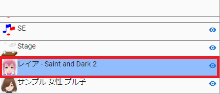
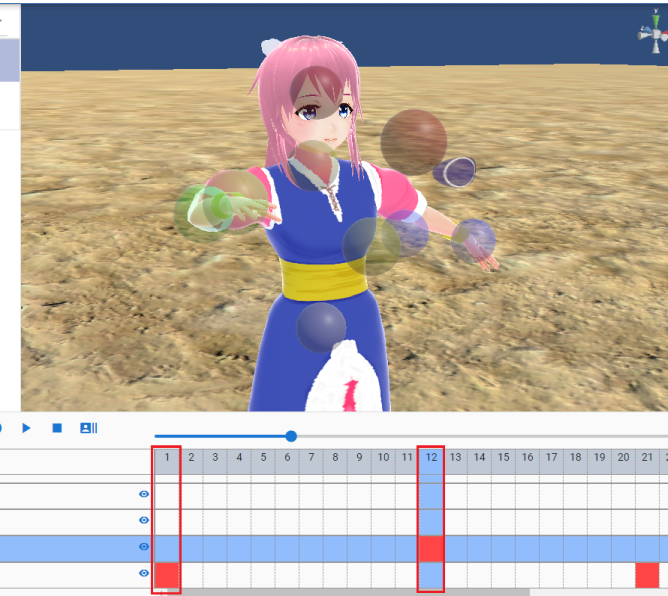

.. index:: キーフレームの登録と設定（アニメーションプロジェクト）

#########################################
キーフレームの登録と設定
#########################################

.. index:: フレームを選択する（アニメーションプロジェクト）

フレームを選択する
===============================

　基本の操作であるフレームの選択操作です。選択には２つの種類があります。

:フレーム番号を選択:
    フレーム位置の選択
:タイムラインの行を選択:
    タイムライン（ロール）の選択

フレーム位置の選択
^^^^^^^^^^^^^^^^^^^^^^

1. タイムラインの上部のフレームの番号をクリックして選択します。

.. image:: img/register_1.png
    :align: center

|

※キーフレームが未登録の場合、キーフレーム部分をクリックしても選択されません。

タイムライン（ロール）の選択
^^^^^^^^^^^^^^^^^^^^^^^^^^^^^^^

1. タイムラインの左のロール名をクリックして選択します。

|

オブジェクト一覧を選択してもタイムラインを選択することができます。

.. image:: img/register_d.png
    :align: center

|

※ただし該当のオブジェクトがロールに紐付いている場合のみ

キーフレームが登録済みの場合
^^^^^^^^^^^^^^^^^^^^^^^^^^^^^^^

1. 登録済みのキーフレームがある箇所をクリックするとフレーム位置とタイムライン（ロール）の両方を選択します。

.. image:: img/register_6.png
    :align: center

|

|

.. index:: キーフレームの登録・更新

キーフレームに登録する・更新する
=====================================

　タイムラインにキーフレームを登録していきます。キーフレームに登録できる内容は次のとおりです。

:登録できる内容:
    * 本アプリで実装しているVRoid/VRMの全ての動作
    * それ以外のオブジェクトの全動作
    * システムエフェクトやオーディオの操作
    * FBXのアニメーション、エフェクトのアニメーション

.. note::
    | ※テクスチャファイルなどの本アプリの操作対象のオブジェクトに含まれないファイルの操作はアニメーションに含まれません。
    | ※一般的に用いられるFBXなどの3Dオブジェクトのアニメーションは、本アプリのアニメーションプロジェクトの中で個別に再生することはできます。

    ※MMDのように特定のボーンだけの登録、ということはできません。必ず全IKパーツを各フレームごとに登録することになります。（つまり、現在のポーズ・状態をまるごと保存する）

1. ポーズを取らせるVRoid/VRMのタイムラインのキーフレームの番号をクリックして選択します。

.. image:: img/register_1.png
    :align: center

|

.. warning::
    ※すでにキーフレームに登録がある場合はそのポーズが読み込まれて現在のポーズが上書きされるのでご注意ください。

2. VRoid/VRMや各オブジェクトにポーズを取らせます。

.. image:: img/register_2.png
    :align: center

|

3. リボンバーのアニメーションタブにある「キーフレーム登録」をクリックします。

|

.. |allregist| image:: img/register_4.png
.. |contextregist| image:: img/register_5.png

|

すべてのオブジェクトを一括で登録する
    |allregist| 　すべてのオブジェクトの現在のポーズ・状態を登録したい場合は「全オブジェクトを登録」をクリックしてください。

右クリックから登録する
    |contextregist| 　オブジェクト一覧上で右クリックし、「ポーズを現在のフレームに登録する」をクリックしても同じ機能です。

※システムエフェクトとオーディオはそれぞれのリボンバーのタブ内に登録ボタンが存在します。

4. タイムライン中の対象のキーフレームが塗りつぶされることを確認します。

.. image:: img/register_6.png
    :align: center

|

5. 別のキーフレームを選択し、別のポーズを取らせてまた登録します。

|

これを作りたいアニメーションの長さ分繰り返していきます。

.. index:: キーフレーム間の補正

.. admonition:: ※キーフレーム間の補正は？

    　本アプリで使用中のライブラリの効果により、登録済みキーフレーム間のアニメーションの補正は自動的に行われます。（一部補正しきれないモーションもあります）

    　なにも登録されていないフレーム番号をクリックした際、登録したキーフレーム間だった場合はアニメーションの途中のポーズが再現されます。これは後述のイージングや間隔により変化します。

.. index:: キーフレームを削除する

キーフレームを削除する
==========================

　タイムライン中の登録済みキーフレームを削除する方法です。

1. 削除したいオブジェクト、そしてキーフレームの番号をクリックして選択します。

.. image:: img/register_8.png
    :align: center

|

2. リボンバーの「アニメーション」タブにある「キーフレームを削除」をクリックします。

.. image:: img/register_9.png
    :align: center

|

3. 確認メッセージが表示されるので問題なければOKボタンを押します。

.. image:: img/register_a.png
    :align: center

|

.. index:: キーフレーム位置を変更

登録したキーフレーム位置を変更する
===========================================

　登録済みキーフレームのフレーム位置を移動させることができます。

1. キーフレームを登録します。

2. 登録したキーフレーム部分をダブルクリックします。

.. figure:: img/register_6.png
    :align: center
    
    　このときのキーフレームは、フレーム番号が正しく選択されていることを確認してください。

|

3. フレームの入力ボックスに新しい位置の数値を入力し、編集ボタンを押します。

.. image:: img/register_b.png
    :align: center

|

.. note::
    | ※変更するとタイムライン上のキーフレームの表示も即座に切り替わります。
    | ※変更先のフレーム位置にすでにキーフレームが登録されていた場合はボタンを押すことは出来ません。

|

.. index:: イージングを設定
.. index:: Easing

イージングを設定する
==============================

　キーフレームを登録した後に設定可能です。アニメーションに慣れていればすでにご存知かもしれませんが、これはあるキーフレームに変化する際の時間のかかり方やスピードなどの動き方に関わる要素です。これを変更することでアニメーションが単調な印象なものから活き活きとしたものになります。

1,キーフレームを登録します。

2,登録したキーフレーム部分をダブルクリックします。

.. figure:: img/register_6.png
    :align: center
    
    　このときのキーフレームは、フレーム番号が正しく選択されていることを確認してください。

3,イージングのコンボボックスから好きなイージングの種類を選びます。

.. image:: img/register_e.png
    :align: center

|

※イージングについては下記のサイトが参考になります。

`イージング関数チートシート <https://easings.net/ja>`_

|

.. index:: キーフレームの間隔を設定

キーフレームの間隔を設定する
===================================

　キーフレームを登録した後に設定可能です。該当のキーフレームに至るまでの時間を設定します。基本的に自動で計算されますが、手動で指定することもできます。

::

    デフォルトの間隔(duration)・・・ [FPS / 6000] 秒

1. キーフレームを登録します。

2. 登録したキーフレーム部分をダブルクリックします。

.. figure:: img/register_6.png
    :align: center
    
    　このときのキーフレームは、フレーム番号が正しく選択されていることを確認してください。

3. 間隔(duration) の欄を秒数で指定します。

.. image:: img/register_f.png
    :align: center

|

