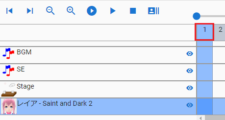
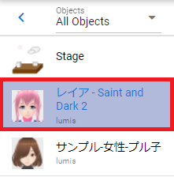
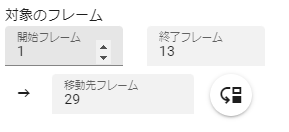
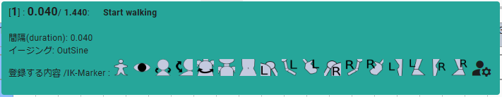

.. index:: キーフレームの登録と設定（アニメーションプロジェクト）

#########################################
キーフレームの登録と設定
#########################################

.. contents::

.. index:: 
    フレームを選択する（アニメーションプロジェクト）
    キーフレームの復元

フレームを選択する
===============================

　基本の操作であるフレームの選択操作です。選択には２つの種類があります。

:フレーム番号を選択:
    フレーム位置の選択
:タイムラインの行を選択:
    タイムライン（ロール）の選択

フレーム位置の選択
^^^^^^^^^^^^^^^^^^^^^^

1. タイムラインの上部のフレームの番号をクリックして選択します。

|

2. 該当位置にキーフレームが登録済みの場合、UIに設定が復元され、オブジェクトがその状態に復元されます。

※キーフレームが未登録の場合、キーフレーム部分をクリックしても選択されません。

タイムライン（ロール）の選択
^^^^^^^^^^^^^^^^^^^^^^^^^^^^^^^

1. タイムラインの左のロール名をクリックして選択します。

.. image:: img/register_c.png
    :align: center

|

オブジェクト一覧を選択してもタイムラインを選択することができます。

|

※ただし該当のオブジェクトがロールに紐付いている場合のみ

2. そのオブジェクトの設定がUIに復元されます。

キーフレームが登録済みの場合
^^^^^^^^^^^^^^^^^^^^^^^^^^^^^^^

1. 登録済みのキーフレームがある箇所をクリックするとフレーム位置とタイムライン（ロール）の両方を選択します。

.. image:: img/register_6.png
    :align: center

|

.. _reg_anim:

.. index:: 
    キーフレームの登録・更新
    キーフレームの登録ウィンドウ（アニメーション）

キーフレームに登録する・更新する
=====================================

　タイムラインにキーフレームを登録していきます。キーフレームに登録できる内容は次のとおりです。

:登録できる内容:
    * 本アプリで実装しているVRoid/VRMの全ての動作
    * それ以外のオブジェクトの全動作
    * システムエフェクトやオーディオの操作
    * FBXのアニメーション、エフェクトのアニメーション

.. note::
    * テクスチャファイルなどの素材の管理はアニメーションに含まれません。各オブジェクトで使われる素材名に該当する各ファイルを事前に読み込んでおいてください。
    * 一般的に用いられるFBXなどの3Dオブジェクトのアニメーションは、本アプリのアニメーションプロジェクトの中で個別に再生することはできます。
    * ``ver 2.1.0`` よりシステムエフェクトとオーディオの登録もキーフレームの登録ウィンドウ内のボタンから行えるようになりました。（リボンバーのそれぞれのタブ内にあった登録ボタンは廃止しました）

.. admonition:: ボーン(IKマーカー)単位でのキーフレーム登録はできない？

    ※MMDのように特定のボーンだけの登録、ということはできません。必ず全IKパーツを各フレームごとに登録することになります。（つまり、現在のポーズ・状態をまるごと保存する）

    ``ver 2.1.0`` より、これから登録しようとしているボーン(本アプリではIKマーカーと呼称)をUI上で確認できるようにしました。将来的にはMMD/MMMと同様にボーン単位でのキーフレームの登録を出来るようにする予定です。

1. ポーズを取らせるVRoid/VRMのタイムラインのキーフレームの番号をクリックして選択します。

|

.. warning::
    ※すでにキーフレームに登録がある場合はそのポーズが読み込まれて現在のポーズが上書きされるのでご注意ください。

2. VRoid/VRMや各オブジェクトにポーズを取らせます。

|

3. リボンバーの ``アニメーション`` タブにある ``キーフレーム登録`` をクリックします。

.. image:: img/register_3.png
    :align: center

|

1. ``キーフレームの登録ウィンドウ`` が表示されます。

.. |keyframe1| image:: ../img/screen_ribbon_animation_keyframe1.png

キーフレームの登録ウィンドウでは、これから登録しようとしている内容とボーンを確認できます。

.. csv-table::
    :header-rows: 1

    VRM, VRM以外
    |keyframe1|, |keyframe2|
    IKParentを含めた全てのIKマーカー, IKParentのみ

.. hint::
    リボンバーの中ならどこで右クリック（macOSの場合はControlキーを押しながらクリックまたは2点タップ）することで表示可能です。

.. index:: キーフレームに登録する内容

登録する内容を決める
    ``登録する内容`` では次の内容を選ぶことができます。

    .. csv-table::
        
        共通(移動), IKマーカーの移動のみを登録します。プロパティ一覧の ``共通`` タブの ``位置`` のことです。
        共通(移動以外),IKマーカーの回転・倍率・ジャンプ・揺れを登録します。プロパティ一覧の ``共通`` タブの同名の項目です。
        プロパティ, 現在選択中のオブジェクトの各プロパティを登録します。プロパティ一覧の共通以外のタブのことです。
    
    * ``ver 2.0.3`` までは強制的に3種類全てが登録されました。
    * ``ver 2.1.0`` 以降では、例えば1フレーム目でブレンドシェイプを変更したらその後ずっとそのブレンドシェイプを反映し続けたいという場合に、2フレーム目以降ではプロパティのチェックを外して登録することで、再びプロパティを変更するキーフレームまでずっとそのままにすることができます。ブレンドシェイプを修正するには1フレーム目と再び変更するフレームだけで済むようにできます。
    * システムエフェクトとオーディオではチェックをオンオフしても意味はありません。

.. |vvmico_ikparent| image:: img/vvmico_bn_ikparent.png
.. |vvmico_head| image:: img/vvmico_bn_head.png
.. |vvmico_eye| image:: img/vvmico_bn_eyeviewhandle.png
.. |vvmico_lookat| image:: img/vvmico_bn_lookat.png
.. |vvmico_chest| image:: img/vvmico_bn_chest.png

.. |vvmico_pelvis| image:: img/vvmico_bn_pelvis.png

.. |vvmico_rightla| image:: img/vvmico_bn_rightlowerarm.png

.. |vvmico_leftsho| image:: img/vvmico_bn_leftshoulder.png

.. |vvmico_lefthand| image:: img/vvmico_bn_lefthand.png
.. |vvmico_rightll| image:: img/vvmico_bn_rightlowerleg.png
.. |vvmico_rightft| image:: img/vvmico_bn_rightleg.png
.. |vvmico_leftll| image:: img/vvmico_bn_leftlowerleg.png
.. |vvmico_leftft| image:: img/vvmico_bn_leftleg.png
.. |vvmico_prop| image:: img/vvmico_prop.png

登録するIKマーカーを確認する
    ``登録するボーン`` では実際に登録されるIKマーカーを確認できます。なおVRMとそれ以外のオブジェクトで確認できるIKマーカーの数が異なります。
    
    :VRM: 
        .. csv-table::

            |vvmico_prop| プロパティ, |vvmico_ikparent| IKParent, |vvmico_head| Head, |vvmico_eye| EyeViewHandle, |vvmico_lookat| LookAt
            |vvmico_chest| Chest, |vvmico_aim| Aim, |vvmico_pelvis| Pelvis, |vvmico_leftsho| LeftShoulder, |vvmico_rightsho| RightShoulder
            |vvmico_leftla| LeftLowerArm, |vvmico_lefthand| LeftHand, |vvmico_rightla| RightLowerArm, |vvmico_righthand| RightHand,
            |vvmico_leftll| LeftLowerLeg, |vvmico_leftft| LeftLeg, |vvmico_rightll| RightLowerLeg, |vvmico_rightft| RightLeg, 
        
    :VRM以外: 
        .. csv-table::

            |vvmico_ikparent| IKParent, |vvmico_prop| プロパティ

    なお、アイコンで部位がわかるようにも表現しています。このアイコンはタイムライン上でのキーフレーム内容のポップアップでも使用されます。

    .. image:: ../img/screen_timeline02.png
        :align: center

.. |allregist| image:: img/register_4.png
.. |contextregist| image:: img/register_5.png

|

..
    すべてのオブジェクトを一括で登録する
        |allregist| 　すべてのオブジェクトの現在のポーズ・状態を登録したい場合は ``全オブジェクトを登録`` をクリックしてください。

右クリックから登録する
    |contextregist| 　オブジェクト一覧上で右クリックし、 ``ポーズを現在のフレームに登録する`` をクリックしても同じ機能です。

6. タイムライン中の対象のキーフレームが塗りつぶされることを確認します。

.. image:: img/register_6.png
    :align: center

|

    .. note::
        * 移動や回転などの共通プロパティが登録されたキーフレームは数字が表示されます。
        * 後述の子キーが登録されるとその数字が増えます。
        * 共通プロパティの登録がないキーフレームには数字は表示されません。

7. 別のキーフレームを選択し、別のポーズを取らせてまた登録します。

.. image:: img/register_7.png
    :align: center

|

これを作りたいアニメーションの長さ分繰り返していきます。

.. index:: キーフレーム間の補正

.. admonition:: キーフレーム間の補正は？

    　本アプリで使用中のライブラリの効果により、登録済みキーフレーム間のアニメーションの補正は自動的に行われます。（一部補正しきれないモーションもあります）

    　なにも登録されていないフレーム番号をクリックした際、登録したキーフレーム間だった場合はアニメーションの途中のポーズが再現されます。これは後述のイージングや間隔により変化します。

.. index:: 
    キーフレームを削除する
    キーフレームのプロパティだけを削除する

キーフレームを削除する
==========================

　タイムライン中の登録済みキーフレームを削除します。

1. 削除したいオブジェクト、そしてキーフレームの番号をクリックして選択します。

.. image:: img/register_8.png
    :align: center

|

2. リボンバーの ``アニメーション`` タブにある ``キーフレームを削除`` をクリックします。

|

3. 削除する方法を選んでクリックします。

    .. csv-table::
        :align: center

        キーフレームを削除, 通常通りキーフレーム自体を削除します。
        プロパティだけを削除, キーフレームの登録内容のうち、``共通以外`` のオブジェクトの各プロパティを削除します。キーフレームは削除されません。

4. 確認メッセージが表示されるので問題なければOKボタンを押します。

.. image:: img/register_a.png
    :align: center

|

.. index:: 
    キーフレーム位置を変更
    複数のキーフレームを対象にする

登録したキーフレーム位置を変更する
===========================================

　登録済みキーフレームのフレーム位置を移動させることができます。

1. キーフレームを登録します。

2. 登録したキーフレーム部分をダブルクリックします。

.. figure:: img/register_6.png
    :align: center
    
    　このときのキーフレームは、フレーム番号が正しく選択されていることを確認してください。

|

3. 移動先フレームの入力ボックスに新しい位置の数値を入力し、移動のアイコンのボタンを押します。

|

.. note::
    * 変更するとタイムライン上のキーフレームの表示も即座に切り替わります。
    * 変更先のフレーム位置にすでにキーフレームが登録されていた場合はボタンを押すことは出来ません。

.. hint::
    開始フレームと終了フレームを特定の範囲で指定すると、一度に複数のキーフレームを動かすことができます。

    例
        | キーフレームが存在する位置＝10, 13, 14
        | 現在の開始フレーム＝10
        | 現在の終了フレーム＝15
        | 移動先フレーム＝20

        | 移動後＝20, 23, 24

|

.. index:: 変更可能なプロパティ

変更可能なプロパティ
==============================

　キーフレームの設定ダイアログで変更可能なプロパティは次のとおりです。いずれのプロパティもキーフレームを複数対象にすることで一度に多くの変更を行うことができます。活用しどころが多いと思います。

　なお、登録済みのキーの位置にマウスカーソルを当てると、ポップアップ表示されてその位置の間隔とイージングを確認することができます。

|

.. index:: メモを記入する(キーフレーム)

メモを記入する
^^^^^^^^^^^^^^^^^^^^^^

　キーフレームを登録した後に設定可能です。実際の動きやプロパティには影響しません。そのキーフレームのときにどういう動きをするのかをメモすることができます。

.. index:: イージングを設定する

イージングを設定する
^^^^^^^^^^^^^^^^^^^^^^

　キーフレームを登録した後に設定可能です。アニメーションに慣れていればすでにご存知かもしれませんが、これはあるキーフレームに変化する際の時間のかかり方やスピードなどの動き方に関わる要素です。これを変更することでアニメーションが単調な印象なものから活き活きとしたものになります。

1. キーフレームを登録します。

2. 登録したキーフレーム部分をダブルクリックしてキーフレームウィンドウを開きます。

.. figure:: img/register_6.png
    :align: center
    
    　このときのキーフレームは、フレーム番号が正しく選択されていることを確認してください。

3. イージングのコンボボックスから好きなイージングの種類を選びます。

.. image:: img/register_e.png
    :align: center

|

.. hint::
    開始フレーム・終了フレームを指定すると、一度に複数のキーフレームのイージングを設定変更できます。

    .. image:: img/register_h.png
        :align: center

※イージングについては下記のサイトが参考になります。

`イージング関数チートシート <https://easings.net/ja>`_

.. note::
    VRMViewMeister ver 2.2.0より、連続して同じイージングを指定した範囲はそのイージングに沿ってアニメーションするようになりました。

|

.. index:: キーフレームの間隔を設定

.. _modifyeachduration:

キーフレームの間隔を設定する
^^^^^^^^^^^^^^^^^^^^^^^^^^^^^^^^

　キーフレームを登録した後に設定可能です。該当のキーフレームに至るまでの時間を設定します。基本的に自動で計算されますが、手動で指定することもできます。

::

    デフォルトの間隔(duration)・・・ [FPS / 6000] 秒

1. キーフレームを登録します。

2. 登録したキーフレーム部分をダブルクリックしてキーフレームウィンドウを開きます。

.. figure:: img/register_6.png
    :align: center
    
    　このときのキーフレームは、フレーム番号が正しく選択されていることを確認してください。

3. 間隔(duration) の欄を秒数で指定します。

.. image:: img/register_f.png
    :align: center

|

　これにより、実際のフレーム番号に従ってキーフレームを登録していかなくても **タイムライン（ロール）ごとに自由なタイミングで** モーションを作ることができます。

.. caution::
    　ただし自分で間隔(duration)をきちんと管理しないと各タイムラインごとのモーションのタイミングを図りづらくなり混乱するおそれがあります。ご注意ください。

.. hint::
    開始フレーム・終了フレームを指定すると、一度に複数のキーフレームの間隔を設定変更できます。

    .. image:: img/register_h.png
        :align: center

|

.. index:: 他のアバターのタイムラインから間隔をコピーする

他のアバターのタイムラインから間隔をコピーする
^^^^^^^^^^^^^^^^^^^^^^^^^^^^^^^^^^^^^^^^^^^^^^^^^

　他のタイムラインの特定の範囲のキーフレームから、間隔を合計したものを簡単に取得することができます。

 .. image:: img/register_g.png
    :align: center

1. コピーしたいタイムライン（のロール名）を選択します。
2. ``開始`` と ``終了`` のフレーム番号を入力します。
3. コピーボタンを押すと、指定の範囲の間隔の合計値が間隔(duration)の入力ボックスに反映されます。
4. 本当に適用してもよい場合は間隔(duration)の入力ボックスで端数を消すなどの **キー操作をします。すると変更が確定** します。

.. note::
    　コピーボタンを押すと間隔の合計値が入力ボックスにセットされます。
    
    　その入力を **キャンセルしたい** 場合は入力ボックスで **キー操作をせず、タイムラインの選択を切り替えるなどして** ください。そうすることで変更がキャンセルされ、別のタイムラインやアバターの編集に移ることができます。

|

.. index:: 位置や回転を変更する

位置や回転を変更する
^^^^^^^^^^^^^^^^^^^^^^

　キーフレームを登録した後に設定可能です。選択中のアバターがVRM、OtherObject、カメラ、ライト、エフェクトの場合にそのオブジェクト自体の位置や回転を調整する事ができます。

1. 位置または回転のX, Y, Z軸の入力欄に入力します。
2. 初期設定では相対位置・相対の角度で対象となるキーフレームに変更を適用します。

.. image:: img/register_k.png
    :align: center

:位置: オブジェクトを現在の位置からプラス・マイナスして移動させます。0の場合は変更しません。
:回転: オブジェクトを現在の角度からプラス・マイナスして回転させます。指定可能な値は-180～+180度の範囲です。0の場合は変更しません。

.. note::
    ``絶対指定`` にチェックを入れると絶対指定ができます。
    しかし既存のキーフレーム内の位置・回転を容易に上書きできてしまうため、複数のキーフレームを対象とする際は注意して使って下さい。

.. hint::
    開始フレーム・終了フレームを指定すると、一度に複数のキーフレーム内のオブジェクトの位置・回転を変更できます。

    .. image:: img/register_h.png
        :align: center

|

.. index:: 現在位置に空のフレームを挿入する

現在位置に空のフレームを挿入する
===============================================

　現在選択中のフレーム番号に空のフレームを挿入し、右のすべてのフレームを1つずつずらします。

.. image:: img/register_i.png
    :align: center

1. このアイコンのボタンを押します。
2. すると現在選択中のフレーム位置含めて右すべてのフレームが1つ右にずれ、最大フレーム数が1つ増えます。

.. index:: 現在のフレーム位置を削除

現在のフレーム位置を削除
===============================================

　現在選択中のフレーム位置を削除します。

.. image:: img/register_j.png
    :align: center

1. このアイコンのボタンを押します。
2. 現在選択中のフレーム位置が削除され、右すべてのフレームが1つ左にずれ、最大フレーム数が1つ減ります。

.. warning::
    対象のフレーム位置の各タイムラインにキーフレームが登録済みの場合、それらのキーフレームも削除されます。

|

.. index::
    キーフレームを切り取る
    キーフレームをコピーする
    キーフレームを貼り付ける

キーフレームを切り取り・コピー・貼り付けする
================================================

　登録済みのキーフレームはコピーしたり切り取って貼り付けて移動などを行えます。

.. image:: img/register_m.png
    :align: center

1. リボンバーの ``アニメーション`` タブのこれらのボタンを押します。

**コピーして貼り付ける**

1. コピーボタンを押します。
2. 任意のフレーム番号を選択し、貼り付けボタンを押します。

|

**切り取って貼り付ける**

1. 切り取りボタンを押します。
2. 任意のフレーム番号を選択し、貼り付けボタンを押します。

.. note::
    いずれの場合も、すでにキーフレームが登録済みのフレームに貼り付けた場合は内容が上書きされます。

.. caution::
    貼り付け先のタイムライン（ロール）は同じである必要があります。

    ※オブジェクトの種類が同じであってもロールが異なると貼り付けはできません。

子キー機能
====================

　``ver 2.2.0`` で廃止しました。全てのモーションはイージングを連続して設定することで滑らかにモーションするようになりました。本来の目的を達成できたので子キー機能は廃止しました。

..
    　``ver 2.1.0`` から追加しました。子キーとは、一つのキーフレームに複数のモーションのキーフレームを登録する機能です。これにより少ないキーフレームでもVRMなどのオブジェクトの動きがさらになめらかになります。

    　子キーはタイムラインパネルのツールバーから操作できます。

    .. image:: img/register_n.png
        :align: center

    |

    .. caution::
        子キーはIKマーカーの移動のみ記憶されます。回転などは1キーフレームの1つのIKマーカーにつき1つのみです。

        **キーの流れ**

        .. image:: img/register_n0.png
            :align: center
            :alt: flowchart

    |

    .. |childkey1| image:: img/register_n1.png
    .. |childkey2| image:: img/register_n2.png
    .. |childkey3| image:: img/register_n3.png

    子キーを登録する
    ^^^^^^^^^^^^^^^^^^^^^^

    1. 選択中のオブジェクトに通常通りにポーズを取らせます。
    2. タイムラインパネルのツールバーの入力ボックス |childkey2| の値を **-1** にします。
    3. 子キーの登録には |childkey1| を押します。

    .. caution::
        登録した子キーは修正はできますが通常のキーフレームのように後で入れ替えることはできません。子キー同士を入れ替えたい場合は一旦削除して登録する必要があります。

    |

    子キーを修正する
    ^^^^^^^^^^^^^^^^^^^^^^

    　一度登録した子キーを編集できます。

    1. 対象のオブジェクト・対象のキーフレームを選択します。
    2. タイムラインパネルのツールバーの入力ボックス |childkey2| から修正したい子キーのインデックスを選択します。
    3. ポーズを修正したら |childkey1| を押します。

    .. caution::
        子キーの入力ボックスは次のようになっています。

        :-1: キーフレームの子キー全体を選択・復元する。子キー追加の場合はこれを選ぶ。
        :0～n: 指定した子キーのポーズを選択・復元する。修正や削除時にはこれらを選ぶ。

    子キーを削除する
    ^^^^^^^^^^^^^^^^^^^^^^^

    　指定した子キーを削除します。キーフレーム自体はまだ削除されません。

    1. 対象のオブジェクト・対象のキーフレームを選択します。
    2. タイムラインパネルのツールバーの入力ボックス |childkey2| から削除したい子キーのインデックスを選択します。
    3. ポーズを修正したら |childkey3| を押します。

    .. caution::
        入力ボックスで **-1** を選んでも削除はできません。