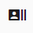

.. index:: タイムラインを一つ前へ戻る
.. index:: タイムラインを一つ先へ進める
.. index:: タイムラインの表示を縮小する
.. index:: タイムラインの表示を拡大する
.. index:: フレームを読み込む

#########################################
タイムラインの表示に関するいくつか
#########################################

　タイムラインのツールバーについて説明していきます。

.. image:: img/tl_1.png
    :align: center

|

|

.. |tlprev| image:: img/tl_3.png

.. |tlout| image:: img/tl_5.png
.. |tlin| image:: img/tl_6.png
.. |tlplay| image:: img/tl_8.png

.. |tlinsf| image:: img/tl_c.png
.. |tldelf| image:: img/tl_d.png

.. index:: タイムラインのツールバー

|tlprev| **タイムラインを一つ前へ戻る**
    　現在選択中のタイムライン中で、現在の位置より前に一番近い登録済みキーフレームに戻します。（何も登録されていないフレームはスキップします）

|tlnext| **タイムラインを一つ先へ進める**
    　現在選択中のタイムライン中で、現在の位置より後に一番近い登録済みキーフレームに進めます。（何も登録されていないフレームはスキップします）

|tlout| **タイムラインの表示を縮小する**
    　タイムラインの表示をコンパクトにします。

|tlin| **タイムラインの表示を拡大する**
    　タイムラインの表示を通常のサイズにします。これが標準サイズです。

|

|tlplay| **最初から再生、再生/一時停止、停止**
    　リボンバーのアニメーションタブにあるボタンを同様の機能です。

|tlload| **このフレームを読み込む**
    | 　現在選択中のフレーム位置に該当する全タイムライン（ロール）のキーフレームの内容を即座に読み込み、ポーズやプロパティを復元します。通常はフレーム位置を選択すると自動的に復元されますが、それを手動で呼び出すボタンです。
    | ※設定の ``フレームを選択する時、プレビューする`` がオフの場合に主に使用します。

|tlinsf| **現在位置に空のフレームを挿入**
    　現在選択しているフレーム番号の位置のタイムラインすべてに空のフレームを挿入します。これによりこのフレーム番号以降のキーフレームはすべて1つずつ右にズレます。

|tldelf| **現在のフレーム位置を削除**
    | 　すべてのタイムラインの現在選択しているフレーム位置を削除します。これは単なるキーフレームの削除ではなくフレーム位置の削除を伴うため、このフレーム以降のキーフレームはすべて一つずつ左にズレます。
    | 　また、現在位置にキーフレームが存在した場合はそのキーフレーム共々削除されますのでご注意ください。

|tlseek| **シークバー**
    　タイムラインのうちフレーム位置を好きな位置に移動します。フレーム数が増減してもこのシークバーのサイズは変わりません。

    | ※設定の ``フレームを選択する時、プレビューする`` がオンの場合、ゆっくり動かすとアニメーションをコマ送りしてプレビュー再生することができます。（一部のプロパティはプレビューされません）

.. warning:: 
    　HTMLとWebGLの連動の仕様上、あまり素早く動かすとプレビューが追いつかないことがあります。

|

|tlvisi| **タイムラインのキャスト（オブジェクト）の表示・非表示を切り替える**
    　選択中のタイムラインのキャストを非表示にすることができます。非表示にしてもIKマーカーは引き続き表示されます。（別キャストを選択すればIKマーカーすら表示されません）
    

