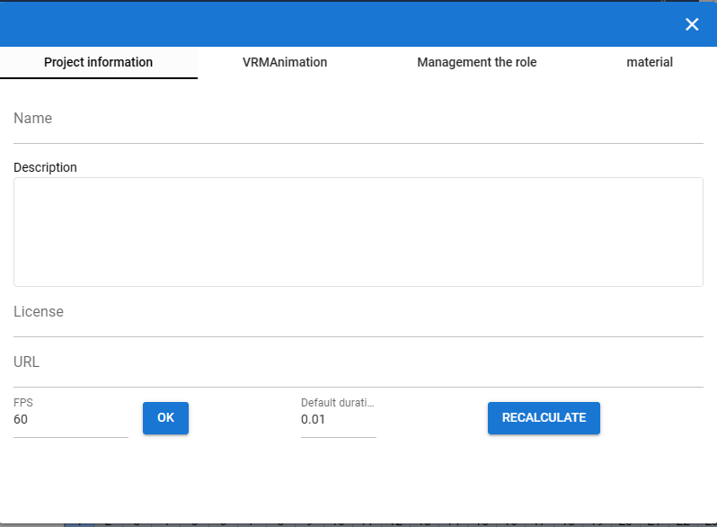

#######################
プロジェクトの設定
#######################

.. contents::

プロジェクトの設定を開く
################################

　現在開いているプロジェクトの設定をします。

1. リボンバーの ``アニメーション`` タブから ``設定`` をクリックします。

|

ここでは次のことを行えます。

* プロジェクトの名称やその他明記する情報の編集
* プロジェクトに含む役割とキャストの管理
* 素材の管理
* VRMAnimationなど、プロジェクトに含む追加ファイルの管理

|

プロジェクトの基本的な情報を記入する
#########################################

　プロジェクト情報タブでは次の情報を記入できます。アニメーションやポーズ、その他演出には影響しません。あくまでメモ書きのためだけに記入するものです。

項目の説明は :ref:`screen_projectdlg` をご覧ください。

:FPS:
    アニメーションの全体的な速度に関わる基本値を指定します。デフォルトでは ``FPS / 6000.0`` の計算結果が時間の間隔となります。その計算にFPSが使われます。

:デフォルトの間隔:
    1フレームあたりの変化する秒数を指定します。キーフレーム間が複数フレーム空いている場合、 ``デフォルトの間隔 * フレーム数`` で計算されます。 

    なお、キーフレームの設定で個別にそのキーフレームになるまでの間隔を独自に指定することができます。
    
    詳しくは :ref:`modifyeachduration` をご覧ください。

.. _prop_vrma_project:

VRMAnimation
########################

　このタブでは、アプリ全体で現在開いているVRMAnimationを一覧で確認することができます。

.. image:: ../img/screen_project7.png
    :align: center

|

項目の説明は画面の構成の :ref:`screen_vrmadlg` をご覧ください。

VRMAnimationを削除
============================

    1. 削除したい .vrmaファイルにチェックを入れます。
    2. 左上の削除ボタンをクリックします。
    3. 確認メッセージが表示されるので、よければOKボタンをクリックします。

プロジェクトファイルに含める
=============================

    ``プロジェクトに保存`` にチェックを入れたVRMAnimationファイルは、そのファイルパスをプロジェクトファイル内に含めることができます。

    プロジェクトに含めることで、プロジェクトファイルを開いたときに対象の .vrmaファイルを同時に開いて読み込みます。そのVRMAnimationはすぐに使用可能になります。

    .. note::
        対象は内蔵ストレージに保存している .vrmaファイルか、各OS版では履歴に掲載されたことのあるファイルのみです。

役割の管理
#######################

現在開いているVRMやその他オブジェクト、そしてそれらに紐づいている役割(ロール,タイムライン)の情報を管理します。

.. image:: ../img/screen_project2.png
    :align: center

|

項目の説明は :ref:`screen_roledlg` をご覧ください。

ここでは次のことをできます。

* ロールとキャスト(オブジェクト)の削除
* ロールに紐づけるキャストの変更
* ロールの名称(表示名)の変更

役割とキャストの割当ての変更については :ref:`settingcast2role` をご覧ください。

.. index:: 
    素材
    テクスチャ（素材）
    素材の追加
    素材の更新
    素材の削除

素材
######################

現在のアプリまたはプロジェクトで開いている画像素材を管理します。

項目の説明は :ref:`screen_materialdlg` をご覧ください。

素材の管理
========================

本アプリ全体で使用できるよう、テクスチャファイルなどを管理できます。

1. リボンバーの ``アニメーション`` タブ → ``設定`` ボタンを押します。
2. ``素材`` タブを開きます。

.. image:: ../img/screen_project3.png
    :align: center

|

素材の追加
========================

    
1. ``素材の種類`` から目的の素材の種類を選びます。
2. ``素材の場所`` で追加先の場所を ``App`` または ``Project`` から選びます。
3. ``追加`` ボタンを押します。
4. 素材の追加のポップアップウィンドウが表示されます。
5. ``素材ファイル`` をクリックして端末からファイルを選びます。
6. ``素材のラベル`` で自分が管理しやすい名称を入力します。
7. OKボタンを押して素材をアプリに追加します。

※追加後、一覧にプレビュー付きで表示されるようになります。

.. note::
    | 　アプリ内またはアニメーションプロジェクト内の素材ファイルは本アプリの専用ストレージに保存されます。PC上でそれらのファイルの場所が変わっても影響ありません。
    | 　例えば画像ファイル自体に変更がある場合、それは反映されませんので素材を一旦削除し、再度追加する必要があります。

.. admonition:: 追加後の素材の使い道

    * OtherObjectのテクスチャ、Stageの ``UserStage`` のテクスチャなどで使用することができます。それぞれのプロパティにおいて、使いたい素材名を指定してください。
    * 別の素材名を選ぶと参照が解除されます。
    * 一つのテクスチャを複数のオブジェクトにセットすることもできますが、全体で共有しているため素材を削除などすると対象のすべてのオブジェクトに変更が影響します。
    * 各オブジェクトでは素材名で参照されるため、実際のテクスチャなどのファイルが何であるかは考慮されません。プロジェクトファイルを配布して別のユーザーに使ってもらうなどの場合、テクスチャファイルを想定通りに使ってもらえるよう注意してもらってください。

素材の更新
========================

一度追加した素材はラベル名の更新、または画像の再読み込みが行なえます。

.. image:: ../img/screen_project5.png
    :align: center

|

ラベル名の更新
    各行の素材名のセルをクリックすると入力ダイアログが表示されます。そこに新しい名称を入力します。

画像の再読み込み
    プロジェクト内の素材の場合に使います。ファイルから読み込んだ（インポートした）プロジェクトが素材を保有している場合、どの素材も実体となるファイルは読み込まれていません。想定される画像などのファイルを再度指定して読み込む必要があります。

素材の削除
========================

1. 一覧から削除したい素材にチェックを入れて選択します。
2. 削除ボタンを押します。
   
.. caution::
    * どこかでその素材を一つでも参照している場合は削除できません。そのオブジェクトで参照を解除（別の素材を選択・あるいは ``--`` で選択を取り消す）してどこからも参照がされなくなったのを確認してから再度お試しください。
    * 実際の素材ファイルがアプリ内の専用ストレージからも削除されます。
