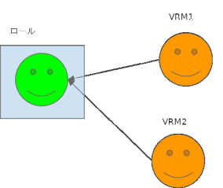

.. index:: アニメーションプロジェクトの構成

#####################################
アニメーションプロジェクトの構成
#####################################

　アニメーションプロジェクトの構成について説明します。大まかに言うと次のようになっています。

.. index:: タイムライン（アニメーションプロジェクトの構成）

タイムライン
    .. image:: img/specifi_1.png
        :align: left

    | 　タイムラインはアニメーションの基本単位です。1つのタイムラインに1つのロール、1つのキャストが対応しています。
    | 　実際の機能としては次のロールがすべて受け持っています。

|
|
|
|
|
|

.. index:: ロール・役割（アニメーションプロジェクトの構成）

ロール・役割
    .. image:: img/specifi_2.png
        :align: left

    | 　ロールとは、各オブジェクトがタイムラインにおいてどう動くかの役割・キャラクターの動作のまとまりです。
    | 　ロールの中には割り当てるキャスト、そしてキーフレームのデータが存在します。
    | 　ロールは同じオブジェクトの種類であれば、別のオブジェクトに差し替えることができます。

    　実質的には、 **タイムライン＝ロール** です。本説明書でタイムラインというときはロールを指し、その逆としても使われます。

|
|
|
|

.. index:: キャスト・オブジェクト（アニメーションプロジェクトの構成）

キャスト・オブジェクト・アバター
    .. image:: img/specifi_3.png
        :align: left

    | 　キャストとはロールに割り当てるオブジェクトのことです。ここが実際のVRoid/VRM、FBX、Light、Audioなどのオブジェクトの実体となっています。
    | 　本アプリでは単にオブジェクトとか、アバターなどとも言い換えています。

|
|
|

.. index:: キーフレーム（アニメーションプロジェクトの構成）

キーフレーム
    .. image:: img/specifi_4.png
        :align: left

    　キーフレームはロールの実際の動きのデータ、モーションです。このデータはあくまでロールが保持しており、原則として各オブジェクトには依存しない形になっています。

|
|
|

.. admonition:: タイムライン・ロール・キャストの関係

    | 　タイムラインは最終的にはロールと同じ意味です。それからキャストは実際のオブジェクトと同じ意味です。
    | 　ロールはキャスト（オブジェクト）と１：１で紐付いています。ロールはキャストなしの状態がありえますが、キャストはロールなしには動くことはできません。

    　厳密ではなくゆるい紐付きです。そのため、ロールには後から別のキャスト（オブジェクト）を紐付けることができます。

    　例で言うと次のようになります。(色とアイコンは上記の例に対応しています)

    **ロール** ・・・アニメやドラマの人物

    **キャスト**・・・声優、俳優本人

| 　実際のアニメーションデータはロールが持っています。そのためそのモーションを再生するのに実際のキャスト（オブジェクト）が何であるかは問いません。
| 　上記の仕組みのために、好きなアニメーションを好きなオブジェクトで再生することができるようになっています。
