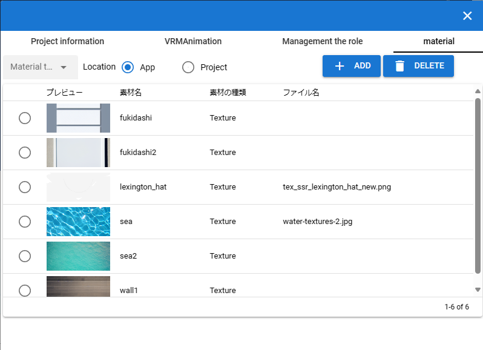

#########################################
設定
#########################################

.. index:: アプリを設定する（設定）

アプリを設定する
=========================================

　設定画面からアプリの挙動を細かく設定できます。

1,リボンバーのホームタブにある設定ボタンをクリックします。

.. image:: img/config_1.png
    :align: center

|

2,設定画面が開きます。

.. image:: img/config_2.png
    :align: center

|

アプリの設定
===========================

.. index:: アプリケーションタブ（設定）

アプリケーションタブ
----------------------------

　アプリケーションタブ内の設定項目です。

メモリの使用率（倍率）
    | 　WebGL画面に費やすメモリ量を調整します。256MB～1024MBの間で設定できます。使用端末のメモリを超えることはできません。
    | 　これを大きくすることで巨大な3Dオブジェクトを読み込めるようになります。

|

マウスホイールの速度
    　WebGL画面でズームイン・ズームアウトする速度を調整します。1～5倍の間で調整できます。

キー入力時のカメラの速度
    　WebGL画面でキーボードのキーによる操作をした場合のカメラの移動・回転の速度を0.05～1.0の間で調整できます。

オブジェクトを選択した時にカメラの中心点をフォーカスする
    　3Dオブジェクトを選択したときに、そのオブジェクトをメインカメラの中心に画面内におさめるよう自動的に移動させます。ただし常に正面かつ若干俯瞰して向くためそれが煩わしい場合はオフにしてください。

ダークテーマを使用する
    　アプリの見た目をダークテーマに変更します。

開いたファイルを履歴に保存する
    　一度開いたVRM、OtherObject、Image、UImageを、アプリ内に履歴として保存します。

履歴から開いた場合、VRMの確認画面を省略する
    　一度開いたVRMについては、利用条件の確認画面を表示することなく読み込ませるようにします。あとから「詳細情報」ボタンで表示することはできます。

Clear
    一度開いたファイルの履歴をすべて削除します。

|

.. index:: モデルタブ（設定）

モデルタブ
-------------------

　モデルタブ内の設定項目です。主にオブジェクト自体の動きに関する設定です。

ポーズの保存時にサムネイルも保存する
    　ポーズを保存する際にそのポーズのスクリーンショットを合わせて保存します。保存しなくてもポーズ・ポーズファイル自体に影響はありません。

ポーズのオープン時にグローバル座標をも適用する
    | 　選択したVRMにポーズファイルを適用する際に、ポーズが保持しているグローバル座標をも適用します。
    | 　これを有効にすると、複数のVRMにポーズを適用したときに位置が重複してしまうことになります。必要に応じてオン・オフを切り替えて使用してください。

足首の回転を自動で行う
    | 　IKのLowerLegを動かしたときに、Legを自動的に回転させます。人体に完全にフィットしているわけではないためLowerLegの動かした範囲によっては回転角度は追随しきれない場合があります。
    | 　アニメーションの再生時は自動的にオフになります。

.. |ashi_off| image:: img/config_5.png

.. csv-table:: ※どちらもLowerLegをy軸・z軸に後方へ移動のみさせた例

    設定がオンの場合,   設定がオフの場合
    |ashi_on|, |ashi_off|

.. note::
    このように足首から下部分が自然な回転を伴うようになります。しかし自由な回転ができなくなります。

VRMの体に自然な稼働制御を適用する
    | 　VRMのひじ（LowerArm）、足（LowerLeg）、足首（Leg）の回転可能範囲を人体の可動域に合わせます。
    | 　これをオンにするとVRMは確かに自然な可動域にはなりますが、その制限を逃れようとして対象部位に追随する他のIKの位置・回転が予期せぬ動作になることがあります。
    | 　必要に応じてオフにすることをおすすめします。

ボーンの連動
    :Pelvis & LowerLeg:
        ``Pelvis`` の動きに合わせて左右の ``LowerLeg`` を上下前後に動かします。
    :Hand & LowerArm:
        ``Hand`` の動きに合わせて左右の ``LowerArm`` を追随して動かします。また、人体らしく自然な動きになるよう ``LowerArm`` の角度に合わせて ``Hand`` を自動的に回転させます。
    :Leg & LowerLeg:
        ``Leg`` の動きに合わせて左右の ``LowerLeg`` を追随して動かします。これによりひざ付近の動きが制限がかかる場合がありますので必要に応じてオフにしてください。

|

.. index:: アニメーションタブ（設定）

アニメーションタブ
------------------------

　アニメーションタブ内の設定項目です。主にアニメーションに関する設定です。

フレーム数の初期値
    　アニメーションプロジェクトのデフォルトのフレーム数を 60～300 の範囲で指定します。これはあくまでも初期値であり、後から拡張する制限には当たりません。
    
再生終了後、最初のフレームに戻す
    　アニメーションを再生しそれが終了した後にフレーム位置を1番目に戻します。

戻すタイミング(ミリ秒)
    　フレーム位置を1番目に戻すタイミングを0～2秒の間で調整します。0は遅延なく即座に1フレーム目に戻します。

フレームを選択する時、プレビューする
    　フレームを選択したら各オブジェクトが登録されたキーフレーム通りにポーズを復元するようにします。これがオフの場合、現在編集中のフレームおよびアニメーションの再生時にしかポーズを確認できなくなります。

.. note::
    ※タイムラインのツールバーにある「:doc:`このフレームを読み込む <../man4/animation_tl>` 」を使用して随時ポーズやプロパティを復元してください。

現在選択中のロールのみプレビューする
    　これがオンの場合、現在選択中のタイムライン（ロール・オブジェクト）のみそのキーフレーム時のポーズを再現します。オフの場合はすべてのタイムラインを対象にします。

再生中はIKマーカーの表示をオフにする
    　これがオンの場合、アニメーションの再生開始時にIKマーカーが自動的にオフになります。再生が終了するとIKマーカーの表示が戻ります。

保存時に録画開始する
    　再生すると同時にアニメーションの録画を開始します。再生終了時に自動的に録画停止します。

プレビュー時に登録キーフレームの位置を超えたら最後のキーフレームを復元する
    　図を交えて説明すると、 ``1`` と ``15`` の位置にキーフレームが登録されていたとします。
    　この設定がオンのときに ``16`` 以降のフレーム番号を選択すると、 ``15`` の位置のキーフレームの内容を復元します。
    　オフの場合は最後に選択したキーフレームの内容のままとなります。（例えば ``7`` を選択していて急に ``19`` を選択した場合は7の内容のままということです）

.. image:: img/config_6.png
    :align: center

|

.. index:: 
    素材
    テクスチャ（素材）
    素材の追加
    素材の更新
    素材の削除

素材の管理
========================

本アプリ全体で使用できるよう、テクスチャファイルなどを管理できます。

1. リボンバーの ``アニメーション`` タブ → ``設定`` ボタンを押します。
2. ``素材`` タブを開きます。

|

素材の追加
----------------------

1. ``素材の種類`` から目的の素材の種類を選びます。
2. ``素材ファイル`` をクリックして端末からファイルを選びます。
3. ``素材のラベル`` で自分が管理しやすい名称を入力します。
4. ``素材の場所`` で追加先の場所を ``App`` または ``Project`` から選びます。
5. OKボタンを押して素材をアプリに追加します。

※追加後、一覧にプレビュー付きで表示されるようになります。

.. note::
    | 　アプリ内またはアニメーションプロジェクト内の素材ファイルは本アプリの専用ストレージに保存されます。PC上でそれらのファイルの場所が変わっても影響ありません。
    | 　例えば画像ファイル自体に変更がある場合、それは反映されませんので素材を一旦削除し、再度追加する必要があります。

.. admonition:: 追加後の素材の使い道

    * OtherObjectのテクスチャ、Stageの ``UserStage`` のテクスチャなどで使用することができます。それぞれのプロパティにおいて、使いたい素材名を指定してください。
    * 別の素材名を選ぶと参照が解除されます。
    * 一つのテクスチャを複数のオブジェクトにセットすることもできますが、全体で共有しているため素材を削除などすると対象のすべてのオブジェクトに変更が影響します。
    * 各オブジェクトでは素材名で参照されるため、実際のテクスチャなどのファイルが何であるかは考慮されません。プロジェクトファイルを配布して別のユーザーに使ってもらうなどの場合、テクスチャファイルを想定通りに使ってもらえるよう注意してもらってください。

素材の更新
----------------------

一度追加した素材はラベル名の更新、または画像の再読み込みが行なえます。

.. image:: ../img/screen_project5.png
    :align: center

|
ラベル名の更新
    各行の素材名のセルをクリックすると入力ダイアログが表示されます。そこに新しい名称を入力します。

画像の再読み込み
    プロジェクト内の素材の場合に使います。ファイルから読み込んだ（インポートした）プロジェクトが素材を保有している場合、どの素材も実体となるファイルは読み込まれていません。想定される画像などのファイルを再度指定して読み込む必要があります。

素材の削除
----------------------

1. 一覧から削除したい素材にチェックを入れて選択します。
2. 削除ボタンを押します。
   
.. caution::
    * どこかでその素材を一つでも参照している場合は削除できません。そのオブジェクトで参照を解除（別の素材を選択・あるいは ``--`` で選択を取り消す）してどこからも参照がされなくなったのを確認してから再度お試しください。
    * 実際の素材ファイルがアプリ内の専用ストレージからも削除されます。
