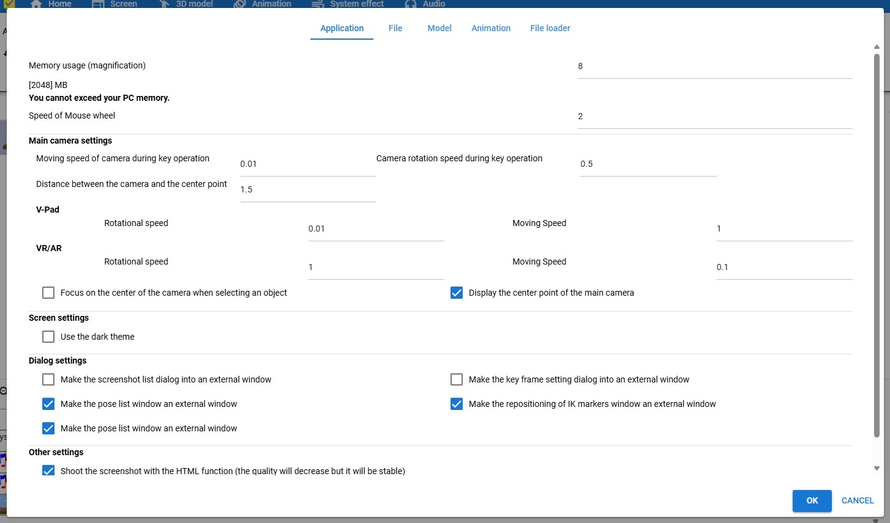

#########################################
設定
#########################################

.. contents::

.. index:: アプリを設定する（設定）

アプリを設定する
=========================================

　設定画面からアプリの挙動を細かく設定できます。

1. リボンバーのホームタブにある設定ボタンをクリックします。

.. image:: img/config_1.png
    :align: center

|

2. 設定画面が開きます。

|

アプリの設定
===========================

.. index:: アプリケーションタブ（設定）

アプリケーションタブ
----------------------------

　アプリケーションタブ内の設定項目です。

ver 2.9.0より、設定の種類ごとに並び替えました。

メモリの使用率（倍率）
    | 　WebGL画面に費やすメモリ量を調整します。256MB～2048MBの間で設定できます。使用端末のメモリを超えることはできません。
    | 　これを大きくすることで巨大な3Dオブジェクトを読み込めるようになります。

    .. warning::
        増やしすぎると逆に端末全体の動作に影響する可能性があります。ほどほどに調整してください。

.. image:: img/config_3.png
    :align: center

|

マウスホイールの速度
    　WebGL画面でズームイン・ズームアウトする速度を調整します。1～5倍の間で調整できます。

メインカメラ設定
^^^^^^^^^^^^^^^^^^^^

    キー操作時のカメラの移動速度
        　WebGL画面でキーボードのキーによる操作をした場合のカメラの移動の速度を0.01～0.25の間で調整できます。

    キー操作時のカメラの回転速度
        　WebGL画面でキーボードのキーによる操作をした場合のカメラの回転の速度を0.01～2.0の間で調整できます。

    カメラと中心点の間の距離
        通常、カメラは自身ではなくオブジェクトの周りを回転移動します。本アプリでは対象は常に特定のオブジェクトではなく、 **一定の距離の空間** が基準です。その一定の距離とメインカメラの距離を指定します。

    .. index:: 
        移動速度(V-pad)
        回転速度(V-pad)
        移動速度(VR/AR)
        回転速度(VR/AR)

    V-pad
        回転速度
            V-padで回転を操作する際の速度を調整します。0.01～0.1までで0.01単位です。
        
        移動速度
            V-padで移動を操作する際の速度を調整します。0.1～2までで0.01単位です。

    VR/AR
        回転速度
            VR/AR空間でのメインカメラ・選択中のオブジェクトの回転を操作する際の速度を調整します。0.01～0.1までで0.01単位です。
        
        移動速度
            VR/AR空間でのメインカメラ・選択中のオブジェクトの移動を操作する際の速度を調整します。0.1～2までで0.01単位です。

    オブジェクトを選択した時にカメラの中心点をフォーカスする
        　3Dオブジェクトを選択したときに、そのオブジェクトをメインカメラの中心に画面内におさめるよう自動的に移動させます。ただし常に正面かつ若干俯瞰して向くためそれが煩わしい場合はオフにしてください。

    メインカメラの中心点を表示する
        メインカメラの中心点の表示をします（薄暗い四角形の表示がそれです）。上記 ``カメラと中心点の間の距離`` の設定により遠近の具合で中心点のサイズは変化します。操作するオブジェクトやアニメーションプロジェクトには一切影響しません。

画面設定
^^^^^^^^^^^^^^^^

    ダークテーマを使用する
        　アプリの見た目をダークテーマに変更します。

ダイアログ設定
^^^^^^^^^^^^^^^^^^^

    スクリーンショット一覧ダイアログを外部ウィンドウにする
        スクリーンショット一覧ダイアログをアプリ内ウィンドウまたは外部ウィンドウいずれかに切り替えます。

    キーフレーム登録ダイアログを外部ウィンドウ化する
        　キーフレームの登録ダイアログはアプリ内ウィンドウまたは外部ウィンドウどちらかで表示可能です。このダイアログを一般的なPCアプリのように、外部ウィンドウで表示させます。

    ポーズ一覧ウィンドウを外部ウィンドウにする
        ポーズ一覧ウィンドウをアプリ内ウィンドウまたは外部ウィンドウいずれかに切り替えます。

    IKマーカーの一括変更ウィンドウを外部ウィンドウにする
        VRMのIKマーカーの一括変更ウィンドウをアプリ内ウィンドウまたは外部ウィンドウいずれかに切り替えます。

    重力設定ウィンドウを外部ウィンドウにする
        VRMの重力設定ウィンドウ（スプリングボーンの設定）をアプリ内ウィンドウまたは外部ウィンドウいずれかに切り替えます。

その他設定
^^^^^^^^^^^^^^^^

    スクリーンショットをHTMLの機能で撮影する
        | 　スクリーンショットをHTML/Javascript側の機能で撮影することで、若干質は下がりますがカメラを複数使う映像が正常に反映されるなど安定します。メインカメラおよびCameraオブジェクトを完全に切り替えて使う分にはどちらを使っても差はありません。必要に応じて切り替えてください。
        | 　Cameraオブジェクトのビューポートやレンダーテクスチャ中のプレビューを含めて画面そのままを撮りたい場合はONにしてください。

|

.. index:: ファイルタブ（設定）

ファイルタブ
----------------------------

　ファイルタブ内の設定項目です。

開いたファイルを履歴に保存する
    　一度開いたVRM、OtherObject、Image、UImageを、アプリ内に履歴として保存します。

履歴から開いた場合、VRMの確認画面を省略する
    　一度開いたVRMについては、利用条件の確認画面を表示することなく読み込ませるようにします。あとから「詳細情報」ボタンで表示することはできます。

Clear
    一度開いたファイルの履歴をすべて削除します。

プロジェクトを開いた時、このサイズを超えるファイルを自動的に読み込まない。
    　アニメーションプロジェクトを開く時、ここで指定したMBのサイズを超えるオブジェクトファイルが含まれている場合はそれを読み飛ばします。
    　読み飛ばされたオブジェクトは別途手動で読み込んでロールに割り当てる必要があります。

プロジェクトをバックアップする
    　現在作成中のアニメーションプロジェクトを自動的にバックアップします。通常の保存と同じく、キーフレームに登録していないIKマーカーの位置・回転は保存されないので、こまめにキーフレームに登録しておいてください。

バックアップの間隔
    　バックアップする間隔を指定します。1～10分の間で指定できます。

|

.. index:: モデルタブ（設定）

モデルタブ
-------------------

　モデルタブ内の設定項目です。主にオブジェクト自体の動きに関する設定です。

ポーズの保存時にサムネイルも保存する
    　ポーズを保存する際にそのポーズのスクリーンショットを合わせて保存します。保存しなくてもポーズ・ポーズファイル自体に影響はありません。

ポーズのオープン時にグローバル座標をも適用する
    | 　選択したVRMにポーズファイルを適用する際に、ポーズが保持しているグローバル座標をも適用します。
    | 　これを有効にすると、複数のVRMにポーズを適用したときに位置が重複してしまうことになります。必要に応じてオン・オフを切り替えて使用してください。

足首の回転を自動で行う
    | 　IKのLowerLegを動かしたときに、Legを自動的に回転させます。人体に完全にフィットしているわけではないためLowerLegの動かした範囲によっては回転角度は追随しきれない場合があります。
    | 　アニメーションの再生時は自動的にオフになります。

.. |ashi_on| image:: img/config_4.png
.. |ashi_off| image:: img/config_5.png

.. csv-table:: ※どちらもLowerLegをy軸・z軸に後方へ移動のみさせた例

    設定がオンの場合,   設定がオフの場合
    |ashi_on|, |ashi_off|

.. caution::
    このように足首から下部分が自然な回転を伴うようになります。しかし意図しない回転が伴うことになるため、足首を動かした後に手動で回転を戻す必要があります。

VRMの体に自然な稼働制御を適用する
    | 　VRMのひじ（LowerArm）、足（LowerLeg）、足首（Leg）の回転可能範囲を人体の可動域に合わせます。
    | 　これをオンにするとVRMは確かに自然な可動域にはなりますが、その制限を逃れようとして対象部位に追随する他のIKの位置・回転が予期せぬ動作になることがあります。
    | 　必要に応じてオフにすることをおすすめします。
    | 　アニメーションの再生時は自動的にオフになります。

ボーンの連動
    　いずれの場合もアニメーションの再生時は自動的にオフになります。

    :Chest & LowerArm & Head:
        ``Chest`` の動きに合わせて左右の ``LowerArm`` そして ``Head`` も追随させます。ただしX軸・Z軸のみです。
    :Aim & Chest:
        ``Aim`` の動きに合わせて ``Chest`` も追随させます。ただしX軸・Z軸のみです。
    :Pelvis & LowerLeg:
        ``Pelvis`` の動きに合わせて左右の ``LowerLeg`` を上下前後に動かします。
    :Hand & LowerArm:
        ``Hand`` の動きに合わせて左右の ``LowerArm`` を追随して動かします。ただしX軸・Z軸のみです。
    :Leg & LowerLeg:
        ``Leg`` の動きに合わせて左右の ``LowerLeg`` を追随して動かします。これによりひざ付近の動きが制限がかかる場合がありますので必要に応じてオフにしてください。

|

.. index:: アニメーションタブ（設定）

アニメーションタブ
------------------------

　アニメーションタブ内の設定項目です。主にアニメーションに関する設定です。

フレーム数の初期値
    　アニメーションプロジェクトのデフォルトのフレーム数を 60～300 の範囲で指定します。これはあくまでも初期値であり、後から拡張する制限には当たりません。
    
再生終了後、最初のフレームに戻す
    　アニメーションを再生しそれが終了した後にフレーム位置を1番目に戻します。

戻すタイミング(ミリ秒)
    　フレーム位置を1番目に戻すタイミングを0～2秒の間で調整します。0は遅延なく即座に1フレーム目に戻します。

フレームを選択する時、プレビューする
    　フレームを選択したら各オブジェクトが登録されたキーフレーム通りにポーズを復元するようにします。これがオフの場合、現在編集中のフレームおよびアニメーションの再生時にしかポーズを確認できなくなります。

.. note::
    ※タイムラインのツールバーにある「:doc:`このフレームを読み込む <../man4/animation_tl>` 」を使用して随時ポーズやプロパティを復元してください。

現在選択中のロールのみプレビューする
    　これがオンの場合、現在選択中のタイムライン（ロール・オブジェクト）のみそのキーフレーム時のポーズを再現します。オフの場合はすべてのタイムラインを対象にします。

再生中はIKマーカーの表示をオフにする
    　これがオンの場合、アニメーションの再生開始時にIKマーカーが自動的にオフになります。再生が終了するとIKマーカーの表示が戻ります。

プレビュー時に登録キーフレームの位置を超えたら最後のキーフレームを復元する
    　図を交えて説明すると、 ``1`` と ``15`` の位置にキーフレームが登録されていたとします。
    　この設定がオンのときに ``16`` 以降のフレーム番号を選択すると、 ``15`` の位置のキーフレームの内容を復元します。
    　オフの場合は最後に選択したキーフレームの内容のままとなります。（例えば ``7`` を選択していて急に ``19`` を選択した場合は7の内容のままということです）

|

録画時に音声も保存する
    　録画時にBGMやSEが録音されるようにします。この設定を切り替えたときはアプリを再起動させてください。ウェブアプリ版はブラウザによってマイクの使用確認メッセージが表示されます。

.. image:: img/config_7.png
    :align: center

|

　ウェブアプリ版の場合（なおかつPWAによる別ウィンドウ化した場合）、右上のマイクのアイコンから、マイクの許可を後から切り替えることができます。ただし、本アプリでの設定が有効なのにブラウザのここの設定でブロックをしてしまうと正常に動かなくなります。必ず本アプリの設定と2つ合わせて設定を切り替えてください。

.. image:: img/config_8.png
    :align: center

|

　なお、 管理ボタンを押すとブラウザの設定ページに遷移し、使用するマイクのデバイスを切り替えたりできます。

.. hint::
    PC版の場合は各OSのサウンドの設定に従ってください。

前回指定した間隔とイージングを記憶する（キーフレーム登録ダイアログ）
    キーフレーム登録ダイアログにて、前回入力した時間の間隔や選択したイージングを記憶させます。

.. index:: 
    ファイルローダタブ（設定）
    Google Drive拡張機能
    GoogleAppsScript
    ユーザーフォルダのID（Googleドライブ）
    名前指定（ユーザーフォルダのIDの・Googleドライブ）

.. _config_fileloader:

ファイルローダタブ
------------------------

　Googleドライブから読み込んだり保存可能にする拡張機能に関する設定です。この機能を使用するためには、ユーザー側で事前にGoogleアカウントの取得と、GoogleAppsScriptの設定が必要になります。

詳しくは下記を御覧ください。

:vrmviewmeister-gdrive-extension - Github:
    https://github.com/nishlumi/vrmviewmeister-gdrive-extension
:インストール方法 - Github:
    https://github.com/nishlumi/vrmviewmeister-gdrive-extension/blob/main/install.rst
:Googleスライドによるインストール方法:
    https://docs.google.com/presentation/d/e/2PACX-1vQP2RstLGn82dh_FOqBfbPPBGvx9o-YQXc-3ol8Gk4_IseKrzsgs0hgAt0h4uYX2kA71ENrnI-XXbBf/pub?start=false&loop=false&delayms=3000&slide=id.p

Googleドライブの読み込み拡張機能のURL
    チェックを入れることで読み込み機能を有効化します。

URL
    別途ユーザー各自に用意してもらうGoogleAppsScriptのウェブアプリのURLを入力する欄です。

APIKEY
    GoogleAppsScript内でユーザー各自が決めたAPIKEYを入力する欄です。

ユーザーフォルダのID
    | Project, Motion, Pose, VRM, OtherObject, Imageそれぞれの読み込み場所となるフォルダIDを入力する欄です。これらを指定するとそのフォルダのみから読み込みます。
    | 指定がない場合はドライブのすべての場所から検索して読み込むため、動作に時間がかかる可能性があります。

名前指定
    ユーザーフォルダの欄に入力した内容をフォルダ名とします。フォルダIDだと長くて打ちにくい、といった場合にこのトグルスイッチをオンにすれば、フォルダ名を入力できます。

    .. caution::
        Googleドライブ上では必ず一意になるフォルダ名を付けてください。複数同じ名前が見つかった場合、最初のフォルダを検索します。

