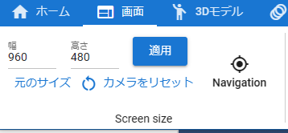
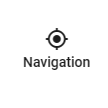
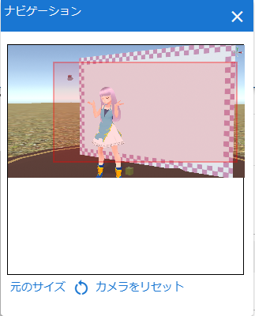
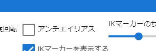
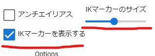
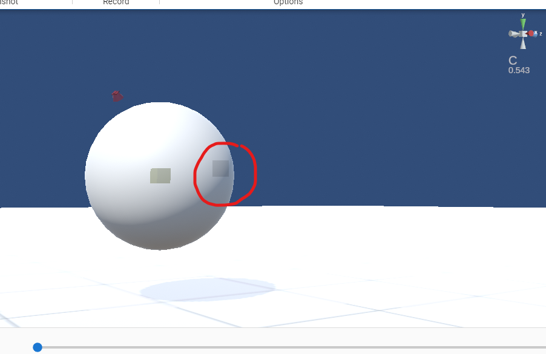
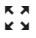
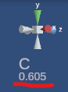
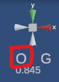
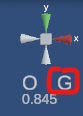

#########################
アプリの操作
#########################

.. contents::

.. index::
    画面解像度を変更する

（ウェブアプリ版）ブラウザとは別ウィンドウで使う
==================================================

　ウェブアプリ版はPWAという技術によってChromeやEdgeなどのブラウザ本体とは完全に別のウィンドウで利用することができます。

　詳しくは :doc:`../man1/install` をご覧ください。

メリット
    * ブラウザ本体とは異なるウィンドウサイズにできる
    * ブラウザ本体を閉じても本アプリを利用し続けられる
    * 見た目が各OSのアプリと近くなる
    * スタートメニューやランチャーメニューに追加され、そこから開けるようになる

　ウェブアプリ版はタブのまま使うのではなく、ぜひインストールしてお使いください。

VR/AR
    デバイスによって扱いが異なります。
    
    PICO4はPWAインストールが可能です。ただし、複数ウィンドウに対応していないため、いくつかの小ウィンドウはアプリのメイン画面を上書きしてしまいます。ブラウザの戻る操作をすれば戻れます。

スマートフォン、タブレット
    PWAインストールが可能です。アプリの一覧に本アプリのアイコンが並びます。PWAインストール後は通常表示モードですが、このアプリについての画面で切り替えることができます。詳細は :ref:`changedisplaymode` をご覧ください。

|

画面解像度を変更する
============================

　3Dモデルを操作するWebGL画面はデフォルトではウィンドウサイズに適したサイズとなっています。本アプリではWebGL画面のサイズ（≒解像度）を自由なサイズに変更することができます。

|

1. ``幅`` と ``高さ`` を入力します。
2. 適用ボタンを押します。

表示する領域に収まりきらない場合、スクロールバーが表示されます。

**元のサイズに戻す**

1.  ``元のサイズ`` ボタンを押します。

.. index:: ナビゲーション(一般的な使い方)

ナビゲーションを活用する
-------------------------------

　画面解像度が上がると見えなくなった部分をスクロールしてから操作する必要があります。その場合、 Ver 2.0から実装した ``ナビゲーション`` を使うと操作しやすくなります。

1. リボンバーの画面タブにある ``Navigation`` ボタンを押します。
 

|

2. アプリのメインウィンドウ内にナビゲーションの小ウィンドウが表示されます。

|

3. ナビゲーションのプレビュー画面に現在表示中の範囲として赤い枠が表示されます。
4. 表示領域よりWebGL画面の解像度が大きい場合、赤い枠を任意の場所でクリックしたりドラッグすると、WebGL画面がその通りにスクロールします。

.. hint::
    ナビゲーションのウィンドウ内からも ``元のサイズ`` や ``カメラのリセット`` を行うことができます。

|

.. index:: アンチエイリアスをかける

アンチエイリアスをかける
================================

　本アプリではWebGL画面にアンチエイリアスをかけることができます。

1. リボンバーの画面タブを開きます。
2. 右にある ``アンチエイリアス`` にチェックを入れます。

|

.. warning::
    * かけたままポーズやモーションを再生することもできますが、動作が重くなる可能性があります。
    * アンチエイリアスは本来であればシステムエフェクト（ポストプロセッシング）の範疇ですが、動作への影響を考慮してアニメーションへの登録の対象外とさせていただきます。
    * アンチエイリアスを有効にしていると、Stageオブジェクトの空の設定において、 ``sky night blue/sky night purple`` の2つはキャプチャ時に不要な線が交じることがあります。これはWebGLの仕様です。ご了承下さい。

|

.. index:: IKマーカーの表示を変更する

IKマーカーのサイズや表示を変更する
======================================

　IKマーカーのサイズを変更するには、リボンバーの ``画面`` タブ にあるOptionsから指定します。

|

サイズの変更
    IKマーカーのサイズのスライダーを動かして指定します。

表示自体
    IKマーカーを表示するのチェックをオン・オフします。

.. index:: 
    メインカメラの操作
    メインカメラのリセット
    メインカメラのZ軸のリセット

メインカメラの操作
=========================

　本アプリではメインカメラには必ず回転軸となる中心点が存在します。設定により表示をオンオフ切り替えられますが、初期設定ではわかりやすさのため表示をオンにしています。

　キーボード操作が関係しますので詳しい操作方法は :doc:`../man5/special_operation` をご覧ください。

|

　薄暗い半透明で表示される■が該当します。

　メインカメラはこの中心点を基準にして回転します。見たいオブジェクトを中心点に近づければ、そのオブジェクトを360度眺めることができます。

　ただ、カメラの移動やオブジェクトの移動をし続けていると必ずしも距離や位置が一致せずにだんだん表示がズレていくことがあります。そういうときはキーボードの ``Iキー`` または ``Oキー`` を押してください。

　すると中心点がメインカメラに向かって近づいたり離れたりします。

中心点とオブジェクトの距離
--------------------------------

　中心点と現在選択中のオブジェクトの距離は右上に表示されます。

|

　あくまで目安です。IとOキーを押していると **数値が減っていくのと増える境目** があります。そこが中心点と現在選択中のオブジェクトが重なっている点です。そこでカメラを回転すれば比較的きれいにオブジェクトの周囲を回転することができます。

.. hint::
    アプリケーション設定の ``カメラと中心点の間の距離`` で調整できます。

移動・回転しすぎて中心点が吹っ飛んだら
--------------------------------------------

　移動や回転、WebGL画面の右上の軸の変更をすると中心点がずれることがあります。そういうときはキーボード操作がカメラモードのときに ``Rキー`` を押してください。するとメインカメラと中心点が初期位置にリセットされます。

.. hint::
    リボンバーの画面タブの ``カメラをリセット`` ボタンでも同様です。

    調整しづらいZ軸をリセットするには ``Q`` キーを押してください。

|

.. index::
    メインカメラを360度回転させる
    ターンテーブル風に使う

オブジェクトの周りを360度回転する
------------------------------------------

いわゆるターンテーブル風にカメラを使います。選択中のオブジェクトの周りを回り続けます。

1. リボンバーの画面タブにある Options領域に注目します。
2. ``回転速度`` に好きな値を入力します。デフォルトは15です。
3. リボンバーの画面タブにある ``360度回転`` にチェックを入れます。
4. チェックを外すまでずっと回り続けます。

.. hint::
    この状態でスクリーンショットを撮ったり、画面録画をすることもできます。

.. caution::
    VR/ARに切り替えている間は回転が止まります。

| 

.. index:: 
    オブジェクトとキーボード操作
    グローバル座標とローカル座標

オブジェクトとキーボード操作
===============================

　キーボード操作の詳しい説明は :doc:`../man5/special_operation` をご覧ください。

操作の基準
    　本アプリでは **グローバル座標** を基準としています。

    .. note::
        キーボード操作にてグローバル←→ローカル座標を切り替えて操作することができます。

        .. csv-table::

                ``Xキー`` , IKマーカーに対するグローバル・ローカル切り替え
                ``Gキー`` , キーボード操作で移動・回転することに対するグローバル・ローカル切り替え
        
        ただし、UI上の入力欄に表示されるのはグローバル座標です。

現在の操作の状態
    現在のオブジェクトや画面に対する操作基準は右上に表示されます。

    .. csv-table::
        :header-rows: 1
        :stub-columns: 1
        :align: center

        ,操作モード,座標の切り替え
        値1, C - カメラ,G - グローバル
        値2, O - オブジェクト,L - ローカル
        画面表示, |objmark_CO| , |objmark_GL|
        操作キー, Mキー, Gキー

    左のアルファベット
        キーボードでの操作モードを示します。 ``Mキー`` を押すことで C - Oが入れ替わります。

        **C** のときはメインカメラの操作、 **O** のときは選択中のオブジェクトの操作となります。

    右のアルファベット
        オブジェクトの操作の時の座標を示します。 ``Gキー`` を押すことで G - L が入れ替わります。

        **G** のときはグローバル座標で移動や回転し、 **L** の時はローカル座標での移動・回転となります。

        .. warning::
            ``Xキー`` のグローバル・ローカルの切り替えは反映されません。混同にご注意ください。
    

.. hint::
    操作モードを ``O`` オブジェクトにしておくと、マウスとキーボードの両方でオブジェクトを移動や回転させることができ、効率アップするでしょう。

.. index:: v-pad(アプリの操作)

マウスやタッチの操作をさらに活用する
=======================================

　本アプリはWebGL画面をマウスやタッチ操作で動かしますが、使い方や環境によってはCtrlキーやSPACEキーなど、キーボード操作を交える必要があります。キーボードをすぐに使えない環境などで全てマウス操作をできるのが、V-padというウィンドウです。

V-pad
    　このウィンドウを使うことにより、メインカメラの移動・回転・ズームインズームアウトをマウスやタッチの環境に悩むことなく共通して使うことができるようになります。

    ver 2.10.0より選択中のオブジェクトも移動や回転できるようになりました。

    　これはVRデバイスやスマートフォンなどのモバイル端末でも使用可能です。タッチだとどうすればいいかわからない操作も、このウィンドウならば目的に応じたパネルをスワイプすることでわかりやすく実行できます。

    .. image:: img/spcl_05.png
        :align: center

    |

    ウィンドウの見た目と使い方は :doc:`../man1/screen_vpad` をご覧ください。

    .. admonition:: 移動と回転のスピードについて

        アプリケーションの設定の ``アプリケーション`` タブにあるV-padの ``移動速度`` 、 ``回転速度`` でスピードを調整することができます。

いろんな操作例
    * メインカメラの回転をマウスで行う。メインカメラの移動を WASD FV キーで行う
    * メインカメラの操作全般を V-pad で、細かい調整をマウスで行う
    * スマートフォンで左手で V-pad の移動パネル、右手で V-padの回転パネルを操作する

    ver 2.10.0よりゲームパッドにも対応しました。詳細は :ref:`operategamepad` をご覧ください。操作感はV-padと合わせてあります。

自分に適した操作方法を見つけてみてください。

|

