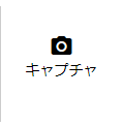
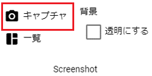
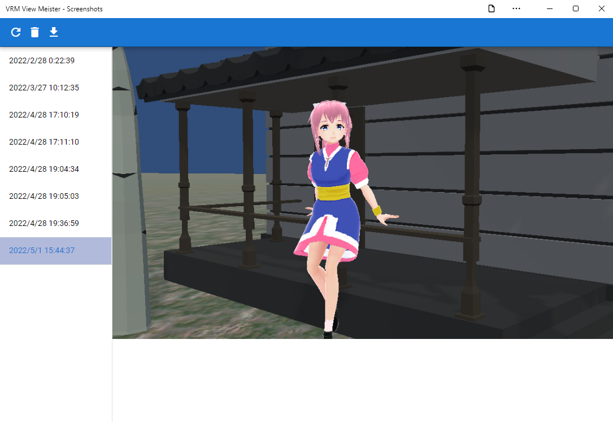
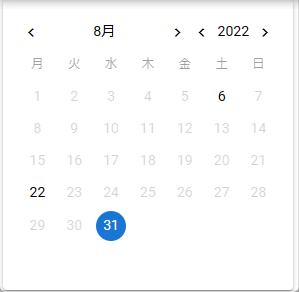

#########################################
スクリーンショット
#########################################

.. contents::

.. index:: スクリーンショットを撮る（撮影）

撮る
=========================================

　現在のWebGL画面の状態をスクリーンショットとして撮影し、保存することができます。

1. リボンバーのホームタブあるいは画面タブを開きます。

2. それぞれのタブにある「キャプチャ」をクリックします。

.. csv-table::
    :header-rows: 1

    ホームタブ   ,   画面タブ
    |homecap|   ,   |screencap|

3. 撮影したスクリーンショットを閲覧する場合は「一覧」をクリックします。

※別ウィンドウでスクリーンショット一覧が表示されます。

.. note::
    | ※ホームタブにはよく使うと思われる「キャプチャ」ボタンのみ置かれています。
    | ※背景オプションで「**透明にする**」にチェックを入れると空と地面を透明にして撮影することができます。
    | ※IKマーカーは設定変更しなくても自動的にカットされます。

|

.. index:: スクリーンショットを見る（撮影）

見る
=========================================

　撮影したスクリーンショットはアプリ内に保存されます。別ウィンドウですべて閲覧したり必要に応じて保存することができます。

1. リボンバーの画面タブにある「一覧」をクリックして開きます。

|

:できること:
    * 時系列で表示
    * 最新の状態に更新（メイン画面で撮影しても別ウィンドウにはすぐに反映されないため）
    * 削除
    * ローカルディスクに保存
    * 共有（ver 2.3.0より）

|

.. hint::
    Cameraオブジェクトが1つ以上存在する場合、いずれかでプレビューをするとその映像がスクリーンショットの対象になります。すべてをプレビュー停止すると、メインカメラからの映像に戻ります。

    ビューポートやレンダーテクスチャ中のプレビューも反映されてしまうため、必要に応じて設定の「スクリーンショットをHTMLの機能で撮影する」をONにしてください。そうするとWebGL画面に写った(Cameraオブジェクトのビューポートやレンダーテクスチャ含め)そのままがスクリーンショットになります。

|

.. index:: スクリーンショットの検索

探す
============================

　撮影したスクリーンショットは日付順に管理されており、カレンダーから特定の日付だけを探すことが可能です。

|

スクリーンショットがある日付は日にちの色が濃くなっていてクリックできるようになっています。

1. 色が濃くなっている日にちをクリックします。
2. スクリーンショット一覧の表示内容が更新され、選択した日にちのスクリーンショットが並びます。

.. index:: スクリーンショットの保存（撮影）

保存する
======================================

1. 保存したいスクリーンショットを選択します。
2. ツールバー上のこのボタン |dwnbtn| を押します。
   
.. note::
    ※ブラウザからの利用の場合、右クリックでも画像をクリップボードにコピーしたりその他機能を利用可能です。

共有する
=========================================

ver 2.3.0より、画像の共有に対応しました。ブラウザから利用する場合のみ使用できます。

1. 共有したいスクリーンショットを選択します。
2. ツールバー上の |shrbtn| 共有ボタンを押します。
3. 各OSごとに共有機能のウィンドウが表示されるので、送りたい先のアプリを選択します。

