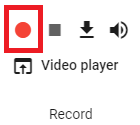
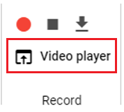

#########################################
撮影
#########################################

.. index:: スクリーンショットを撮る（撮影）

スクリーンショットを撮る
=========================================

　現在のWebGL画面の状態をスクリーンショットとして撮影し、保存することができます。

1. リボンバーのホームタブあるいは画面タブを開きます。

2. それぞれのタブにある「キャプチャ」をクリックします。

.. |screencap| image:: img/photograph_2.png

============= ============
ホームタブ      画面タブ
------------- ------------
|homecap|       |screencap|
============= ============

3. 撮影したスクリーンショットを閲覧する場合は「一覧」をクリックします。

※別ウィンドウでスクリーンショット一覧が表示されます。

.. note::
    | ※ホームタブにはよく使うと思われる「キャプチャ」ボタンのみ置かれています。
    | ※背景オプションで「**透明にする**」にチェックを入れると空と地面を透明にして撮影することができます。
    | ※IKマーカーは設定変更しなくても自動的にカットされます。

|

.. index:: スクリーンショットを見る（撮影）
.. index:: スクリーンショットの保存（撮影）

スクリーンショットを見る・保存する
=========================================

　撮影したスクリーンショットはアプリ内に保存されます。別ウィンドウですべて閲覧したり必要に応じて保存することができます。

.. image:: img/photograph_3.png
    :align: center

|

1. リボンバーの画面タブにある「一覧」をクリックして開きます。

:できること:
    * 時系列で表示
    * 最新の状態に更新（メイン画面で撮影しても別ウィンドウにはすぐに反映されないため）
    * 削除
    * ローカルディスクに保存

.. note::
    ※ブラウザからの利用の場合、右クリックでも画像をクリップボードにコピーしたりその他機能を利用可能です。

|

.. index:: 録画する（撮影）

ビデオに録画する
=======================

　本アプリではスクリーンショットによる静止画だけでなくWebGL画面を動画撮影することができます。

.. warning::
    ブラウザの標準機能を利用していますが、安定した動作のためには下記ブラウザを推奨します。

    * Chrome
    * Edge（Chromiumバージョン）

    ※PC版の場合は特に制限はありません。

1. リボンバーの画面タブにある ``Record`` 内の録画ボタンをクリックします。

|

2. 動画に含めたい操作あるいはアニメーションを再生します。

.. image:: img/photograph_5.png
    :align: center

|

.. note::
    WebGL画面に対するすべての操作が録画されます。（IKマーカーのオン・オフなど設定もそのまま録画されるため、事前にオフにしてください）

3. 停止ボタンをクリックします。

|

※一度でも録画開始～停止をするとダウンロードボタンが押せるようになります。

|

.. index:: ビデオを見る（撮影）

ビデオを見る
==================

　本アプリはビデオプレイヤーを内蔵しており、アプリで録画した映像をすぐに確認することができます。

.. image:: img/photograph_8.png
    :align: center

|

1,リボンバーの画面タブにある「Video player」ボタンをクリックします。

|

.. |appvideo| image:: img/photograph_a.png
.. |localvideo| image:: img/photograph_b.png

|appvideo| アプリで録画したビデオを読み込みます。録画するたびに内容は書き換わるので永久に見たい場合は保存してください。

|localvideo| 端末にある動画ファイルを読み込みます。対応形式は各ブラウザのvideo要素の仕様に従います。
