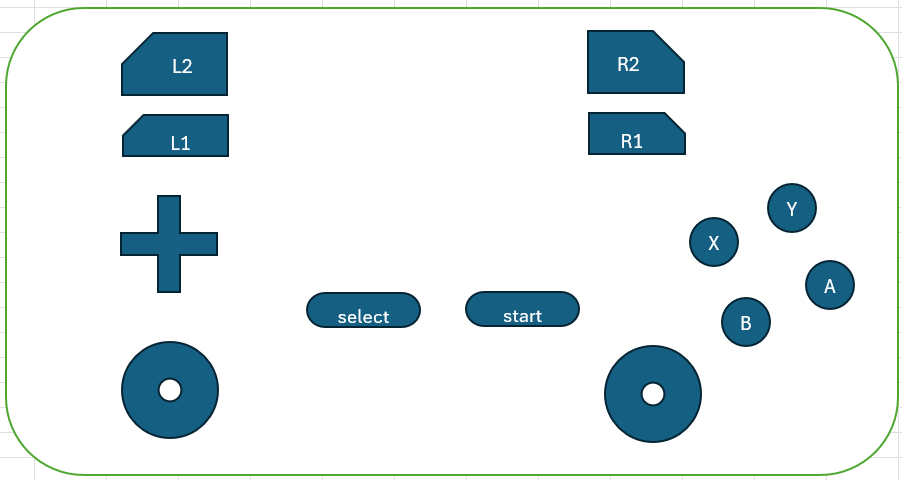

#########################################
特殊な操作
#########################################

.. contents::

.. index:: キーボードでの操作

キーボードでの操作
======================

本アプリでのキーボード操作をまとめます。

メインカメラの操作
-------------------------

.. csv-table::

    キー,  操作
    W,ズームイン（前進）
    S,ズームアウト（後退）
    A,左移動
    D,右移動
    Shift + W,上へ回転
    Shift + S,下へ回転
    Shift + A,左へ回転
    Shift + D,右へ回転
    F,上に移動
    V,下に移動
    Q,カメラのZ軸による回転を元に戻す
    M,メインカメラ(C)←→現在オブジェクト(O)操作の切り替え
    R,カメラと中心点のリセット
    I,カメラと中心点の距離を離す
    O,カメラと中心点の距離を近づける
    Ctrl,マウスの左クリックと一緒に押したままマウスを動かして回転
    SPACE,マウスの左クリックと一緒に押したままマウスを動かして移動

.. note::
    ※キーボード操作時（WASDのみ）のカメラのスピードは設定 ``キー操作時のカメラの移動速度`` で変更することができます。

現在オブジェクトの操作
-----------------------------

.. csv-table::

    キー,  操作
    W,前進
    S,後退
    A,左移動
    D,右移動
    F,上に移動
    V,下に移動
    Shift + W,前方へ回転
    Shift + S,後方へ回転
    Shift + A,左を向く
    Shift + D,右を向く
    Shift + F,左方へ回転
    Shift + V,右方へ回転
    Q,IKの回転を0に戻す
    G,グローバル(G)・ローカル(L)切り替え（ **キー操作による移動・回転に対して** ）
    M,メインカメラ(C)←→現在オブジェクト(O)操作の切り替え

オブジェクトのIKマーカーの操作
----------------------------------

.. csv-table::

    キー,   操作
    Ctrl,押しながらIKマーカーをクリックして複数選択
    X,グローバル座標・ローカル座標の切り替え（ **IKマーカーに対して** ）
    T,IKマーカーを初期状態に戻す（移動・回転両方）
    Shift + Z,IKの移動・回転をもとに戻す
    Shift + Y,IKの移動・回転をやり直す

.. index:: ゲームパッドでの操作

.. _operategamepad:

ゲームパッドでの操作
==========================

 ver 2.10.0より追加しました。

.. csv-table::

    キー,  操作
    左スティック,前後左右に移動
    右スティック,上下左右に回転
    十字キー(上),上へ移動
    十字キー(下),下へ移動
    L1, 操作対象をメインカメラに切り替え
    R1, 操作対象を現在選択中のオブジェクトに切り替え
    Select, 押すたびに操作空間をWorldとLocalに切り替え

.. note::
    移動速度や回転速度は ``キー操作時`` の設定値が使われます。

