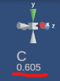

#########################################
特殊な操作
#########################################

.. contents::

.. index:: キーボードでの操作

キーボードでの操作
======================

本アプリでのキーボード操作をまとめます。

**メインカメラの操作**

.. csv-table::

    キー,  操作
    W,ズームイン（前進）
    S,ズームアウト（後退）
    A,左移動
    D,右移動
    Shift + W,上へ回転
    Shift + S,下へ回転
    Shift + A,左へ回転
    Shift + D,右へ回転
    F,上に移動
    V,下に移動
    Q,カメラのZ軸による回転を元に戻す
    M,カメラ←→現在オブジェクト操作の切り替え
    R,カメラと中心点のリセット
    I,カメラと中心点の距離を離す
    O,カメラと中心点の距離を近づける
    Ctrl,マウスの左クリックと一緒に押したままマウスを動かして回転
    SPACE,マウスの左クリックと一緒に押したままマウスを動かして移動

.. note::
    ※キーボード操作時（WASDのみ）のカメラのスピードは設定 ``キー操作時のカメラの移動速度`` で変更することができます。

**現在オブジェクトの操作**

.. csv-table::

    キー,  操作
    W,前進
    S,後退
    A,左移動
    D,右移動
    F,上に移動
    V,下に移動
    Shift + W,前方へ回転
    Shift + S,後方へ回転
    Shift + A,左を向く
    Shift + D,右を向く
    Shift + F,左方へ回転
    Shift + V,右方へ回転
    Q,IKの回転を0に戻す
    G,グローバル・ローカル切り替え
    M,カメラ←→現在オブジェクト操作の切り替え

**オブジェクトのIKマーカーの操作**

.. csv-table::

    キー,   操作
    Ctrl,押しながらIKマーカーをクリックして複数選択
    X,グローバル座標・ローカル座標の切り替え
    T,IKマーカーを初期状態に戻す（移動・回転両方）
    Shift + Z,IKの移動・回転をもとに戻す
    Shift + Y,IKの移動・回転をやり直す

.. index:: メインカメラの操作

メインカメラの操作
=========================

　本アプリではメインカメラには必ず回転軸となる中心点が存在します。設定により表示をオンオフ切り替えられますが、初期設定ではわかりやすさのため表示をオンにしています。

.. image:: img/spcl_01.png
    :align: center
    :alt: 中心点

|

　薄暗い半透明で表示される■が該当します。

　メインカメラはこの中心点を基準にして回転します。見たいオブジェクトを中心点に近づければ、そのオブジェクトを360度眺めることができます。

　ただ、カメラの移動やオブジェクトの移動をし続けていると必ずしも距離や位置が一致せずにだんだん表示がズレていくことがあります。そういうときはキーボードの ``Iキー`` または ``Oキー`` を押してください。

　すると中心点がメインカメラに向かって近づいたり離れたりします。

**中心点とオブジェクトの距離**

　中心点と現在選択中のオブジェクトの距離は右上に表示されます。

|

　あくまで目安です。IとOキーを押していると数値が減っていくのと増える境目があります。そこが中心点と現在選択中のオブジェクトが重なっている点です。そこでカメラを回転すれば比較的きれいにオブジェクトの周囲を回転することができます。

**移動・回転しすぎて中心点が吹っ飛んだら**

　移動や回転、WebGL画面の右上の軸の変更をすると中心点がずれることがあります。そういうときはキーボード操作がカメラモードのときに ``Rキー`` を押してください。するとメインカメラと中心点が初期位置にリセットされます。

.. hint::

    リボンバーの画面タブの ``カメラをリセット`` ボタンでも同様です。

