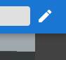
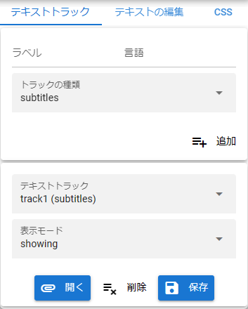
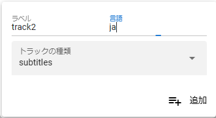
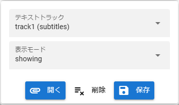
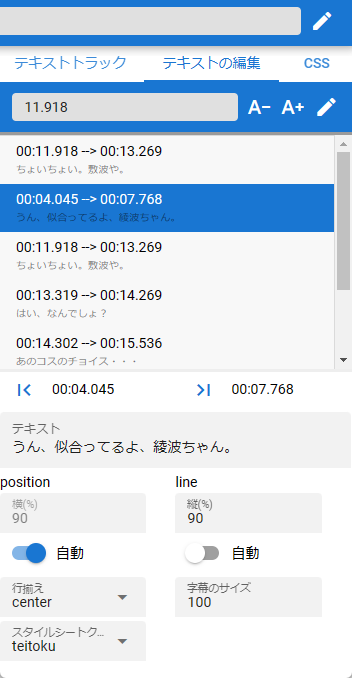

#####################################
字幕の編集
#####################################

.. index:: 字幕の編集

ver 1.2.0よりビデオプレイヤーに字幕編集機能を実装しました。
他のアプリやツールを使わなくても、録画した後にそのまま動画に合わせた字幕の編集をし始めることができます。

字幕・テキストトラックについてはMDNの下記のページを御覧ください。

https://developer.mozilla.org/ja/docs/Web/API/WebVTT_API

.. contents::

パネルを表示する
=========================

字幕を編集するには、右上にある字幕の編集ボタンを押します。

.. csv-table::
    :align: center

    |headerbtn|, →, |rightpanel| 

|

テキストトラックを追加する
====================================

ビデオプレイヤーではデフォルトで1つのテキストトラックを用意しています。さらに追加したい場合の方法です。

|

1. テキストトラックタブを開きます。
2. パネルの上部の ``ラベル`` を入力します。
3. その隣の ``言語`` を入力します。（日本語であれば ``ja-JP`` などと）
4. トラックの種類を選びます。

.. hint::
    トラックの種類については下記のサイトをご覧ください。

    https://developer.mozilla.org/ja/docs/Web/HTML/Element/track#attr-kind

    通常の用途では ``subtitles`` でかまいません。

|

既存のテキストトラックを管理する
======================================

すでに存在するテキストトラックを選択したり削除など管理します。

|

1. ``テキストトラック`` から操作したいトラックを選択します。

表示モードを変更する
--------------------------

1. ``表示モード`` から目的のモードを選択します。

.. csv-table::
    :header-rows: 1
    :align: center

    モード名, 効果
    disabled, トラックを完全に無効化します。
    hidden, トラックを非表示にします。
    showing, トラックを表示します。

.. hint::
    モードについて詳しい説明は下記サイトをご覧ください。

    https://developer.mozilla.org/ja/docs/Web/API/TextTrack/mode

|

字幕ファイルを読み込む
---------------------------

端末上にある字幕ファイルを読み込みます。

1. 開くボタンをクリックします。
2. 目的の字幕ファイルを選択し、開きます。
3. 選択中のトラックに字幕ファイルの中身が読み込まれます。

:対応するファイル拡張子: .vtt, .srt 

.. note::
    本アプリでは用意しきれない機能についてもVTTファイル・SRTファイルでは記述することができます（スタイルシートやコメントなど）。それら設定の効果は本アプリ上で再生した場合でも発揮できますが、アプリのUI上には反映されません。
    
    特にスタイルシートを追加・編集したい場合はCSSタブで改めて定義し直して下さい。

|

字幕ファイルとして保存する
---------------------------------------

選択中のテキストトラックを字幕ファイルとして端末上に保存します。

1. 保存ボタンを押します。
2. ファイル名をつけて保存します。

.. warning::
    端末上から読み込んだ字幕ファイルを改めて保存し直す場合、元の字幕ファイルに含んでいるスタイルシートは保存されませんのでご注意ください。

字幕を編集する
==============================

　選択したテキストトラック中に字幕のを追加したり削除できます。

　上部ツールバーは現在のシーク位置の表示、削除・追加・適用ボタンがあります。
字幕の一覧で出来る操作は次の通りです。

.. csv-table::
    
    クリック, 選択
    ダブルクリック, 選択した字幕の開始位置まで自動的にシーク

|

|

**字幕で編集できること**

字幕の次のプロパティを設定できます。

開始位置・終了位置
    .. image:: img/vtt_010.png

    動画のシークバーで動かした後、左のアイコンで開始位置、右のアイコンで終了位置を決定します。

:テキスト:
    字幕の文章です。なお、次のタグを使用できます。

..
    .. csv-table::
        :header-rows: 1

        タグ, 機能
        <b></b>, 太字
        <i></i>, イタリック
        <u></u>, 下線
        <ruby></ruby>, ルビ
        <c.クラス名></c>, CSSクラス名を指定してスタイルを適用します。なお、これは本アプリでは下記説明の ``スタイルシートクラス名`` を指定すると自動的に付与されるため、あえて指定する必要はありません。

:横(position):
    動画における字幕のX座標の位置をパーセンテージで設定します。

    :横(自動):
        X座標の位置を自動で調整するようにします。

:縦(line):
    動画における字幕のY座標の位置をパーセンテージで設定します。

    :縦(自動):
        X座標の位置を自動で調整するようにします。

|

:行揃え:
    字幕の領域における位置を調整します。

    VTTCueのalignです。

    https://developer.mozilla.org/en-US/docs/Web/API/VTTCue/align

:字幕のサイズ:
    字幕の領域を設定します。 **文字の大きさではありません** 。文字の大きさよりのこのサイズが小さいと字幕が入り切らないことがあります。

:スタイルシートクラス名:
    CSSタブで定義したクラス名を指定します。そのスタイルシートどおりに字幕のフォントや色が変わります。

.. note::
    VTTCueというクラスにあたります。詳しくは下記サイトのページをご覧ください。

    https://developer.mozilla.org/ja/docs/Web/API/VTTCue

字幕を追加する
---------------------------

1. 動画のシークバーを動かします。
2. 開始位置のアイコンを押します。
3. 終了位置にしたいところまでシークバーを動かします。
4. 終了位置にのアイコンを押します。
5. 字幕の各プロパティを入力します。
6. このボタンを押します。 |cueaddbtn| 

字幕を選択する・編集する
-------------------------------

1. 字幕の一覧上で目的の行を選択します。
2.  **追加** 時と同じく開始位置・終了位置・各プロパティを設定します。
3.  このボタンを押します。 |cueeditbtn|

字幕を削除する
----------------------------------

1. 字幕の一覧上で目的の行を選択します。
2.  このボタンを押します。 |cuedelbtn|

|

CSSを管理する
=========================

字幕に適用するスタイルシートを追加したり削除できます。

.. warning::
    .vttや.srtファイルを読み込んだ際に含まれているスタイルシートは、HTMLの仕様のため本アプリのこのタブに復元することはできません。

    改めて保存する場合、ご面倒ですがこのタブにて改めて定義し直してください。

.. image:: img/vtt_011.png
    :align: center

|

CSSファイルを読み込む
----------------------

.cssファイルを読み込んで字幕のスタイルシートとして使うことができます。

.. |upbtn1| image:: img/vtt_012.png

1. CSSタブのツールバーの左端にある |upbtn1| をクリックします。
2. .cssファイルを選択して開きます。

.. caution::
    .cssファイル中に ``::cue()`` のセレクタがある定義が対象です（それ以外のセレクタは無視されます）。

|

CSSをファイルに保存する
-----------------------

本アプリ上で定義したCSSを .vttファイルとは別に .cssファイルで保存します。

.. |dwnbtn1| image:: img/vtt_013.png

1. CSSタブのツールバーの左端にある |dwnbtn1| をクリックします。

.. note::
    * ファイル名は ``style_[日付をベースとした連番].css`` で固定です。

CSSを追加する
-----------------

1. ``スタイルシートクラス名`` の入力欄に入力します。

* ここでは ``::cue()`` の記述は不要です。あくまで名称だけです。

2. ``CSS`` の入力ボックスに必要なスタイルを記述していきます。

* 通常のCSSのように記述していきます。

.. code:: css

    font-size: 12pt;
    background-color : rgba(0,0,0,0.5);
    fotn-weight: bold;

3. ツールバーのこのボタン |cueaddbtn| を押します。

CSSを編集する
--------------------

1. CSSの一覧で編集したいクラス名の行を選択します。
2. ``CSS`` の入力ボックスでスタイルを変更します。
3. このボタンを押します。 |cueeditbtn| 

.. warning::
    スタイルシートクラス名は変更することはできません。

CSSを削除する
----------------

1. CSSの一覧で削除したいクラス名の行を選択します。
2. このボタンを押します。 |cuedelbtn| 

