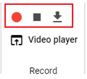
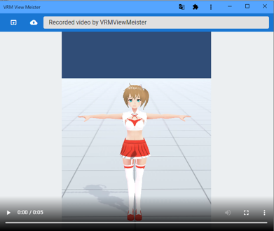
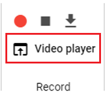

#########################################
ビデオ
#########################################

　本アプリではスクリーンショットによる静止画だけでなくWebGL画面を動画撮影することができます。

各OS版だけでなくウェブアプリ版でももちろん利用できます。

.. contents::

.. index:: 録画する（撮影）

録画する
=======================

.. warning::
    ブラウザの標準機能を利用していますが、安定した動作のためには下記ブラウザを推奨します。

    * Chrome
    * Edge（Chromiumバージョン）

    ※PC版の場合は特に制限はありません。

1. リボンバーの画面タブにある ``Record`` 内の録画ボタンをクリックします。

|

2. 動画に含めたい操作あるいはアニメーションを再生します。

|

.. note::
    WebGL画面に対するすべての操作が録画されます。（IKマーカーのオン・オフなど設定もそのまま録画されるため、事前にオフにしてください）

3. 停止ボタンをクリックします。

|

※一度でも録画開始～停止をするとダウンロードボタンが押せるようになります。

.. hint::
    ビデオの音声をミュートする

    .. image:: img/photograph_c.png
        :align: center

    　本アプリでは録画する際、音声も記録することができます。将来的には音声合成によるナレーション等にも対応させる予定です。一般的には効果音などを収録させる目的でも使用することができます。ただしマイクが備わっていない、不調などの理由で音声を不必要に入れたくないこともあるでしょう。

    　そんな時、このボタンを押すことで音声を有効・ミュートを切り替えることができます。

|

.. index:: ビデオを見る（撮影）

見る
==================

　本アプリはビデオプレイヤーを内蔵しており、アプリで録画した映像をすぐに確認することができます。

|

1,リボンバーの画面タブにある「Video player」ボタンをクリックします。

|

.. |appvideo| image:: img/photograph_a.png

|appvideo| アプリで録画したビデオを読み込みます。録画するたびに内容は書き換わるので永久に見たい場合は保存してください。

|localvideo| 端末にある動画ファイルを読み込みます。対応形式は各ブラウザのvideo要素の仕様に従います。アプリとしては ``.webm`` と ``.mp4`` のみ開くことが可能です。

.. hint::
    なお、後述の :doc:`./texttrack` 機能も利用できます。
