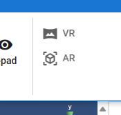

###########################################
VR/ARの基本
###########################################

.. contents::

.. index:: 
    確認済みの環境・機能(VR/AR)

確認済みの環境・機能
######################################

　本アプリでのVR/ARは、通常のアプリ画面と切り替えて使用します。常にVR/AR状態ではありませんので、VR機器でも通常画面を使用することもできます。

* Meta Questのブラウザ(VR/AR)
* PICO のブラウザ(VR/AR)
* Quest Linkにて接続したPC上のブラウザ(PWA含む)(VR)

.. hint::
    * Quest Linkの接続は、Air Linkよりも有線接続の方をお勧めします。Air LinkでもVR機器のブラウザより遥かに高速な動作を期待できますが、実際にモーションを動かすとチラつきが発生します。
    * ブラウザのページの倍率を **80%程度** に縮小すると、通常画面での利用もしやすくなります。（Oculus Linkによる利用では解像度が高いため、ページの倍率は特に必要ないと思われます）

.. index::
    VR/ARの制限事項
    VR/AR時の別ウィンドウ

制限事項
######################################

* Quest Linkにて接続したPC上の各OS版（Electron版）ではVR/AR両方とも利用できません。
* 本アプリはWebGLビルドのためブラウザが利用できる各端末の性能に大きく依存します。各OSネイティブアプリよりも制限があります。また、通常画面とVR/AR画面切り替えもある程度負荷があるため、プロジェクト・モーション・ポーズいずれかのファイル形式で **こまめに保存すること** をお勧めします。
* CameraオブジェクトはVR/AR空間では再生できません。OtherObjectのレンダーテクスチャ機能と組み合わせて使えばVR/AR空間でも別のカメラからの映像を見ることができます。
* SystemEffectはVR/AR空間には反映されません。

別ウィンドウを開く機能について
======================================

キーフレーム設定ウィンドウやポーズ・モーションウィンドウなど、別のウィンドウが開く機能はタブに置き換わります。

Meta Quest3
    タブを別のウィンドウにドラッグして分離できるので、2画面以上で本アプリを使用できるようになるでしょう。

PICO4
    PICO4のブラウザはPWA方式によるウェブアプリのインストールを行うことができます。しかしながらPICO4上でウェブアプリ化した状態で別ウィンドウを開く機能を使うと、ウェブアプリの画面そのものがそのウィンドウに置き換わってしまうことを確認しています。

    どうやらPICOの仕様と思われます。

    PICO4でもブラウザでの使用をお勧めします。

.. index:: VR/AR空間への入り方

VR/AR空間への入り方
######################################

1. リボンバーのホームタブにある ``VR`` または ``AR`` ボタンをクリックします。

|

.. hint::
    * VR/AR空間の初期位置を設定するには、アプリケーション設定の ``モデル`` タブにあるVR/ARの ``カメラの初期位置`` を設定してください。
    * 同じタブ内にある ``最後のカメラ位置を記憶`` にチェックを入れると、次回再び入った時に前の位置から再開します。

.. caution::
    利用できない環境の場合、それぞれのボタンを押すことは出来ません。

.. admonition:: モバイル端末でAR空間に切り替える

    各OSの仕様のためか、一度で正常に切り替わらないことがあります。

    :エラーになる目印: 画面が切り替わっても仮想コントローラのメニューパネルが表示されません。
        その場合は一度画面を戻り、もう一度 ``AR`` ボタンをタップして切り替えてください。

撮影
##################################

VR機器では標準でスクリーンショット・録画機能が備わっているため、それらを使うことを推奨します。

モバイル端末でもVR/AR空間では各端末標準のスクリーンショット・録画機能を使ってください。

本アプリのスクリーンショット・録画機能も一応利用可能です。

.. index:: 現実に合わせてオブジェクトを配置する(VR/AR)

.. _real_object:

現実に合わせてオブジェクトを配置する
########################################

現実の壁や物に合わせて3Dモデルを見えなくしたり、奥行きを演出したい場合があるかもしれません。本アプリならどんなVRデバイスでも簡単に実現できます。

MetaQuest3などの標準の設定にある、現実を認識しているかのような効果を簡単に付けられます。

そのような時は、 ``基本の図形`` と :ref:`shader_cutout` シェーダーを使いましょう。

方法1
    1. OtherObjectとして基本の図形を配置します。
    2. 必要に応じて大きさや回転させます。
    3. テクスチャのプロパティでシェーダーを ``Cutout`` にします。
    4. AR空間で想定通りに現実の壁や物に隠れる状態になったかを確認します。

方法2
    1. OtherObjectとして基本の図形を配置します。
    2. 必要に応じて大きさや回転させます。
    3. 左手の仮想コントローラにある ``透明化`` のボタンを押します。

.. hint::
    * ポイントとしては、現実の壁や物に合わせて基本の図形の形を選び、うまく配置することです。
    * CutoutシェーダーにしてからOtherObjectを動かそうとしても透明なため動かすのが困難になります。
    * 方法2は **OtherObject** 限定ですが、VR/AR空間でいつでも透明にして配置することができます。

物理効果を使ってみる
################################

ver 2.4.0より、OtherObjectやEffectなどのオブジェクトには ``物理効果`` のプロパティを用意しました。これを使えば、VR/AR空間でポーズ・モーションだけでなく新たな遊びを体験できるでしょう。

UnityでVR/ARアプリを新たに作るのにはいろんな準備が必要になりますが、本アプリであればプロパティからこれらの設定を変更するだけで、自由自在にオブジェクトを活用することができます。

.. image:: ../img/prop_common_5.png
    :align: center

各プロパティについては :ref:`rigid_property` をご覧ください。