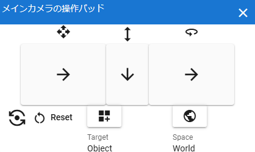

#####################################
VR/AR上の操作方法
#####################################

VR機器のコントローラはもちろんですが、Meta Quest 3 ではハンドトラッキングにフル対応しています。

ただし、コントローラとハンドトラッキングではデフォルトでできることが違います。

ver 2.8.0 より、モバイル端末でもVR/ARに対応しました。

.. contents::

.. index:: 
    基本の操作(VR/AR)
    VR/ARの操作

基本の操作
#####################################

.. admonition:: モバイル端末でのVR/AR操作

    スマートフォンなどのモバイル端末でもVRとAR表示できますが、VR機器と異なりコントローラがありません。そのため、下記操作はまったく操作感が異なるのでご注意ください。

掴む:
    オブジェクトを掴んで動かします。現実のもののように移動・回転を行うことができます。

    :VR機器のコントローラ時: 
        トリガーおよびグリップ
    :ハンドトラッキング時: 
        親指と人差し指で操作したいオブジェクトをつまむ

        .. caution::
            Meta Quest 3のハンドトラッキングの場合、手のひらを自分に向けるとシステム的な操作が発動する可能性があります。なるべく手のひらをオブジェクトに向けた状態で行ってください。

    :モバイル端末:
        タップで掴んで画面内を上下左右に指を動かす。ただし回転は不可。

    掴んで動かせるのは次のとおりです。

    * VRMの各部位のIKマーカー
    * OtherObject（の3Dモデル） **自体**
    * OtherObject, Camera, Light, Effect, Image のIKマーカー
    * 照明（Directional Light）のIKマーカー

メインカメラ移動:
    VR/AR空間の視点となっているメインカメラを動かします。通常画面のメインカメラとは視点の高さ・位置が若干ずれることがあります。

    :VR機器のコントローラ時: 
        :前後左右の移動: 左スティック
        :上下の移動: 右スティックを前・後ろに倒す
    :ハンドトラッキング時: 
        右手の仮想コントローラ

        操作対象を ``メインカメラ`` 、 操作モードを ``移動`` にしてください。
    :モバイル端末:
        右手の仮想コントローラ

        操作対象を ``メインカメラ`` 、 操作モードを ``移動`` にしてください。

メインカメラ回転:
    VR/AR空間の視点となっているメインカメラを回転させます。

    :VR機器のコントローラ時: 
        :左を向く: 右スティックを左へ倒す
        :右を向く: 右スティックを右へ倒す

        VR機器のコントローラを使用する場合は上記以外の回転は混乱する可能性があるためできません。
        
    :ハンドトラッキング時: 
        右手の仮想コントローラ

        操作対象を ``メインカメラ`` 、 操作モードを ``回転`` にしてください。
    
    :モバイル端末:
        右手の仮想コントローラ

        操作対象を ``メインカメラ`` 、 操作モードを ``回転`` にしてください。

.. note::
    * VRM全体を掴んで動かすには、 ``IK、全身`` のプロパティから、 ``移動モード`` をONにしてください。すると他のIKマーカー同様に掴んで動かすことができます。後述の仮想コントローラでも操作することが可能です。
    * VR/AR空間では全てのIKマーカーが同時に表示されるようになっています。
    * VR/ARの仕様上、IKマーカーは透過表示されないためオブジェクトに隠れます。

.. index::
    仮想の手(VR/AR)
    仮想コントローラ(VR/AR)
    VR機器のコントローラ(VR/AR)

仮想コントローラ
#####################################

　基本の操作だけではできないことが多いため、VR/AR空間で特定の機能を実行できる仮想コントローラを用意しました。

これらは仮想の手の斜め下付近に表示されます。VR機器のコントローラ使用時・ハンドトラッキング時いずれも使用可能です。

ver 2.8.0から、モバイル端末でも同等の操作パネルを導入しました。

.. |vrarctrl_off| image:: img/vrar_ctrl02.jpg
.. |leftctrl| image:: img/vrar_ctrl03.jpg
.. |rightctrl| image:: img/vrar_ctrl04.jpg

.. |mobilectrlland| image:: img/vrar_ctrl06.jpg

.. |mobilectrlvrmbone| image:: img/vrar_ctrl08.jpg

.. index:: VR/ARの仮想の手

    
.. admonition:: 各ボタンの機能について

    同じアイコンのボタンは、VR・モバイル端末時どちらの場合も同じ機能が使用可能です。（配置は若干異なります）

.. index::
    VR/ARの仮想コントローラ

仮想コントローラ(VR)
=======================

     実際のコントローラと同じく左右の手元に表示されます。

     デフォルトでは邪魔にならないように非表示になっています。 

     ハンドトラッキング時は全ての指先が当たり判定になっており、指先とボタンを重ねるとボタンが沈み込みます。VRデバイスのコントローラではトリガー時の人差し指のみです。

    黄色のCube
        仮想の手の指先で触れると仮想コントローラが表示されます。VRデバイスのみ表示されます。
    青色のCube
        仮想の手の指先で触れるとアニメーションの再生・一時停止をします。VRデバイスのみ表示されます。

    .. csv-table:: 仮想の手

        VR機器のコントローラ使用時, ハンドトラッキング時
        |vrarctrl_on|, |vrarctrl_off|

    .. csv-table:: 
        :header-rows: 1

        左手,右手
        |leftctrl|, |rightctrl|

仮想コントローラ(モバイル)
================================

    画面の左下・右下・右上にメニューパネルとして表示されます。

    ポートレート・ランドスケープで幅や高さに違いはありますがほぼ同じです。
    操作モードにより、X/Y/Zにアイコンが加わります。（実際の動きを連想しやすいアイコンです）

    |mobilectrlwhole|

    フッター
        |mobilectrlfoot|

        画面下にある見えないボタンです。モバイル端末の画面録画やスクリーンショット機能を使っていただくため、赤枠の部分は実際には何も表示されません。

        左から順に次の機能を利用できます。

        .. csv-table::

            左の仮想コントローラを表示/非表示, アニメーション再生・一時停止, 右の仮想コントローラを表示/非表示

|

    VRMのボーン選択
        操作対象を各ボーンに切り替えます。操作したいボーンのボタンをタップしてください。

        アイコンとその意味は :ref:`inputikasmarker` を御覧ください。

        |mobilectrlvrmbone|
        
        右の仮想コントローラの次のボタンををタップすると表示されます: |rightctrl12|
        
        操作対象がVRMの時、次のボタンをタップするとこのボタンが表示されます: |rightctrl05| 

.. |leftctrl02| image:: img/vrar_ctrlleft_02.png
.. |leftctrl03| image:: img/vrar_ctrlleft_03.png
.. |leftctrl04| image:: img/vrar_ctrlleft_04.png
.. |leftctrl05| image:: img/vrar_ctrlleft_05.png
.. |leftctrl06| image:: img/vrar_ctrlleft_06.png
.. |leftctrl07| image:: img/vrar_ctrlleft_07.png
.. |leftctrl08| image:: img/vrar_ctrlleft_08.png
.. |leftctrl09| image:: img/vrar_ctrlleft_09.jpg
.. |leftctrl10| image:: img/vrar_ctrlleft_10.jpg

.. index::
    VR/ARの仮想コントローラ(左手)

左手の仮想コントローラ
==========================

.. csv-table:: 
    :header-rows: 1
    
    UI, 説明
    オブジェクト名, VR/AR空間で現在選択中の3Dオブジェクトの名称です。通常の画面で2DオブジェクトやStageを選択していた場合は読み飛ばします。
    |leftctrl01|, 一つ前の3Dオブジェクトを選択します。途中に2Dオブジェクトがある場合は読み飛ばします。
    |leftctrl02|, 次の3Dオブジェクトを選択します。途中に2Dオブジェクトがある場合は読み飛ばします。
    |leftctrl03|, IKマーカーの表示を切り替えます。表示がオフになっていても掴んで操作できます。通常画面のIKマーカーのON/OFFとは連動していません。
    中央の行の左の表示, 現在選択中のキーフレーム番号です。
    |leftctrl04|, 一つ前のキーフレームへ戻します。タイムラインパネルのキーフレーム操作とほぼ同じです。
    |leftctrl05|, 次のキーフレームへ戻します。タイムラインパネルのキーフレーム操作とほぼ同じです。
    |leftctrl06|, 現在選択中の3Dオブジェクトのポーズを、現在選択中のキーフレームに登録します。ここでいう **選択中** とは、あくまでもVR/AR空間上でのみ有効です。通常画面での選択とは異なります。
    |leftctrl07|, アニメーションを再生します。
    |leftctrl08|, アニメーションを停止します。
    |leftctrl09|, VR/AR画面を終了します。(VRデバイスのみ)
    |leftctrl10|, (OtherObjectのみ) オブジェクトの全マテリアルのシェーダーをCutoutにして透明化します。詳細は次を参照してください。(テクスチャ :ref:`shader_cutout` )
    |leftctrl11|, 操作モードの軸の基準を G - ``グローバル座標`` または L - ``ローカル座標`` に切り替えます。

.. |rightctrl01| image:: img/vrar_ctrlright_01.png
.. |rightctrl02| image:: img/vrar_ctrlright_02.png
.. |rightctrl03| image:: img/vrar_ctrlright_03.png
.. |rightctrl04| image:: img/vrar_ctrlright_04.png
.. |rightctrl05| image:: img/vrar_ctrlright_05.png

.. |rightctrl07| image:: img/vrar_ctrlright_07.png
.. |rightctrl08| image:: img/vrar_ctrlright_08.png
.. |rightctrl09| image:: img/vrar_ctrlright_09.png

.. |rightctrl11| image:: img/vrar_ctrlright_11.png

.. index::
    VR/ARの仮想コントローラ(右手)

右手の仮想コントローラ
==========================

.. csv-table:: 
    :header-rows: 1
    
    UI, 説明
    |rightctrl01|, X軸を基準に操作します。
    |rightctrl02|, Y軸を基準に操作します。
    |rightctrl03|, Z軸を基準に操作します。
    |rightctrl04|, 操作対象を ``メインカメラ`` にします。
    |rightctrl05|, 操作対象を ``現在選択中の3Dオブジェクト`` にします。
    |rightctrl12|, 操作対象を ``VRMの各ボーン`` にします。(モバイル端末のみ)
    |rightctrl06|, 操作モードを ``移動`` にします。
    |rightctrl07|, 操作モードを ``回転`` にします。
    |rightctrl10|, 操作モードを ``サイズ`` にします。
    |rightctrl08|, 現在選択中のオブジェクトの位置をリセットします。
    |rightctrl09|, 現在選択中のオブジェクトの回転をリセットします。
    |rightctrl11|, 現在選択中のオブジェクトのサイズをリセットします。

.. note::
    上記以外の操作は通常画面に戻って行ってください。

操作のまとめ
#####################################

.. csv-table::
    :header-rows: 2

        , Meta Quest 3, ,PICO4, モバイル端末
    機能, コントローラ, ハンドトラッキング, コントローラ, 
    掴む, トリガーorグリップ, 人差し指+親指, トリガーorグリップ, 画面タップ
    メインカメラ移動, 左スティック+右スティック前後, 右手の仮想コントローラ, 左スティック+右スティック前後, 右手の仮想コントローラ
    メインカメラ回転, 右スティック左右, 右手の仮想コントローラ, 右スティック左右, 右手の仮想コントローラ
    VRMの移動・回転, 仮想コントローラ, 仮想コントローラ, 仮想コントローラ, 右手の仮想コントローラ
    VRMの各部位のIKマーカー, 掴む, 掴む, 掴む,  右手の仮想コントローラ
    VRM以外の移動・回転, 掴む, 掴む, 掴む, 掴むor右手の仮想コントローラ

本アプリのメインカメラとVR機器のカメラ（視点）にズレが生じた場合、各VR機器を操作して視点を中央に戻してください。

.. warning::
    PICO4のブラウザアプリでは、コントローラのBとYはブラウザの ``戻る`` に機能が割り当てられていると思われます。そのため、誤って押した場合は確認メッセージをよく見て操作してください。

便利な操作機能
#############################

.. index::
    V-pad(VR/ARの操作)

.. _vpad_for_vrar:

VR/AR環境におけるV-pad
======================

VR機器だとマウスに相当するのがコントローラです。ただしマウスと異なり細かい作業に向きません。本アプリではマウスが使えない環境でもある程度操作できるように、 ``V-pad`` という機能を用意しています。

VR機器でもそれを使えば、通常画面を操作できます。

このV-padはそれぞれの四角の中をスワイプすることによってメインカメラを移動したり回転できます。VR機器では、製品によって若干操作感が変わります。

Meta Quest 3
    * トリガーを押しながらV-pad内の四角の中をコントローラを動かすことで操作できます。
    * メインカメラの回転は両方のコントローラのトリガーを押しながらWebGL画面にフォーカスを当てると操作できます。

PICO4
    * トリガーを押しながらV-pad内の四角の中をコントローラを動かすことで操作できます。
    * V-pad内の四角の中をスティックで動かすだけで操作できます。 ``一番お勧め`` の操作方法です。

.. hint::
    反応速度が良すぎる場合があります。その場合は設定の ``アプリケーション`` から、V-padの移動速度と回転速度を調整してください。

.. index::
    オブジェクトの移動・回転・リサイズ(VR/AR)

オブジェクトのtransform
============================

選択中のオブジェクトの移動・回転・リサイズを行うには右手の仮想コントローラを使います。

移動と回転はVRデバイスのコントローラまたはハンドトラッキングで直接掴んで動かすこともできますが、細かい調整をしたい場合は仮想コントローラで行うほうがよいでしょう。

.. hint::
    * 下記のいずれの操作も、設定の ``アプリケーション`` タブにあるVR/ARの移動速度と回転速度を調整してください。
    * 基準はローカル軸です。

移動モード
    1. |rightctrl06| を押して移動モードに切り替えます。
    2. 下記のいずれかを押してその軸に沿って移動させます。

    .. csv-table::

        |rightctrl01| , |rightctrl02| , |rightctrl03| 

回転モード
    1. |rightctrl07| を押して回転モードに切り替えます。
    2. 上図のボタンを押して回転させます。

リサイズモード
    1. |rightctrl10| を押してリサイズモードに切り替えます。
    2. 上図のボタンを押してサイズを変更します。

変更をリセットする
    以下のいずれかのボタンを押してください。

    .. csv-table::

        |rightctrl08|, 現在選択中のオブジェクトの位置をリセットします。
        |rightctrl09|, 現在選択中のオブジェクトの回転をリセットします。
        |rightctrl11|, 現在選択中のオブジェクトのサイズをリセットします。
