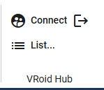
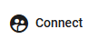
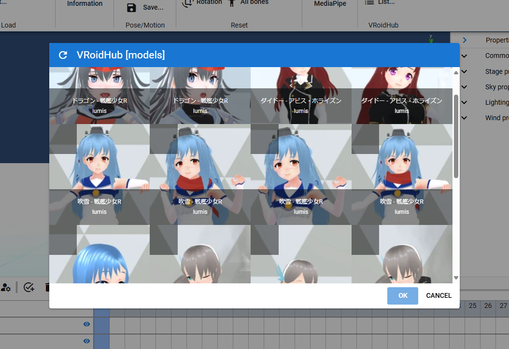

.. index:: VRoid Hub

####################################
VRoid Hub
####################################

.. contents::

.. index:: VRoid Hubへの接続

VRoid Hubへの接続
====================================

ver 2.11.0より、VRoid HubからVRMを読み込めるように対応しました。

事前にVRoid Hubのアカウント登録をしておいてください。

:VRoid Hub: https://hub.vroid.com/

1. 本アプリのリボンバーの ``3Dモデル`` タブを開きます。

2. VRoid Hubの領域の ``接続`` ボタンを押します。

ウェブアプリの場合
    3. 本アプリからVRoid Hubのサイトに切り替わります。

    .. image:: img/vroidhubmenu02.png
        :align: center

    4. VRoid Hubにログインし、本アプリとVRoid Hubの接続を許可してください。

    .. image:: img/vroidhubmenu03.png
        :align: center

    |

    5. ログイン完了後本アプリの画面が再び表示されます。
    6. 本アプリとVRoid Hubの接続が完了します。

各OS版の場合
    3. ポップアップダイアログにVRoid Hubへのログインボタンが表示されるので、クリックしてブラウザで開いてください。

    .. image:: img/vroidhubmenu_pc01.png
        :align: center

    |

    4. VRoid Hubにログインし、本アプリとVRoid Hubの接続を許可してください。
    5. Webページ上のコードが表示されるので、それをコピーしてください。
    6. 本アプリ画面を再び見てください。
    7. 次にコード入力用ボックスが表示されるので、コピーしたコードを貼り付けて送信ボタンを押します。
    8. 本アプリとVRoid Hubの接続が完了します。

.. hint::
    本アプリは利用者のVRoid Hubへのログイン情報を保持しません。VRoid Hubの仕様上、一度本アプリと接続しても、数分後には接続が自動的に切り離されるようになっています。

    その場合、再接続が必要です。

|

.. index:: VRoid Hubからログアウトする

VRoid Hubからログアウトする
=====================================

    1. 本アプリのリボンバーの ``3Dモデル`` タブを開きます。

    .. image:: img/vroidhubmenu01a.png
        :align: center

    2. VRoid Hubの領域の ``ログアウト`` ボタンを押します。

    .. image:: img/vroidhubmenu01d.png
        :align: center

    3. 確認メッセージが表示されるので、問題なければOKボタンを押します。

    .. image:: img/vroidhub_logout01.png
        :align: center

.. caution::
    ログアウトすると次の状態になります。
    
    * 現在読み込み済みのVRoid Hubから開いたVRMは、 **現在のプロジェクトからすべて削除されます。**
    
    ただしタイムライン（ロール）は残ります。登録済みのキーフレームの内容もそのまま残るため、後から別のVRMを開いてタイムライン（ロール）に割り当てて、モーションを再生することもできます。

    :ref:`settingcast2role` を参照してください。

    **また、VRoid Hubから開いたVRMは履歴にも残りません。** 
    
    いつでもすぐに使いたいモデルはVRoid Hubから直接ダウンロードして、PCやスマートフォン、Googleドライブに保存して本アプリで使うようにしてください。

.. index:: VRoid Hubからモデルを読み込む

VRoid Hubからモデルを読み込む
=====================================

接続に成功すると、リストのメニューから次の種類のモデルを参照できます。

* 自分の登録したモデル
* お気に入りしたモデル
* スタッフおすすめのモデル

モデルをクリック（タップ）するとチェックマークがついて選択できます。そしてOKボタンを押すと確認メッセージが表示されるので進めてください。

その後は端末から読み込むときと同様にVRMの情報画面が表示され、ライセンスや利用条件を確認できます。

一覧の続きを読み込む場合は |reloadbtn| を押すと一覧の続きが読み込まれます。

.. caution::
    スタッフおすすめのモデルはランダムに出るようです。VRM内部のメタ情報に情報が正しくセットされていないモデルが多く、本アプリでは予期せぬ動作をする可能性があります。

    スタッフおすすめのモデルについては自己責任でのご利用をお願いします。

